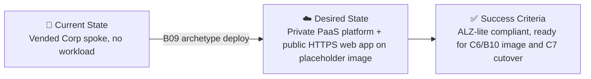

# 📋 Step 1: Requirements - university

<strong>📑 Requirements Overview</strong>

- [🎯 Project Overview](#-project-overview)
- [🚀 Functional Requirements](#-functional-requirements)
- [⚡ Non-Functional Requirements (NFRs)](#-non-functional-requirements-nfrs)
- [🔒 Compliance & Security Requirements](#-compliance--security-requirements)
- [💰 Budget](#-budget)
- [🔧 Operational Requirements](#-operational-requirements)
- [🌍 Regional Preferences](#-regional-preferences)
- [📊 Complexity Classification](#-complexity-classification)
- [📋 Summary for Architecture Assessment](#-summary-for-architecture-assessment)
- [References](#references)

> Generated by 02-Requirements agent | 2026-10-05

| ⬅️ Previous | 📑 Index            | Next ➡️                                                        |
| ----------- | ------------------- | -------------------------------------------------------------- |
| —           | [README](README.md) | [02-architecture-assessment.md](02-architecture-assessment.md) |

## 🎯 Project Overview

| Field                   | Value                                                                                                          |
| ----------------------- | -------------------------------------------------------------------------------------------------------------- |
| **Project Name**        | `university` (artifacts in `agent-output/university/`, Bicep in `infra/bicep/university/`)                     |
| **Project Type**        | Full-Stack platform (containerized web app + managed SQL + storage + messaging)                                |
| **Timeline**            | Not date-bound; platform must be ready before C6/B10 pushes the real image and C7 performs cutover             |
| **Primary Stakeholder** | Archetype owner (CoE), technical contact `ghostbusters`                                                        |
| **Business Context**    | CoE archetype (B09) providing the Azure platform for the Contoso University app inside an existing Corp spoke |

### Business Context

| Field               | Value                                                                                                                         |
| ------------------- | ----------------------------------------------------------------------------------------------------------------------------- |
| Industry / Vertical | Education (training/demo scenario)                                                                                            |
| Company Size        | Partner CoE / training kit                                                                                                    |
| Current State       | Modernization — platform only. The .NET Framework 4.8 MVC app is modernized to .NET 10 in a separate workstream (B06/B10)     |
| Migration Source    | Legacy Contoso University (.NET Framework 4.8 MVC + SQL Server); the app and data migration are out of scope here (B06/B10/C7) |
| Business Drivers    | Reusable, policy-compliant landing-zone archetype for training cohorts; realistic security baseline on non-production data    |
| Success Criteria    | Every resource evaluates compliant against all ALZ-lite deny policies at `mg-factory-corp`; web app runs the placeholder image over VNet-integrated egress; app identity holds all required roles before first image pull |

### State Transition

## 🚀 Functional Requirements

### Core Capabilities

| #   | Capability                                                                                                                         | Priority  | Acceptance Criteria                                                                                                     |
| --- | ---------------------------------------------------------------------------------------------------------------------------------- | --------- | ----------------------------------------------------------------------------------------------------------------------- |
| 1   | Deploy into the existing, already-vended spoke (`rg-spoke`, `vnet-spoke`, `snet-app`, `snet-pe`, `snet-sqlmi`) without creating or modifying VNet, subnets, NSGs, route tables or private DNS zones | 🔴 Must | IaC contains no VNet/subnet/NSG/route-table/private DNS zone/zone-group declarations; existing resources referenced only |
| 2   | Human inputs limited to tenant ID, workload subscription ID and `suffix` (4–6 lowercase letters/digits); everything else discovered at deploy time | 🔴 Must | Region, spoke, hub subscription, Log Analytics workspace and SQL MI admin are derived, not hardcoded (see Integrations) |
| 3   | Linux container web app on App Service, VNet-integrated into `snet-app` with all traffic routed through the VNet (`vnetRouteAllEnabled: true` / `outboundVnetRouting.allTraffic`) and container image pull explicitly routed over the VNet (`outboundVnetRouting.imagePullTraffic: true`, formerly `vnetImagePullEnabled`) | 🔴 Must | Effective routing settings verified after deployment; web app starts from the pinned placeholder `mcr.microsoft.com/dotnet/samples:aspnetapp-10.0` (runnable .NET 10 ASP.NET Core sample, listens on 8080) via hub-firewall-allowed egress, with `WEBSITES_PORT=8080` matching the real `contoso-university` image (B06). Pinned tag, never `latest` |
| 4   | Private container registry for app images                                                                                          | 🔴 Must | ACR reachable only via private endpoint in `snet-pe` with `publicNetworkAccess: Disabled`; `networkRuleBypassOptions: AzureServices` set so `az acr import` of the known-good image can work. The import is a requirement with a post-deployment test, **not verified** until that test passes |
| 5   | SQL Managed Instance as migration target                                                                                           | 🔴 Must | MI in `snet-sqlmi`, `databaseFormat`/engine set to `SQLServer2022` explicitly, Entra-only, reachable on VNet-local host name |
| 6   | Blob storage with container `teaching-materials`                                                                                   | 🔴 Must | Container exists; access via Entra RBAC only                                                                            |
| 7   | Service Bus queue `notifications`                                                                                                  | 🔴 Must | Queue exists; access via Entra RBAC only                                                                                |
| 8   | Key Vault for runtime secrets (`ConnectionStrings--DefaultConnection` populated later by C7)                                       | 🔴 Must | Vault exists with RBAC authorization; app identity can read secrets; secret value not set by this archetype           |
| 9   | Workspace-based Application Insights bound to the central `log-management` workspace                                             | 🔴 Must | Connection string exposed to the app; diagnostics from every resource flow to the same workspace                       |
| 10  | One user-assigned managed identity for the web app, role-assigned before first image pull                                          | 🔴 Must | Web app uses the UAMI (not system-assigned) for ACR pull and data-plane access                                          |
| 11  | App settings with exact names from the B06 golden-path report (see Integrations)                                                   | 🔴 Must | No renamed keys; no secrets in app settings                                                                              |
| 12  | SQL MI stop/start schedule (Automation or Logic App) for event hours                                                               | 🟡 Should | Deployed **enabled**: time zone `W. Europe Standard Time`, start Mon–Fri 07:30, stop Mon–Fri 18:30 (stopped overnight and at weekends). Time zone and times are Bicep parameters with these defaults for the facilitator to adjust per event, not member inputs. README documents that it cannot stop an MI with an active MI link (saves cost only after C7 cutover) and that a stopped MI must be started, or wait for 07:30, before checks outside those hours |
| 13  | Generated README documents Azure Hybrid Benefit and how to disable it                                                              | 🟡 Should | README states the owner assumption (partner holds eligible SQL Server core licences with Software Assurance) and shows how to switch `licenseType` to `LicenseIncluded` (`az sql mi update --license-type LicenseIncluded`) |
| 14  | Deployment prerequisites are explicit and preflighted                                                                              | 🔴 Must | Preflight confirms the deployer holds the control-plane rights listed under User Types and the ACR import authorization (Container Registry Data Importer and Data Reader, or equivalent `importImage/action` permission, on the target registry), and fails with a clear message naming the missing permission before any resource is created |
| 15  | Private-endpoint DNS readiness is gated, not assumed                                                                               | 🔴 Must | Readiness is claimed only after Step 3.5 verifies the DINE assignments (scope, parameters, identity permissions) and post-deploy checks confirm DINE registration completed, central zones are linked to the network path, and ACR, Blob, Service Bus and Key Vault FQDNs resolve to private IPs from `snet-app`; any failure blocks the readiness claim |
| 16  | Pre-deploy region checks                                                                                                           | 🔴 Must | Discovered hub region and the `log-management` workspace region must each be in the manifest's approved regions (`swedencentral`, `germanywestcentral`); otherwise stop and ask. No silent move, SKU substitution or replacement workspace |
| 17  | Pre-deploy landing-zone budget check (read-only)                                                                                   | 🔴 Must | Budget `budget-factory-workload` exists on the workload subscription with at least one contact e-mail; otherwise stop and tell the user to run vending. Requires read access to the budget (listed under User Types, checked by capability 14); a lookup error or missing permission fails closed with a clear message. The archetype never creates a budget or Action Group |
| 18  | MCR egress for the placeholder image (read-only preflight + post-deploy test)                                                      | 🔴 Must | Pre-deploy: in the shared services subscription, `afwp-hub` has rule collection group `rcg-member-<n>` with application rule `app-to-mcr` allowing `snet-app` to `mcr.microsoft.com` and `*.data.mcr.microsoft.com` on HTTPS 443 (created by vending, B08); if missing, stop and tell the user to rerun vending. The deployer needs least-privileged read access to the `afwp-hub` firewall policy and its rule collection groups (listed under User Types and checked by capability 14); a lookup error or missing permission fails closed. Post-deploy: the web app pulls the placeholder image and returns HTTP 200 on its public HTTPS endpoint. No fallback image source |

### User Types

| User Type                          | Description                                                     | Est. Count     | Access Level                                                                                              |
| ---------------------------------- | --------------------------------------------------------------- | -------------- | --------------------------------------------------------------------------------------------------------- |
| Training attendee / demo user      | Uses the web app over public HTTPS                              | < 50           | Application-level (end-user auth out of scope for B09; handled by the app in B06/B10)                     |
| Deploying member (data plane)      | Runs local tasks from `vm-dev01`; also SQL MI Entra admin       | 1 per member   | AcrPush, Container Registry Data Importer and Data Reader (for `az acr import`; AcrPush does not grant `importImage/action`), Storage Blob Data Contributor, Service Bus Data Sender + Receiver, Key Vault Secrets Officer |
| Deploying member (control plane)   | Deployment prerequisites, preflighted (capability 14)           | 1 per member   | Create workload resources in the target resource group; write role assignments limited to the roles in this table (role-assignment rights constrained to these roles where supported); join `snet-app`, `snet-pe`, `snet-sqlmi`; read `vnet-spoke` and its peering, the `budget-factory-workload` budget on the workload subscription, the hub VNet and the `afwp-hub` firewall policy (including its rule collection groups) in the shared services subscription, and the `log-management` workspace, plus the rights to link diagnostics and Application Insights to it. Exact least-privileged role set confirmed at Step 4 |
| Web app workload identity (UAMI)   | Runtime identity used by `DefaultAzureCredential`               | 1              | AcrPull, Storage Blob Data Contributor, Service Bus Data Sender + Receiver, Key Vault Secrets User, Monitoring Metrics Publisher (on the Application Insights component) |

### Integrations

| System                                         | Direction     | Protocol                       | Auth Method                        | SLA            |
| ---------------------------------------------- | ------------- | ------------------------------ | ---------------------------------- | -------------- |
| Hub VNet `vnet-hub` (shared services sub)       | Read at deploy | ARM (peering walk from `vnet-spoke`) | Deployer Entra identity         | Best-effort    |
| Log Analytics `log-management` in `rg-management` (shared services sub) | Outbound | Azure Monitor ingestion (public, allowed by hub firewall) | Entra-authenticated ingestion (UAMI); local auth disabled on Application Insights | Best-effort; region must be an approved region (capability 16) |
| Central private DNS zones (shared services sub) | Policy-driven | DeployIfNotExists registration | Landing-zone policy identity       | Required — readiness gated (capability 15) |
| Microsoft Container Registry (placeholder image) | Outbound    | HTTPS 443 via hub firewall     | Anonymous public pull              | Required for initial deployment (capability 18); MCR is the only approved source, no fallback |
| App settings consumed by the app               | Inbound config | App Service app settings      | n/a (non-secret values only)       | n/a            |

App settings (exact names, do not rename):

| Setting                                  | Value                                                    |
| ---------------------------------------- | -------------------------------------------------------- |
| `Storage:BlobServiceUri`                 | Storage account blob endpoint                            |
| `Storage:ContainerName`                  | `teaching-materials`                                     |
| `ServiceBus:FullyQualifiedNamespace`     | Namespace FQDN                                           |
| `ServiceBus:QueueName`                   | `notifications`                                          |
| `KeyVault:VaultUri`                      | Vault URI                                                |
| `APPLICATIONINSIGHTS_CONNECTION_STRING`  | Application Insights connection string (endpoint metadata only, not a credential) |
| `AZURE_CLIENT_ID`                        | UAMI client ID (or the app's documented equivalent)      |

`ConnectionStrings:DefaultConnection` is **not** an app setting: it is the Key Vault secret `ConnectionStrings--DefaultConnection` (Entra-only MI connection string, `Authentication=Active Directory Default`, VNet-local host name), populated in C7.

Discovery and naming rules:

| Value                         | Derivation                                                                                         |
| ----------------------------- | -------------------------------------------------------------------------------------------------- |
| Region                        | Location of `vnet-hub` (peered to `vnet-spoke`); Bicep takes `location` as a parameter; must be an approved manifest region |
| Spoke and subnets             | Backlog naming convention: `rg-spoke`, `vnet-spoke`, `snet-app`, `snet-pe`, `snet-sqlmi`           |
| Hub / shared services sub     | Walk `vnet-spoke` peering to the hub VNet and its subscription                                     |
| Log Analytics workspace       | `log-management` in `rg-management`, shared services subscription                                  |
| SQL MI Entra admin            | Signed-in deploying user/principal                                                                 |
| Resource names                | CAF abbreviation + `university` + `suffix` (e.g. `app-university-<suffix>`); ACR strips dashes    |

### Data Types

| Category                              | Sensitivity | Est. Volume       | Retention                    | Residency                         |
| ------------------------------------- | ----------- | ----------------- | ---------------------------- | --------------------------------- |
| Sample university data (SQL MI)       | 🟢 Low      | Within 64 GB      | Lab lifetime (teardown)      | EU (`swedencentral` / `germanywestcentral`) |
| Teaching materials (blob)             | 🟢 Low      | Small (lab)       | Lab lifetime                 | EU                                |
| Notification messages (Service Bus)   | 🟢 Low      | Low               | Queue default TTL            | EU                                |
| Telemetry                             | 🟢 Low      | Low               | Central workspace policy     | EU                                |

No production data is stored.

### Architecture Pattern

| Field              | Value                                                                                                             |
| ------------------ | ----------------------------------------------------------------------------------------------------------------- |
| Workload Pattern   | N-Tier (containerized web tier + managed SQL + blob + async messaging)                                            |
| Recommended Option | App Service (Linux container) + SQL Managed Instance + Storage + Service Bus + Key Vault + App Insights, all user-pinned |
| Tier               | Balanced (Premium SKUs where private endpoints require them; single instance, no zones)                           |
| Justification      | Matches the brief's fixed service list and the landing zone's private-PaaS policies while keeping lab cost bounded |

## ⚡ Non-Functional Requirements (NFRs)

| WAF Pillar     | Metric             | Target                                                         | Current | Gap                       |
| -------------- | ------------------ | -------------------------------------------------------------- | ------- | ------------------------- |
| 🔄 Reliability | SLA                | Best-effort; no availability target (lab, redeploy from IaC)   | N/A     | None — accepted by owner  |
| 🔄 Reliability | RTO                | Best-effort; recovery = redeploy from IaC                      | N/A     | None — accepted by owner  |
| 🔄 Reliability | RPO                | Best-effort; no production data                                | N/A     | None — accepted by owner  |
| ⚡ Performance | Page Load          | No target (demo)                                               | N/A     | —                         |
| ⚡ Performance | API Response (p95) | No target (demo)                                               | N/A     | —                         |
| ⚡ Performance | Concurrent Users   | < 50                                                           | N/A     | —                         |
| 🔒 Security    | Auth Method        | Entra ID for all Azure resource access (MI / RBAC), including telemetry ingestion; end-user auth out of scope for B09 | — | — |
| 🔒 Security    | Encryption         | At rest (platform default) + in transit (TLS 1.2 minimum)      | —       | —                         |
| 💰 Cost        | Monthly Budget     | Soft; subscription's existing budget policy (see Budget)       | —       | —                         |
| 🔧 Operations  | Uptime Monitoring  | No (App Insights telemetry only)                               | —       | —                         |

Additional constraints: single instance, no availability zones pinned, no optional zone redundancy enabled anywhere. ACR Premium and Service Bus Premium are zone-redundant automatically; this is accepted per kit convention.

### Scalability

| Dimension        | Current          | 6-Month Projection | 12-Month Projection |
| ---------------- | ---------------- | ------------------ | ------------------- |
| Users            | < 50             | < 50               | < 50                |
| Data Volume      | < 64 GB (SQL MI) | < 64 GB            | < 64 GB             |
| Transactions/day | Low (demo)       | Low                | Low                 |

## 🔒 Compliance & Security Requirements

### Regulatory Frameworks

No regulatory framework applies (owner-confirmed: training/demo, no production data). The binding control set is the ALZ-lite deny policies at `mg-factory-corp`; every resource must evaluate compliant.

<strong>PCI-DSS</strong> — Not Applicable

| Requirement             | Applicability | Notes             |
| ----------------------- | ------------- | ----------------- |
| Cardholder data storage | No            | No payment data   |
| Network segmentation    | No            | Spoke vended by LZ |
| Encryption requirements | No            | Baseline applies  |

<strong>SOC 2</strong> — Not Applicable

| Trust Principle | Applicability | Notes      |
| --------------- | ------------- | ---------- |
| Security        | No            | Lab only   |
| Availability    | No            | Best-effort |
| Confidentiality | No            | No real data |

<strong>HIPAA</strong> — Not Applicable

| Requirement   | Applicability | Notes              |
| ------------- | ------------- | ------------------ |
| PHI handling  | No            | No health data     |
| BAA required  | No            | —                  |
| Audit logging | No            | Diagnostics still required by baseline |

<strong>GDPR</strong> — Not Applicable

| Requirement      | Applicability | Notes                                           |
| ---------------- | ------------- | ----------------------------------------------- |
| EU data subjects | No            | Sample data only                                |
| Data residency   | Yes (policy)  | Allowed-locations policy limits to EU regions   |
| Right to erasure | No            | —                                               |

<strong>ISO 27001</strong> — Not Applicable

| Control Area        | Applicability | Notes    |
| ------------------- | ------------- | -------- |
| Access control      | No            | RBAC baseline still applies |
| Asset management    | No            | —        |
| Incident management | No            | —        |

### Data Residency

| Requirement              | Value                                                                       |
| ------------------------ | --------------------------------------------------------------------------- |
| Primary Region           | Hub region (expected `swedencentral`; `germanywestcentral` approved)        |
| Data Sovereignty         | EU-only (allowed locations: `swedencentral`, `germanywestcentral`, `global`) |
| Cross-region Replication | Not required (LRS everywhere, SQL MI backup redundancy `Local`)             |

### Authentication & Authorization

| Requirement       | Value                                                                                       |
| ----------------- | ------------------------------------------------------------------------------------------- |
| Identity Provider | Microsoft Entra ID (resource access); end-user auth out of scope for B09                    |
| MFA Requirement   | Inherited from tenant Conditional Access for human principals                               |
| RBAC Model        | Azure RBAC data-plane roles (see User Types); Key Vault RBAC authorization, no access policies |

SQL MI: Entra-only authentication, admin = deploying principal. A contained database user for the UAMI is **out of scope** — the MI starts as a read-only replica target and the user can only be created after C7 cutover (follow-up for B11/C7).

### Network Security

| Control                     | Required | Notes                                                                                                              |
| --------------------------- | -------- | ------------------------------------------------------------------------------------------------------------------ |
| Private endpoints           | ✅       | ACR, Storage (blob), Service Bus, Key Vault in `snet-pe`. None for the web app or SQL MI                           |
| VNet integration            | ✅       | Web app → `snet-app`, route-all on, image pull over VNet. SQL MI injected in `snet-sqlmi`                          |
| Public endpoints acceptable | ✅ (2 exceptions only) | (1) web app HTTPS front end, (2) Application Insights ingestion (Entra-authenticated, local auth disabled) |
| WAF required                | ❌       | Not requested for the demo front end                                                                               |

Additional network rules:

- Do **not** declare `networkSecurityGroup`, route tables or inline NSG/route rules on `snet-sqlmi`; vending already delegated and secured it, and conflicting declarations fight the MI network intent policy.
- Private DNS: the archetype creates no private DNS zones or zone groups. ALZ-lite DeployIfNotExists policies register the ACR, Blob, Service Bus and Key Vault endpoints in the central zones. SQL MI's VNet-local host name resolves through Azure DNS directly.
- SQL MI public data endpoint off; storage, Service Bus, Key Vault and ACR public network access disabled (each is a deny policy).
- Named network-rule exception (not a public endpoint): ACR keeps `publicNetworkAccess: Disabled` and sets `networkRuleBypassOptions: AzureServices`. Justification: `az acr import` of the known-good image; Microsoft Learn states "To import to or from a network-restricted Azure container registry, the restricted registry must allow access by trusted services." Carried to Steps 2 and 4 as a requirement with a post-deployment import test; not verified until that test passes.
- Application Insights ingestion stays public only under the authenticated-ingestion rule: local auth disabled, the UAMI holds Monitoring Metrics Publisher, and the app must send telemetry with Entra authentication. That app-side setting is a dependency on B06/B10; until the app supports it, telemetry ingestion fails rather than falling back to unauthenticated access.

### Recommended Security Controls

| Control               | Recommended | User Confirmed | Notes                                                                                                   |
| --------------------- | ----------- | -------------- | ------------------------------------------------------------------------------------------------------- |
| Managed Identity      | yes         | yes            | One UAMI for the web app, created and role-assigned before first image pull                              |
| Private Endpoints     | yes         | yes            | ACR, Blob, Service Bus, Key Vault                                                                        |
| WAF                   | no          | no             | Demo front end; not requested                                                                            |
| Key Vault for Secrets | yes         | yes            | RBAC authorization; soft delete on; purge protection **off** (throwaway lab, enables teardown/redeploy)   |
| Diagnostic Settings   | yes         | yes            | Every resource → `log-management` (workspace region verified pre-deploy)                                 |
| TLS 1.2 Minimum       | yes         | yes            | HTTPS-only web app                                                                                       |
| Encryption at Rest    | yes         | yes            | Platform-managed keys                                                                                    |
| Network Isolation     | yes         | yes            | Existing spoke; local/SAS auth off on Service Bus; shared key off on Storage; ACR admin user off         |

## 💰 Budget

> [!NOTE]
> Figures below are the owner-supplied brief estimates, not verified pricing. Step 2 must
> re-price via the cost-estimate subagent.

| Field              | Value                                                                                                                      |
| ------------------ | -------------------------------------------------------------------------------------------------------------------------- |
| 💰 Monthly Budget  | No fixed monthly cap. Workload run-rate ≈ $1.83/hour while fully deployed (≈ $1,336/month if left running 24×7)             |
| 📅 Annual Budget   | Not specified (event-hours usage expected)                                                                                 |
| 🚦 Limit Type      | 🟡 Soft — governed by the subscription's existing budget policy                                                            |
| 📊 Cost Model Pref | Consumption / on-demand only (no reservations); SQL MI Azure Hybrid Benefit on (`licenseType: 'BasePrice'`) by owner decision, assuming the partner holds eligible SQL Server core licences with Software Assurance |

Brief cost breakdown (per hour, fully deployed):

| Item                                             | Brief estimate | Deployed by this archetype |
| ------------------------------------------------ | -------------- | -------------------------- |
| SQL MI General Purpose 4 vCores with AHB         | ~$0.68         | Yes                        |
| Service Bus Premium (1 MU)                       | ~$0.93         | Yes                        |
| App Service P0v3                                 | ~$0.10         | Yes                        |
| ACR Premium                                      | ~$0.07         | Yes                        |
| Private endpoints                                | ~$0.05         | Yes                        |
| **Workload subtotal**                            | **~$1.83**     |                            |
| ALZ-lite (runs alongside in the kit)             | ~$1.25         | No                         |
| Datacenter (runs alongside in the kit)           | ~$1.55         | No                         |
| **Kit total while fully deployed**               | **~$4.63**     |                            |

Storage, Key Vault, Application Insights ingestion and the stop/start schedule are not itemized in the brief; Step 2 prices them. Step 2 must show SQL MI cost both with AHB and licence-included; the budget is based on the AHB price.

Cost monitoring: inherited from the landing zone. Vending (B08) already creates the subscription budget `budget-factory-workload` with an e-mail alert at 80%. The archetype creates no budget and no Action Group, and adds no deploy inputs (`cost_alert_emails = []`). Recorded as `cost_monitoring_mode = deferred` with exception rationale "inherited from landing zone" and review date 2027-01-03, reviewed sooner if B08's vending budget changes or the event date is set.

### Cost Optimization Priorities

| Priority                         | Selected | Impact                                                    |
| -------------------------------- | -------- | --------------------------------------------------------- |
| Minimize compute costs           | ☑        | High — SQL MI stop/start for event hours (after C7)       |
| Prefer consumption-based pricing | ☑        | Medium — on-demand only                                   |
| Reserved instances acceptable    | ☐        | Low — teardown/redeploy lab                               |
| Spot instances for non-critical  | ☐        | Low — no VM workloads                                     |

## 🔧 Operational Requirements

### Monitoring & Alerting

| Capability             | Required | Tool / Service              | Notes                                                                                 |
| ---------------------- | -------- | --------------------------- | ------------------------------------------------------------------------------------- |
| Application monitoring | ✅       | Application Insights        | Workspace-based on `log-management`; public ingestion is a documented exception        |
| Log aggregation        | ✅       | Log Analytics               | Central `log-management` (shared services); diagnostics from every resource            |
| Alert notifications    | ✅       | Landing-zone budget (B08)   | `budget-factory-workload` e-mail alert at 80%, owned by vending; archetype creates none (capability 17) |
| Custom dashboards      | ❌       | Azure Monitor / Grafana     | Not requested                                                                         |

### Support & Maintenance

| Requirement         | Value                                                                                   |
| ------------------- | --------------------------------------------------------------------------------------- |
| Support Hours       | Best-effort                                                                             |
| On-call Requirement | No                                                                                      |
| Maintenance Windows | Outside event hours; SQL MI runs Mon–Fri 07:30–18:30 `W. Europe Standard Time` (facilitator-adjustable parameters), stopped otherwise once C7 cutover removes the MI link |
| Change Management   | Team approval via APEX gates                                                            |

Tags (APEX 9-tag fallback, all values owner-supplied; Step 3.5 discovers the effective tag-policy contract, which wins on keys/casing): `environment=dev`, `owner=lab-admin`, `costcenter=apex-factory`, `application=university`, `workload=university`, `sla=best-effort`, `backup-policy=platform-default`, `maint-window=system-default`, `technical-contact=ghostbusters`.

### Backup & Disaster Recovery

| Component        | Backup Frequency           | Retention               | Recovery Method                               |
| ---------------- | -------------------------- | ----------------------- | --------------------------------------------- |
| SQL MI           | Platform automated backups | Platform default        | Automated PITR; backup storage redundancy `Local` |
| Storage (blob)   | None beyond LRS            | Lab lifetime            | Redeploy / re-seed                            |
| Key Vault        | Soft delete                | Platform default        | Recover deleted vault/secret; purge protection off |
| Platform config  | IaC in repo                | Git history             | Redeploy from Bicep                           |

Other operational notes:

- Initial image: `mcr.microsoft.com/dotnet/samples:aspnetapp-10.0` (pinned tag, port 8080, `WEBSITES_PORT=8080`) until C6/B10 pushes `contoso-university` (also port 8080).
- `Key Vault secret ConnectionStrings--DefaultConnection` value is set in C7, not by this archetype.
- Record the template commit the owner's repo was created from in `archetype/README.md` (brief pin: apex-accelerator `bc96b7284eb116ab5c2ee71b9ba9510f4c22d99a`).

## 🌍 Regional Preferences

| Preference         | Value                                                     | Justification                                                       |
| ------------------ | --------------------------------------------------------- | ------------------------------------------------------------------- |
| Primary Region     | swedencentral (derived from `vnet-hub` at deploy time)    | Must co-locate with the hub/spoke; Bicep takes `location` as a parameter |
| Approved Regions   | `swedencentral` (primary), `germanywestcentral` (owner-approved, same SKUs) | Deploy only when the discovered hub region is approved; otherwise block. Step 2 checks availability and pricing in `germanywestcentral`. Any other region needs a new manifest revision |
| Failover Region    | N/A — no DR replication                                   | Lab; recovery is redeploy from IaC                                  |
| Availability Zones | Not needed                                                | Brief forbids zone pinning and optional zone redundancy             |

---

## 📊 Complexity Classification

| Field      | Value                                                                                                                                         |
| ---------- | --------------------------------------------------------------------------------------------------------------------------------------------- |
| Complexity | `standard`                                                                                                                                    |
| Criteria   | simple: ≤3 resource types, single region, no custom policies, single env                                                                     |
|            | standard: 4–8 resource types, multi-region OR multi-env, ≤3 custom policies                                                                   |
|            | complex: >8 resource types, multi-region + multi-env, >3 custom policies                                                                      |
| Rationale  | More than 8 resource types, but single region, single environment and built-in policies only, so it does not meet the `complex` combination. Cross-subscription discovery and existing-spoke constraints are handled as explicit risks rather than raising the tier |

---

## 📋 Summary for Architecture Assessment

### Handoff Summary

| Aspect               | Key Points                                                                                                                                                       |
| -------------------- | ---------------------------------------------------------------------------------------------------------------------------------------------------------------- |
| Critical Constraints | (1) Existing vended spoke; create no network or DNS resources. (2) All ALZ-lite deny policies must pass; only 2 public exceptions plus 1 named ACR network-rule exception. (3) All SKUs are user pins.   |
| Key Decisions        | Bicep only; UAMI over system-assigned; Key Vault purge protection off; SQL MI AHB on (owner assumption), `Local` backup redundancy, `SQLServer2022`; on-demand only; cost monitoring inherited from landing-zone budget `budget-factory-workload` (`deferred`, review 2027-01-03); approved regions `swedencentral` + `germanywestcentral`; two public exceptions plus one named ACR network-rule exception |
| Open Risks           | Verify P0v3 supports regional VNet integration (else smallest Premium v3 that does, recorded as deviation); ACR import under trusted-services bypass needs a post-deploy test; least-privileged deployer role set to confirm at Step 4; private DNS readiness depends on DINE remediation; App Insights Entra-authenticated ingestion depends on app support (B06/B10); SKU availability/pricing in `germanywestcentral`; stop/start schedule ineffective while MI link active |
| Recommended Pattern  | N-Tier: Linux container App Service + SQL MI + Storage + Service Bus + Key Vault + App Insights                                                                  |
| Budget Envelope      | Soft; ≈ $1.83/hour workload (brief estimate, to be re-priced)                                                                                                    |

### Requirements Completeness

| Section                  | Status | Notes                                                                 |
| ------------------------ | ------ | --------------------------------------------------------------------- |
| Project Overview         | ✅     | From brief                                                            |
| Functional Requirements  | ✅     | From brief; end-user auth explicitly out of scope                     |
| NFRs                     | ✅     | Best-effort SLA/RTO/RPO confirmed by owner                            |
| Compliance & Security    | ✅     | No regulatory framework; ALZ-lite deny policies binding               |
| Budget                   | ✅     | Soft; brief estimates pending Step 2 pricing                          |
| Operational Requirements | ✅     | All nine fallback tag values owner-supplied                           |

---

## References

> [!NOTE]
> 📚 The following Microsoft Learn resources provide additional guidance.

| Topic                         | Link                                                                                                                  |
| ----------------------------- | --------------------------------------------------------------------------------------------------------------------- |
| Well-Architected Framework    | [Overview](https://learn.microsoft.com/azure/well-architected/)                                                       |
| App Service VNet integration  | [Integrate your app with an Azure virtual network](https://learn.microsoft.com/azure/app-service/overview-vnet-integration) |
| SQL MI connectivity           | [Connectivity architecture](https://learn.microsoft.com/azure/azure-sql/managed-instance/connectivity-architecture-overview) |
| Azure Regions                 | [Products by Region](https://azure.microsoft.com/explore/global-infrastructure/products-by-region/)                   |

Kit sources: owner brief "Archetype brief: CoE archetype for Contoso University (B09)"; `infra/foundation/README.md` in the kit repository (not present in this workspace); [04-governance-constraints.md](04-governance-constraints.md) (pre-staged stand-in, superseded by live Step 3.5 discovery).

---

| ⬅️ — | 🏠 [Project Index](README.md) | ➡️ [02-architecture-assessment.md](02-architecture-assessment.md) |
| ---- | ----------------------------- | ----------------------------------------------------------------- |

