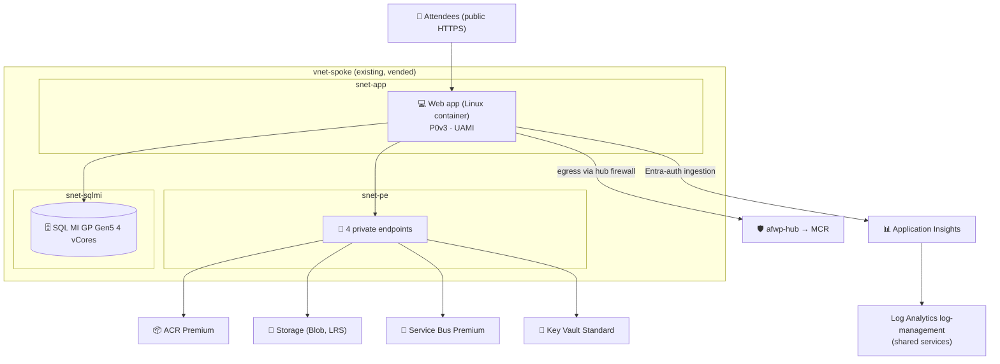
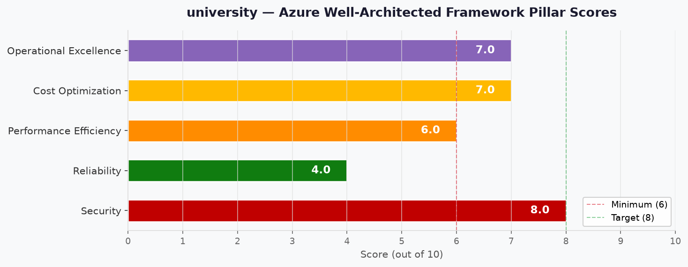

# 🏛️ Step 2: Architecture Assessment - university

[Review and approval status](README.md#-workflow-progress)

<strong>📑 Assessment Contents</strong>

- [✅ Requirements Validation](#-requirements-validation)
- [💎 Executive Summary](#-executive-summary)
- [🏛️ WAF Pillar Assessment](#-waf-pillar-assessment)
- [📦 Resource SKU Recommendations](#-resource-sku-recommendations)
- [🎯 Architecture Decision Summary](#-architecture-decision-summary)
- [🚀 Implementation Handoff](#-implementation-handoff)
- [🔒 Approval Gate](#-approval-gate)
- [References](#references)

> Generated by architect agent | 2026-10-06

| ⬅️ Previous                              | 📑 Index            | Next ➡️                                            |
| ---------------------------------------- | ------------------- | -------------------------------------------------- |
| [01-requirements.md](01-requirements.md) | [README](README.md) | [03-des-cost-estimate.md](03-des-cost-estimate.md) |

## ✅ Requirements Validation

| Requirement Area        | Status     | Validation Notes                                                                                                                  |
| ----------------------- | ---------- | --------------------------------------------------------------------------------------------------------------------------------- |
| NFRs (SLA, RTO, RPO)    | ✅ Defined | Best-effort SLA/RTO/RPO accepted by the owner; recovery is redeploy from IaC; < 50 concurrent users                                |
| Compliance requirements | ✅ Defined | No regulatory framework; ALZ-lite deny policies at `mg-factory-corp` are binding                                                  |
| Budget (approximate)    | ✅ Defined | Soft; ≈ $1.83/hour workload (brief). Re-priced here via the pricing worker                                                       |
| Scale requirements      | ✅ Defined | < 50 users, < 64 GB SQL data, low message volume; flat 12-month projection                                                         |
| Security controls       | ✅ Defined | Private endpoints, Entra-only, UAMI, local/shared-key auth off; two public exceptions and one named ACR network-rule exception       |
| Data residency          | ⚠️ Partial | EU-only via allowed-locations policy. The governance file is a pre-staged stand-in; live discovery at Step 3.5 must confirm it    |

> [!WARNING]
> Any ❌ items above must be resolved before proceeding to implementation.

### Required Capability Dependencies

| Required capability | Consumer/producer | Dependency and owner | Evidence scope/date | Design status | Runtime status |
| --- | --- | --- | --- | --- | --- |
| Web app VNet egress incl. image pull (cap. 3) | Web app → `snet-app` | P0v3 regional VNet integration; `outboundVnetRouting.allTraffic` + `imagePullTraffic`; spoke owned by vending (B08) | Learn: VNet integration tiers and routing; spoke validated live 2026-10-06 | Designed | Unverified |
| Placeholder image pull from MCR (cap. 18) | Web app → `mcr.microsoft.com` | `afwp-hub` rule `app-to-mcr` (vending B08, shared services subscription); firewall tier Standard | Firewall/policy observed live 2026-10-06; rule content not read | Designed | Unverified |
| Private ACR + `az acr import` (cap. 4) | Deploying member → ACR | Premium tier (private endpoint), `networkRuleBypassOptions: AzureServices`, Data Importer + Data Reader roles | Learn: ACR Private Link requires Premium; import from restricted registry needs trusted services | Designed | Unverified (post-deploy import test) |
| Web app pulls from private ACR (readiness) | Web app → ACR | UAMI AcrPull; `outboundVnetRouting.imagePullTraffic`; ACR private endpoint + central DNS. Post-deploy check, not a pre-deploy gate: import the placeholder into ACR, switch the app to the registry copy, restart, expect HTTP 200. Registry public access is off, so a successful pull proves private resolution and routing of the login and data endpoints | Challenger finding 856501fb, owner disposition 2026-10-06 | Designed | Unverified (runs after the MCR startup test) |
| Private DNS for 4 endpoints (cap. 15) | Web app → ACR, Blob, Service Bus, Key Vault | Central zones + DINE policies in the shared services subscription (landing zone) | Pre-staged governance file, 2026-10-02 | Designed | Unverified (Step 3.5 + post-deploy) |
| Entra-only telemetry ingestion | Web app → Application Insights | `DisableLocalAuth: true`; UAMI Monitoring Metrics Publisher; app SDK credential (B06/B10) | Learn: Entra auth for Application Insights | Designed (app-side dependency) | Unverified |
| SQL MI in delegated subnet (cap. 5) | SQL MI → `snet-sqlmi` | Delegation + `nsg-sqlmi` + `rt-sqlmi` owned by vending; IaC declares no NSG/route | Spoke validated live 2026-10-06 | Designed | Unverified |
| Region gates (cap. 16) | Deployment preflight | Hub and `log-management` regions ∈ {swedencentral, germanywestcentral} | Hub observed in `swedencentral` 2026-10-06; workspace region not read | Designed | Unverified |
| Budget presence (cap. 17) | Deployment preflight | `budget-factory-workload` from vending (B08) | Not read at Step 2 | Designed | Unverified |
| SQL MI stop/start schedule (cap. 12) | SQL MI | Native `startStopSchedules@2025-01-01`; blocked while MI link active (before C7) | Learn: stop/start limitations and billing | Designed | Not applicable until C7 |

---

## 💎 Executive Summary

The workload is a single-region, single-environment N-tier platform: a Linux container web app on App Service, a
private ACR, SQL Managed Instance, Blob storage, a Service Bus queue, Key Vault and Application Insights. It sits
inside an existing, already-vended Corp spoke and creates no network or DNS resources. Every SKU is a user pin; Step 2
verified each pin rather than replacing it. P0v3 supports regional VNet integration, so the brief's fallback to a
larger Premium v3 tier is not needed. All SKUs are offered in both approved regions.

The design optimizes **security** inside a policy-bound landing zone and accepts **best-effort reliability**. The
private-endpoint requirement forces Premium tiers on Service Bus and ACR. Service Bus Premium alone is 51% of the
workload cost. The verified run rate is **$1,320.95/month (≈ $1.81/hour)**, 1.1% below the brief's ~$1.83/hour.

### Recommended Architecture

---

## 🏛️ WAF Pillar Assessment

### Overall Scores

| Pillar                    | Score | Confidence | Summary                                                                                       |
| ------------------------- | ----- | ---------- | --------------------------------------------------------------------------------------------- |
| 🔒 Security               | 8/10  | High       | Private PaaS, Entra-only, UAMI, local auth off; public web front end has no WAF                |
| 🔄 Reliability            | 4/10  | High       | Best-effort by design: single instance, no zones on app/MI, LRS; recovery is redeploy          |
| ⚡ Performance            | 6/10  | Medium     | Adequate for < 50 users; no load test or autoscale; MI start takes ~20 min after a stop        |
| 💰 Cost Optimization      | 7/10  | Medium     | On-demand, AHB applied, native schedule; Premium tiers forced by policy dominate cost           |
| 🔧 Operational Excellence | 7/10  | Medium     | Bicep + AVM, policy-driven diagnostics, explicit preflights; few alerts, governance pre-staged  |

Composite score: 6.4/10 (mean of the five pillars).

**Primary Pillar Optimized**: Security (within ALZ-lite deny policies)
**Trade-offs Accepted**: Reliability is best-effort (owner-accepted for a lab). Cost carries Premium tiers forced by
the private-endpoint mandate rather than by load.

### Service Maturity Assessment

| Service | Lifecycle status | WAF service guide | AVM Bicep (latest stable, 2026-10-06) | Notes |
| --- | --- | --- | --- | --- |
| App Service (Linux, P0v3) | ✅ GA | ✅ app-service-web-apps | `avm/res/web/serverfarm` 0.7.0, `avm/res/web/site` 0.24.0 | `outboundVnetRouting.imagePullTraffic` replaces legacy `vnetImagePullEnabled` |
| Container Registry Premium | ✅ GA | ❌ none (Learn search) | `avm/res/container-registry/registry` 0.13.1 | `zoneRedundancy` property is legacy; zone redundancy is automatic in AZ regions |
| SQL Managed Instance GP Gen5 | ✅ GA | ❌ none (Learn search) | `avm/res/sql/managed-instance` 0.5.1 | `SQLServer2022` update policy must be explicit; newer API versions change the default |
| Storage (StorageV2, LRS) | ✅ GA | ✅ azure-blob-storage | `avm/res/storage/storage-account` 0.33.1 | — |
| Service Bus Premium | ✅ GA | ✅ azure-service-bus | `avm/res/service-bus/namespace` 0.17.1 | — |
| Key Vault Standard | ✅ GA | ❌ none (Learn search) | `avm/res/key-vault/vault` 0.14.2 | RBAC authorization |
| Application Insights (workspace-based) | ✅ GA | ✅ application-insights | `avm/res/insights/component` 0.8.0 | `DisableLocalAuth: true` |
| User-assigned identity | ✅ GA | — | `avm/res/managed-identity/user-assigned-identity` 0.6.0 | — |
| Private endpoint | ✅ GA | — | `avm/res/network/private-endpoint` 0.12.1 | DNS zone groups left to DINE |

No deprecated or retiring service is in scope. Step 4 re-pins AVM versions at plan time.

---

### 🔒 Security Assessment (8/10)

**Strengths:**

- Every PaaS data service (ACR, Blob, Service Bus, Key Vault) is reachable only through private endpoints with public
  network access disabled. Each is backed by a deny policy at `mg-factory-corp`.
- SQL MI is VNet-injected, Entra-only, with the public data endpoint off.
- One user-assigned identity carries only data-plane roles (AcrPull, Blob Data Contributor, Service Bus Sender +
  Receiver, Secrets User, Monitoring Metrics Publisher). It is role-assigned before the first image pull.
- No secrets in app settings; the connection string lives in Key Vault (RBAC authorization). Shared-key, SAS and the
  ACR admin user are disabled.
- Application Insights is Entra-only (`DisableLocalAuth: true`), so its public ingestion endpoint accepts only
  authenticated telemetry.

**Gaps:**

- The public HTTPS front end has no WAF and no end-user authentication; both were explicitly excluded from B09.
- The ACR trusted-services bypass widens the registry's network rule set; owner-accepted, test-gated.
- Key Vault purge protection is off to allow teardown and redeploy; deleted secrets are recoverable only during the
  soft-delete period.
- No NSG on `snet-app` and `snet-pe` is an accepted landing-zone decision (B08); the hub firewall filters egress.

**Recommendations:**

1. Configure the web app for HTTPS-only, minimum TLS 1.2, FTPS disabled and HTTP/2 on; keep basic publishing
   credentials off.
2. Scope the deployer's role-assignment rights to the listed role definitions using a condition, where supported (Step 4).
3. Run the post-deploy ACR import test before claiming the import capability. Do not widen ACR access if it fails.

### 🔄 Reliability Assessment (4/10)

**Strengths:**

- ACR Premium and Service Bus Premium gain zone redundancy automatically in `swedencentral` at no extra cost.
- SQL MI takes automated backups (Local redundancy) with point-in-time restore. The platform is fully reproducible
  from Bicep.
- Explicit preflights (capabilities 14–18) stop deployment early instead of leaving a half-built platform.

**Gaps:**

- The web app runs on a single P0v3 instance with no zone redundancy, and SQL MI General Purpose is a single instance
  with no zone redundancy. Both are single points of failure (owner-accepted).
- After C7, the stop/start schedule makes SQL MI unavailable outside 07:30–18:30 on weekdays and all weekend. A start
  takes about 20 minutes, and no backups are taken while stopped.
- No health check or availability test is defined.

**Recommendations:**

1. Configure an App Service health check path on the placeholder (and later the real) image so that unhealthy
   instances are restarted.
2. Document in the README that out-of-hours checks must start the MI first and allow about 20 minutes.

### ⚡ Performance Assessment (6/10)

**Strengths:**

- Low, steady demand (< 50 users) fits a single P0v3 instance and a 4-vCore General Purpose MI.
- App-to-PaaS traffic stays inside the VNet through private endpoints; no hairpin through the hub firewall.

**Gaps:**

- No performance targets, load test or autoscale rule; capacity is fixed at one instance.
- Service Bus Premium (1 MU) is sized by the private-endpoint mandate, not by throughput, so it is heavily
  over-provisioned for notifications.

**Recommendations:**

1. Add a short smoke load test to the C7 cutover checklist (B06/B10 own the app).
2. Keep `alwaysOn` enabled so the first request after idle does not pay a cold start.

### 💰 Cost Assessment (7/10)

| Metric           | Value                                                            |
| ---------------- | ---------------------------------------------------------------- |
| Monthly Estimate | ~$1,320.95/month (≈ $1.81/hour)                                   |
| Annual Estimate  | ~$15,851.40/year                                                  |
| Budget Status    | ✅ Within the soft budget (1.1% below the brief's ~$1.83/hour)    |
| Confidence       | Medium                                                            |

> 📎 Full cost breakdown: [03-des-cost-estimate.md](03-des-cost-estimate.md)

**Cost Optimization Applied:**

- Azure Hybrid Benefit on SQL MI (owner assumption on licence eligibility). The licence-included alternative is
  shown in the cost estimate.
- The native SQL MI stop/start schedule replaces Automation or a Logic App: no extra resource or runbook. It takes
  effect only after C7 removes the MI link.
- On-demand only: no reservation lock-in for a teardown/redeploy lab.
- Shared central services (private DNS zones, Log Analytics, hub firewall) are reused, not duplicated; their variable
  charges are shown separately.

**Cost monitoring routing:** cost monitoring is inherited from the landing zone (`cost_monitoring_mode = deferred`).

- **Budget:** the subscription-scope budget `budget-factory-workload`, created by vending (B08), sends an e-mail alert
  at 80%. The archetype only checks it read-only (capability 17).
- **Action Group:** none. The archetype creates no Action Group (`ag-cost-university` is not created) and no budget,
  so notifications go to the vending budget's contacts and are not extended with `contactRoles: ["Owner"]`.
- **Anomaly alert:** none. No subscription-scoped daily anomaly alert is created under this mode.
- **Exception:** the opt-down is allowed in non-production via `cost_monitoring_mode ∈ {minimal, deferred}`. It
  expires 2027-01-03, or earlier if the B08 vending budget changes or an event date is set. Step 3.5 persists it in
  governance state.

### 🔧 Operational Excellence Assessment (7/10)

**Strengths:**

- The platform is fully defined in Bicep with AVM modules; only three human inputs (tenant, workload subscription,
  `suffix`). Everything else is discovered at deploy time.
- ALZ-lite DINE policies route diagnostics to the central `log-management` workspace for App Service, SQL MI,
  Key Vault, Service Bus, ACR, Application Insights and Blob services. ALZ-lite has no private-endpoint diagnostics
  policy (B08), so the archetype owns an explicit `AllMetrics` diagnostic setting on each of the four private
  endpoints. Private endpoints have no resource-log categories, so there is no `AllLogs` setting.
- Preflights (capabilities 14–18) and post-deploy tests fail closed with clear messages. The post-deploy tests run
  in order: MCR placeholder startup (HTTP 200), ACR import, then the web app pulling the imported copy from the
  private ACR with its UAMI (HTTP 200), plus private DNS resolution.

**Gaps:**

- No operational alerts beyond the inherited budget alert; Application Insights telemetry is not wired to any action.
- The governance constraints file is a pre-staged stand-in, not live discovery. Tenant-level Modify policies and the
  tag-policy contract are unknown until Step 3.5.
- Telemetry depends on the app enabling Entra authentication (B06/B10); until then ingestion is rejected.

**Recommendations:**

1. At Step 4, decide whether IaC also declares diagnostic settings on the DINE-covered resources or relies on DINE,
   so the same workspace does not receive duplicate settings. Private-endpoint diagnostics are always explicit.
2. Add a README check step listing the post-deploy tests and their expected results.

---

## 📦 Resource SKU Recommendations

Rendered from [sku-manifest.json](sku-manifest.json) rev 2. All rows are user pins verified at Step 2; prices come
from the pricing worker ([02-cost-estimate.json](02-cost-estimate.json)). Services outside the manifest's scope
(Key Vault, private endpoints, Application Insights, identity) are listed after the manifest rows.

| Service | Recommended SKU | Configuration | Monthly Est. | Justification |
| --- | --- | --- | --- | --- |
| App Service Plan | P0v3 (Linux) | 1 instance, VNet-integrated, container | $64.97 | User pin; regional VNet integration verified (Basic and above) |
| Container Registry | Premium | Private endpoint, admin off, trusted-services bypass | $50.69 | User pin; Private Link requires Premium |
| SQL Managed Instance | GP_Gen5, 4 vCores, 64 GB | `BasePrice` (AHB), `Local` backups, `SQLServer2022`, Entra-only | $497.68 | User pin; compute $488.92 + storage $8.76 + backup $0.00 |
| Storage Account | Standard_LRS (StorageV2, Hot) | Private endpoint (blob), shared key off | $1.08 | User pin; LRS keeps data in one EU region |
| Service Bus | Premium, 1 MU | Private endpoint, local auth off | $677.08 | User pin; private endpoints require Premium |
| Key Vault | Standard | RBAC authorization, soft delete on, purge protection off | $0.15 | Architect-derived; no HSM keys needed |
| Private endpoints | Standard ×4 | ACR, Blob, Service Bus, Key Vault in `snet-pe` | $29.30 | Architect-derived; required by deny policies |
| Application Insights | Workspace-based | `DisableLocalAuth: true`, central workspace | Shared services | Ingestion billed to the shared services subscription |
| User-assigned identity | — | One UAMI for the web app | No charge | Not priced (no workload meter) |

<strong>SQL Managed Instance</strong> — Licence Model Comparison

Compute and licence only; storage and backup are identical across options. Source:
[02-cost-estimate-sqlmi-options.json](02-cost-estimate-sqlmi-options.json).

| Option | Hours/month | Price/mo | Fits? |
| --- | --- | --- | --- |
| AHB (`BasePrice`), 24×7 | 730 | $488.92 | ✅ Selected (owner licence assumption) |
| Licence-included, 24×7 | 730 | $780.82 | ⚠️ Fallback if licence eligibility is not confirmed (+$291.90/mo) |
| AHB, scheduled (after C7) | 260.7 | $174.61 | ✅ Post-cutover steady state |
| Licence-included, scheduled (after C7) | 260.7 | $278.85 | ⚠️ Fallback, post-cutover |

**Selected**: AHB. The owner states the partner holds eligible SQL Server core licences with Software Assurance; the
README documents how to switch to `LicenseIncluded`.

<strong>Service Bus</strong> — Tier Fit

| Tier | Private endpoint support | Price/mo | Fits? |
| --- | --- | --- | --- |
| Basic | No | Not priced | ❌ Fails the public-access deny policy |
| Standard | No | Not priced | ❌ Fails the public-access deny policy |
| Premium (1 MU) | Yes | $677.08 | ✅ Only compliant tier |

**Selected**: Premium. It is the only tier that supports private endpoints, so cost is set by policy, not throughput.

---

## 🎯 Architecture Decision Summary

| Decision | Choice | Rationale |
| --- | --- | --- |
| Network placement | Existing vended spoke, no network/DNS resources created | Requirement 1; subnets validated live (`snet-app` /26, `snet-pe` /26, `snet-sqlmi` /26) |
| Web app egress | `outboundVnetRouting.allTraffic` + `imagePullTraffic` true | Learn recommends `imagePullTraffic` over legacy settings; auditable by policy |
| SQL MI schedule | Native `Microsoft.Sql/managedInstances/startStopSchedules@2025-01-01`, name `default`, one entry per weekday | Free, no extra identity; stable API only (owner condition) |
| SQL MI update policy | `SQLServer2022` set explicitly | Newer API versions default to a different policy; the switch is one-way |
| SQL MI licence | AHB (`BasePrice`) | Owner decision; licence-included priced as fallback |
| Identity | One UAMI for all data-plane access | Roles exist before first image pull; matches `AZURE_CLIENT_ID` app setting |
| Telemetry | Workspace-based App Insights, Entra-only ingestion | Removes key-based ingestion on the public endpoint |
| Region | `swedencentral` (hub region); `germanywestcentral` approved alternate | Every SKU offered in both regions; the alternate would be ~$0.10/month higher |
| Environment identifiers | None in artifacts | Public repo reused by every member (owner rule) |

### Top Architecture Risks

| Risk | WAF Pillar | Likelihood | Impact | Mitigation |
| --- | --- | --- | --- | --- |
| Private DNS registration by DINE is late or misconfigured, so the app cannot resolve private endpoints | 🔒 | 🟡 Med | 🔴 High | Step 3.5 verifies DINE scope and identity; post-deploy resolution test from `snet-app` gates readiness |
| App does not send Entra-authenticated telemetry, so ingestion is rejected | 🔧 | 🟡 Med | 🟡 Med | Track as a B06/B10 dependency; never re-enable local auth |
| MI link keeps SQL MI running 24×7 until C7, so schedule savings do not materialize | 💰 | 🔴 High | 🟡 Med | Price at 730 h; README states savings start only after cutover |
| Live governance differs from the pre-staged file (tenant Modify policies, tag contract) | 🔒 | 🟡 Med | 🟡 Med | Step 3.5 live discovery; reconcile before planning |
| ACR import (trusted-services bypass) or the web app's pull from the private ACR fails, breaking the C6 image switch | 🔄 | 🟡 Med | 🔴 High | Post-deploy import test, then a readiness check that pulls the imported placeholder with the UAMI and expects HTTP 200; no fallback widening of ACR access |

---

## 🚀 Implementation Handoff

### Handoff Readiness

The architecture is ready for review. Every SKU is a verified user pin; pricing is complete (workload, licence and
schedule comparisons, shared-services lines, manifest writeback). Open items carried forward: live governance
discovery (Step 3.5), the DINE readiness gate, and the B06/B10 telemetry dependency.

| Parameter      | Value                                                                    |
| -------------- | ------------------------------------------------------------------------ |
| Region         | `swedencentral` (derived from the hub; `germanywestcentral` approved)    |
| Environment    | dev                                                                      |
| Budget         | Soft ≈ $1.83/hour (estimated: $1,320.95/month ≈ $1.81/hour)              |
| Resource Count | 16 resources (13 top-level incl. 4 private endpoints, 3 child resources) plus 4 private-endpoint diagnostic settings and role assignments |

### Resources to Provision

| #   | Resource | SKU | Key Config |
| --- | --- | --- | --- |
| 1 | App Service plan | P0v3 Linux | 1 instance |
| 2 | Web app (container) | — | UAMI; `snet-app` integration; `allTraffic` + `imagePullTraffic`; `WEBSITES_PORT=8080`; deployed on `mcr.microsoft.com/dotnet/samples:aspnetapp-10.0`, then switched post-deploy to the ACR copy of the same image and left there, so C6 changes only the image and tag |
| 3 | Container registry | Premium | `publicNetworkAccess: Disabled`, `networkRuleBypassOptions: AzureServices`, admin user off |
| 4 | SQL Managed Instance | GP_Gen5, 4 vCores, 64 GB | `snet-sqlmi`; `BasePrice`; `Local` backups; `SQLServer2022`; Entra-only, admin = deployer; public endpoint off |
| 5 | SQL MI start/stop schedule (child) | — | `startStopSchedules@2025-01-01`, `default`, Mon–Fri 07:30–18:30, `timeZoneId` parameter |
| 6 | Storage account | Standard_LRS, StorageV2 | Public access off, shared key off, no public blob |
| 7 | Blob container (child) | — | `teaching-materials` |
| 8 | Service Bus namespace | Premium, 1 MU | Public access off, local auth off |
| 9 | Service Bus queue (child) | — | `notifications` |
| 10 | Key Vault | Standard | RBAC, public access off, soft delete on, purge protection off; secret value not set |
| 11 | Application Insights | Workspace-based | `log-management` (shared services), `DisableLocalAuth: true` |
| 12 | User-assigned identity | — | Roles assigned before the web app is created |
| 13–16 | Private endpoints ×4 | Standard | `snet-pe`; ACR registry, Blob, Service Bus, Key Vault; no DNS zone groups (DINE); explicit diagnostic setting `AllMetrics` → `log-management` on each |

### Security Requirements for Implementation

| Requirement | Implementation |
| --- | --- |
| Private PaaS | `publicNetworkAccess: 'Disabled'` on ACR, Storage, Service Bus, Key Vault; `publicDataEndpointEnabled: false` on SQL MI |
| Identity-only access | `allowSharedKeyAccess: false`, `disableLocalAuth: true` (Service Bus, App Insights), `adminUserEnabled: false`, MI `azureADOnlyAuthentication: true` |
| Transport | Web app `httpsOnly: true`, `minTlsVersion: '1.2'`, `ftpsState: 'Disabled'`, `http20Enabled: true`; Storage `minimumTlsVersion: 'TLS1_2'` |
| Least privilege | UAMI role assignments scoped to each resource; Monitoring Metrics Publisher on the App Insights component |
| No network declarations | Reference `vnet-spoke` subnets as `existing`; no NSG, route table, DNS zone or zone group |
| Stable APIs | Stable API versions only for every resource (owner condition) |

### Monitoring Requirements for Implementation

| Requirement | Implementation |
| --- | --- |
| App telemetry | `APPLICATIONINSIGHTS_CONNECTION_STRING` app setting; Entra-authenticated SDK via `AZURE_CLIENT_ID` (B06/B10) |
| Resource diagnostics | DINE policies to `log-management` for DINE-covered types (Step 4 decides on explicit settings there to avoid duplicates) |
| Private-endpoint diagnostics | Archetype-owned: one diagnostic setting per private endpoint, `AllMetrics` only (no resource-log categories), to `log-management`; no DINE-only path. DNS registration stays policy-owned |
| Health | App Service health check path; post-deploy HTTP 200 on the public endpoint, first from the MCR placeholder, then from the private ACR copy pulled with the UAMI |
| Cost | Inherited `budget-factory-workload` (read-only preflight); no Action Group or anomaly alert |

---

## 🔒 Approval Gate

> [!IMPORTANT]
> **🏗️ Architecture Assessment: approval tracked separately**
>
> | Pillar      | Score |
> | ----------- | ----- |
> | Security    | 8/10  |
> | Reliability | 4/10  |
> | Performance | 6/10  |
> | Cost        | 7/10  |
> | Operations  | 7/10  |
>
> **Estimated Monthly Cost**: ~$1,320.95 (within the soft budget; ≈ $1.81/hour vs ~$1.83/hour)
>
> **Confidence Level**: Medium
>
> Current status: [project workflow progress](README.md#-workflow-progress) and recall Step 2 decisions.
> Review evidence: [architecture findings](challenge-findings-architecture.json) and
> [cost-feasibility findings](challenge-findings-cost-estimate.json).
> Per-finding dispositions: [decision sidecar](challenge-findings-architecture-decisions.json), when findings exist.
>
> Request approval only after required review evidence is ready. Otherwise record
> the blocked state and return to the owning agent; do not mark Step 2 complete.
> Record the approver and decision timestamp outside this reviewed document. Do not toggle checkboxes or badges here.

---

## References

> [!NOTE]
> 📚 The following Microsoft Learn resources informed this assessment.

| Topic | Link |
| --- | --- |
| Well-Architected Framework | [Overview](https://learn.microsoft.com/azure/well-architected/) |
| Security Checklist | [WAF Security](https://learn.microsoft.com/azure/well-architected/security/checklist) |
| Reliability Checklist | [WAF Reliability](https://learn.microsoft.com/azure/well-architected/reliability/checklist) |
| Cost Optimization | [WAF Cost](https://learn.microsoft.com/azure/well-architected/cost-optimization/checklist) |
| App Service WAF guide | [Service guide](https://learn.microsoft.com/azure/well-architected/service-guides/app-service-web-apps) |
| Service Bus WAF guide | [Service guide](https://learn.microsoft.com/azure/well-architected/service-guides/azure-service-bus) |
| VNet integration routing | [Configure routing](https://learn.microsoft.com/azure/app-service/configure-vnet-integration-routing) |
| SQL MI stop and start | [Stop and start an instance](https://learn.microsoft.com/azure/azure-sql/managed-instance/instance-stop-start-how-to) |
| SQL MI update policy | [Update policy](https://learn.microsoft.com/azure/azure-sql/managed-instance/update-policy) |
| ACR zone redundancy | [Zone redundancy](https://learn.microsoft.com/azure/container-registry/zone-redundancy) |
| Private Link availability | [Service availability](https://learn.microsoft.com/azure/private-link/availability) |
| App Insights Entra auth | [Microsoft Entra authentication](https://learn.microsoft.com/azure/azure-monitor/app/azure-ad-authentication) |
| Azure Pricing Calculator | [Calculator](https://azure.microsoft.com/pricing/calculator/) |

---

_Assessment performed using Azure Well-Architected Framework. Pricing data from Azure Resource Manager MCP (2026-10-06)._

---

| ⬅️ [01-requirements.md](01-requirements.md) | 🏠 [Project Index](README.md) | ➡️ [03-des-cost-estimate.md](03-des-cost-estimate.md) |
| ------------------------------------------- | ----------------------------- | ----------------------------------------------------- |

