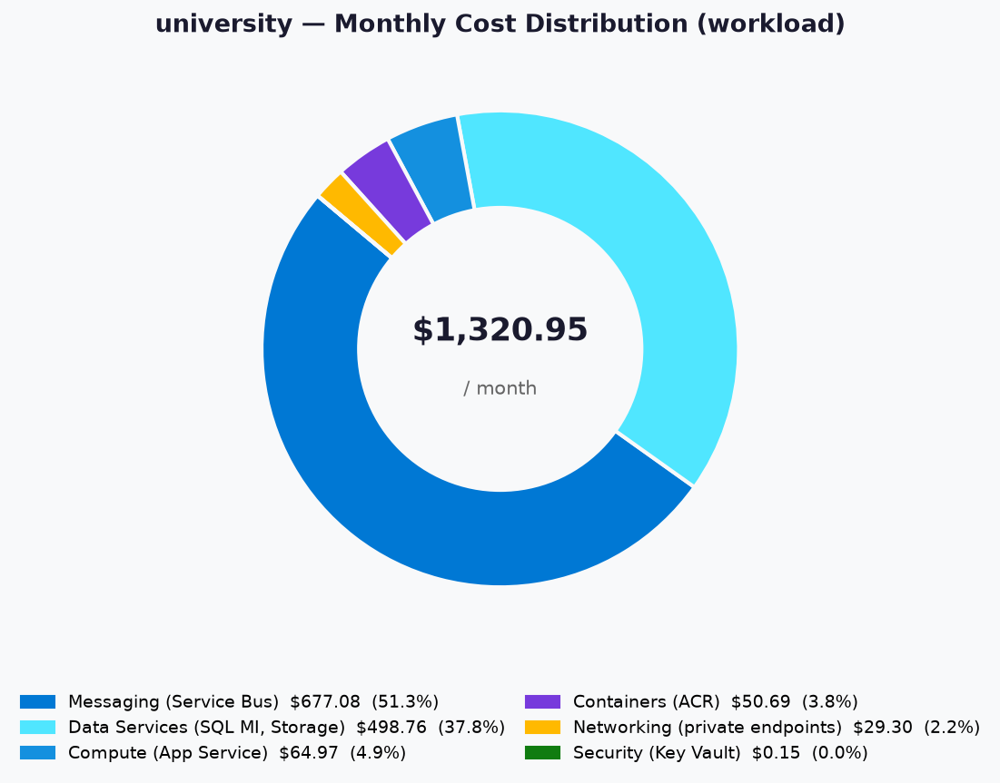
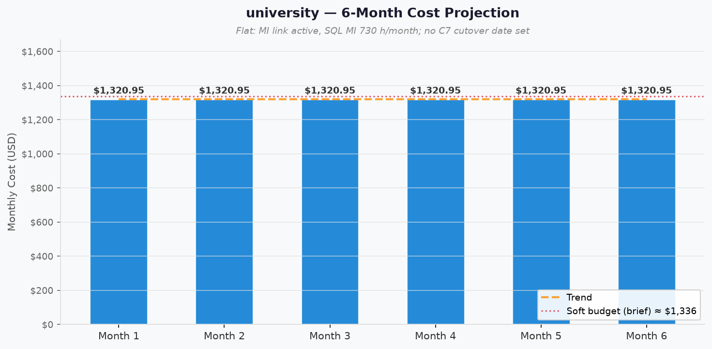

# 💰 Azure Cost Estimate: university


[Review and approval status](README.md#-workflow-progress)


<details open>
<summary><strong>📑 Cost Estimate Contents</strong></summary>

- [💵 Cost At-a-Glance](#-cost-at-a-glance)
- [✅ Decision Summary](#-decision-summary)
- [🔁 Requirements → Cost Mapping](#-requirements--cost-mapping)
- [📊 Top 5 Cost Drivers](#-top-5-cost-drivers)
- [🏛️ Architecture Overview](#-architecture-overview)
- [🧾 What We Are Not Paying For (Yet)](#-what-we-are-not-paying-for-yet)
- [⚠️ Cost Risk Indicators](#-cost-risk-indicators)
- [🎯 Quick Decision Matrix](#-quick-decision-matrix)
- [💰 Savings Opportunities](#-savings-opportunities)
- [🧾 Detailed Cost Breakdown](#-detailed-cost-breakdown)
- [References](#references)

</details>

> Generated by architect agent | 2026-10-06

| ⬅️ Previous                                                    | 📑 Index            | Next ➡️                                                      |
| -------------------------------------------------------------- | ------------------- | ------------------------------------------------------------ |
| [02-architecture-assessment.md](02-architecture-assessment.md) | [README](README.md) | [04-governance-constraints.md](04-governance-constraints.md) |

**Generated**: 2026-10-06
**Region**: swedencentral (comparison: germanywestcentral)
**Environment**: Development (training/demo)
**MCP Tools Used**: get_retail_prices
**Architecture Reference**: [02-architecture-assessment.md](02-architecture-assessment.md)
**Pricing Evidence**: [02-cost-estimate.json](02-cost-estimate.json) (workload),
[02-cost-estimate-sqlmi-options.json](02-cost-estimate-sqlmi-options.json) (licence and schedule),
[02-cost-estimate-sqlmi-schedule.json](02-cost-estimate-sqlmi-schedule.json) (schedule),
[02-cost-estimate-shared-services.json](02-cost-estimate-shared-services.json) (shared services),
[02-cost-estimate-manifest.json](02-cost-estimate-manifest.json) (manifest writeback)

Review and human approval are recorded in recall, decision sidecars and the project index.
Finalize this document before review; do not change its status text afterward merely to record approval.

## 💵 Cost At-a-Glance

> **Monthly Total: ~$1,320.95** | Annual: ~$15,851.40 | Hourly: ≈ $1.81 (÷ 730)
>
> ```text
> Budget: ~$1.83/hour (soft, B09 brief) | Utilization: 99% ($1.81 of $1.83 per hour; 1.1% under)
> ```
>
> | Status            | Indicator                                                        |
> | ----------------- | ---------------------------------------------------------------- |
> | Cost Trend        | ➡️ Stable until C7; schedule then removes $314.32/month          |
> | Savings Available | 💰 Not quantified for reservations (on-demand only by decision)  |
> | Compliance        | ✅ ALZ-lite deny policies (private PaaS, EU locations)           |

## ✅ Decision Summary

- ✅ Confirmed inputs: five user-pinned SKUs (P0v3, ACR Premium, SQL MI GP_Gen5 4 vCores with AHB, Standard_LRS,
  Service Bus Premium 1 MU) plus architect-derived Key Vault Standard, 4 private endpoints and the native SQL MI
  schedule. SKU confirmation approved before pricing; this is not final architecture approval.
- ⏳ Deferred: shared-services charges (Log Analytics ingestion, hub firewall data processing) shown separately; the
  schedule saving starts only after C7 cutover removes the MI link.
- 🔁 Redesign Trigger: SQL licence eligibility not confirmed (switch to licence-included, +$291.90/month); a move
  outside the two approved regions; or a requirement for zone redundancy or a production SLA.

**Confidence**: Medium | **Expected Variance**: ±5% (fixed hourly meters dominate; only small variable meters use
assumed usage)

## 🔁 Requirements → Cost Mapping

| Requirement | Architecture Decision | Cost Impact | Mandatory |
| --- | --- | --- | --- |
| Private PaaS (ALZ-lite deny on public access) | Service Bus Premium (only tier with private endpoints) | +$677.08/month 📈 | Yes |
| Private PaaS (ALZ-lite deny on public access) | ACR Premium (Private Link requires Premium) | +$50.69/month | Yes |
| Private PaaS (ALZ-lite deny on public access) | 4 private endpoints + data processing | +$29.30/month | Yes |
| SQL Server migration target (cap. 5) | SQL MI GP_Gen5 4 vCores, 64 GB, AHB | +$497.68/month 📈 | Yes |
| Containerized web app with VNet egress (cap. 3) | App Service P0v3 Linux, 1 instance | +$64.97/month | Yes |
| Teaching materials (cap. 6) | Storage Standard_LRS Hot | +$1.08/month | Yes |
| Runtime secrets (cap. 8) | Key Vault Standard | +$0.15/month | Yes |
| SQL MI event hours (cap. 12) | Native stop/start schedule | −$314.32/month after C7 | No (Should) |
| Best-effort SLA/RTO/RPO | Single instance, no zone redundancy, LRS | $0 extra | Yes |

## 📊 Top 5 Cost Drivers

| Rank | Resource | Monthly Cost | % of Total | Trend | Optimization |
| ---- | --- | --- | --- | --- | --- |
| 1️⃣ | Service Bus Premium, 1 MU | $677.08 | 51.3% | ➡️ | None within policy: Premium is the only private-endpoint tier |
| 2️⃣ | SQL MI GP_Gen5 4 vCores (AHB) + 64 GB | $497.68 | 37.7% | ↘️ after C7 | Native schedule after cutover (−$314.32/month) |
| 3️⃣ | App Service P0v3 Linux | $64.97 | 4.9% | ➡️ | Smallest Premium v3 SKU; already minimal |
| 4️⃣ | Container Registry Premium | $50.69 | 3.8% | ➡️ | None within policy: Private Link requires Premium |
| 5️⃣ | Private endpoints ×4 | $29.30 | 2.2% | ➡️ | Required by policy; one endpoint per service |

> 💡 **Quick Win**: tear the workload down between events. Every fixed meter here is hourly or daily, so the
> ≈ $1.81/hour run rate stops when the resources are deleted (redeploy from IaC).

<details>
<summary><strong>Cost Driver Details</strong></summary>

#### 1️⃣ Service Bus Premium

| Aspect            | Detail                                                                          |
| ----------------- | ------------------------------------------------------------------------------- |
| Current SKU       | Premium, 1 messaging unit                                                       |
| Monthly Cost      | $677.08                                                                         |
| Cost Breakdown    | Premium Messaging Unit $0.9275/hour × 730 hours                                 |
| Optimization      | None compliant: Basic and Standard do not support private endpoints             |
| Potential Savings | $0 within the current policy set                                                |

#### 2️⃣ SQL Managed Instance

| Aspect            | Detail                                                                                   |
| ----------------- | ---------------------------------------------------------------------------------------- |
| Current SKU       | General Purpose, Standard-series (Gen5), 4 vCores, 64 GB, `BasePrice` (AHB)              |
| Monthly Cost      | $497.68                                                                                  |
| Cost Breakdown    | compute: $488.92, storage: $8.76, backup: $0.00                                           |
| Optimization      | Native schedule Mon–Fri 07:30–18:30 after C7 (compute $174.61 instead of $488.92)          |
| Potential Savings | $314.32/month after C7 with schedule                                                     |

</details>

## 🏛️ Architecture Overview

### Cost Distribution

| Category | Monthly Cost (USD) | Share |
| --- | ---: | ---: |
| 📨 Messaging (Service Bus) | 677.08 | 51.3% |
| 💾 Data Services (SQL MI, Storage) | 498.76 | 37.8% |
| 💻 Compute (App Service) | 64.97 | 4.9% |
| 📦 Containers (ACR) | 50.69 | 3.8% |
| 🌐 Networking (private endpoints) | 29.30 | 2.2% |
| 🔐 Security (Key Vault) | 0.15 | <0.1% |



### Month-over-Month Projection



Flat at $1,320.95/month: usage does not grow, no C7 cutover date is set, and the MI link keeps SQL MI running 24×7.
After cutover, the schedule lowers the run rate by $314.32/month.

### Key Design Decisions Affecting Cost

| Decision | Cost Impact | Business Rationale | Status |
| --- | --- | --- | --- |
| AHB on SQL MI | −$291.90/month vs licence-included 📉 | Owner assumption: eligible SQL Server core licences with Software Assurance | Required |
| Native SQL MI schedule instead of Automation/Logic App | $0 for the mechanism; −$314.32/month after C7 📉 | Event-hours usage; no extra resource or identity | Optional |
| Private endpoints for all PaaS data services | +$757.07/month incl. forced Premium tiers 📈 | ALZ-lite deny policies on public network access | Required |
| No zone redundancy on app or MI | $0 | Best-effort SLA accepted for a lab | Required |
| On-demand only | $0 | Teardown/redeploy lab; no commitment | Required |

The private-endpoint figure is Service Bus Premium ($677.08) + ACR Premium ($50.69) + endpoints ($29.30).

## 🧾 What We Are Not Paying For (Yet)

- Zone redundancy for the web app or SQL MI, or a second region (best-effort SLA).
- A WAF or Front Door in front of the public web app (not requested).
- Reservations or savings plans (on-demand by decision).
- Private DNS zones and queries: central hub zones registered by DINE, billed to the shared services subscription.
- The hub firewall's fixed hours and the central Log Analytics workspace (landing zone, ALZ-lite).
- Shared-services variable charges caused by this workload, shown outside the workload total:

| Shared-services line | Meter | Usage | Monthly |
| --- | --- | --- | --- |
| Log Analytics ingestion (App Insights) | Analytics Logs Data Ingestion, $2.99/GB, no free allowance assumed | 2 GB | $5.98 |
| Hub firewall data processing (`afw-hub`, Standard) | Standard Data Processed, $0.016/GB | 5 GB | $0.08 |
| **Shared-services subtotal** | | | **$6.06** |

### Assumptions & Uncertainty

- SQL MI runs 730 hours/month: the MI link blocks the stop schedule until C7 cutover.
- AHB is applied on the owner's assumption of licence eligibility; licence-included costs $780.82/month for compute
  plus licence instead of $488.92.
- SQL MI backup storage stays within the free allowance (0 billable GB at the matched $0.119/GB-month LRS rate).
- ACR storage stays within the Premium included allowance; no geo-replication or tasks.
- Internet egress for < 50 demo users is excluded.

## ⚠️ Cost Risk Indicators

| Resource | Risk Level | Issue | Mitigation |
| --- | --- | --- | --- |
| SQL MI licence | 🔴 High | If licence eligibility is not confirmed, AHB is not allowed and cost rises $291.90/month | Confirm eligibility before deployment; README documents the switch to `LicenseIncluded` |
| SQL MI schedule | 🟡 Medium | Savings ($314.32/month) do not apply while the MI link is active | Headline priced at 730 h; savings reported separately |
| Service Bus Premium | 🟡 Medium | 51% of cost for a low-volume queue | Policy-driven; revisit only if the private-endpoint mandate changes |
| Shared-services ingestion | 🟢 Low | Telemetry volume could exceed 2 GB/month | Billed to shared services; monitor workspace usage |
| Region alternate | 🟢 Low | `germanywestcentral` estimate is $1,321.05/month | Same SKUs; difference is $0.10/month |

> **⚠️ Watch Item**: SQL licence eligibility is the largest single uncertainty: losing AHB adds 22% to the workload total.

## 🎯 Quick Decision Matrix

_"If you need X, expect to pay Y more"_

| Requirement | Additional Cost | SKU Change | Verdict | Notes |
| --- | --- | --- | --- | --- |
| No SQL Server licence eligibility | +$291.90/month | `BasePrice` → `LicenseIncluded` | 🟡 Monitor | Licence meter $0.099966 per vCore-hour × 4 vCores |
| Deploy in `germanywestcentral` instead | +$0.10/month | Region only | 🟢 Go | Approved alternate; same SKUs offered |
| SQL MI on schedule after C7 | −$314.32/month | Schedule effective | 🟢 Go | Requires the MI link to be removed |
| Licence-included and scheduled after C7 | $278.85/month compute + licence | Both changes | 🟡 Monitor | vs $174.61 with AHB |

## 💰 Savings Opportunities

> ### Savings: Not Quantified in This Run
>
> This estimate covers on-demand consumption pricing only; the owner chose no reservations for a teardown/redeploy
> lab. The schedule saving above ($314.32/month after C7) is an operational saving, not a commitment discount.
>
> **Eligible strategies to evaluate**:
>
> | Strategy | Applicability | Prerequisites |
> | --- | --- | --- |
> | Reserved Instances (RI) | ❌ | Excluded by decision: lab lifetime is short and resources are torn down |
> | Savings Plan (SP) | ❌ | Excluded by decision: no committed compute spend |
> | Spot / Low Priority | ❌ | No VM workloads |
> | Right-sizing | ⚠️ | SKUs are user pins; Service Bus and ACR tiers are forced by policy |
> | Dev/Test Pricing | ⚠️ | Not priced; depends on the subscription offer type, which this run did not verify |

## 🧾 Detailed Cost Breakdown

### Assumptions

- Hours: 730 hours/month for hourly meters; ACR uses 730/24 = 30.4167 billable days/month.
- Network egress: internet egress excluded; private-endpoint processing 5 GB in + 5 GB out per month across all
  endpoints.
- Storage growth: none (10 GB Blob, 64 GB SQL MI for the lab lifetime).
- Region: `swedencentral`; private endpoint meters use the Global billing region.

### Line Items

| Category | Service | SKU / Meter | Quantity / Units | Est. Monthly |
| --- | --- | --- | --- | --- |
| 💻 Compute | App Service | P0v3 App (Linux), $0.089/hour | 1 instance × 730 h | $64.97 |
| 📦 Containers | Container Registry | Premium Registry Unit, $1.6666/day | 1 × 30.4167 days | $50.69 |
| 💾 Data Services | SQL Managed Instance | GP Compute Gen5 4 vCore (AHB), $0.669756/hour | 1 × 730 h | $488.92 |
| 💾 Data Services | SQL Managed Instance | General Purpose Data Stored, $0.13685/GB-month | 64 GB | $8.76 |
| 💾 Data Services | SQL Managed Instance | PITR Backup LRS Data Stored, $0.119/GB-month | 0 billable GB | $0.00 |
| 💾 Data Services | Storage | Hot LRS: data $0.0184/GB, writes $0.05/10K, reads $0.004/10K | 10 GB, 100K writes, 1M reads | $1.08 |
| 📨 Messaging | Service Bus | Premium Messaging Unit, $0.9275/hour | 1 MU × 730 h | $677.08 |
| 🔐 Security | Key Vault | Standard Operations, $0.03/10K | 50K operations | $0.15 |
| 🌐 Networking | Private Link | Standard Private Endpoint $0.01/hour; data processed $0.01/GB in and out | 4 × 730 h; 5 GB + 5 GB | $29.30 |
| **Total** | | | | **$1,320.95** |

### Notes

- All figures come verbatim from the pricing worker's ARM MCP `get_retail_prices` results queried on 2026-10-06
  (workload: 18 MCP calls; licence comparison: 2 MCP calls plus reused compute evidence).
- The SQL MI line in the manifest ($497.68) is compute + storage + backup.
- `germanywestcentral` comparison: $1,321.05/month for the same lines (not a second deployment).
- Shared-services lines ($6.06/month) are excluded from the workload total.

---

## References

| Topic | Link |
| --- | --- |
| Azure Pricing Calculator | [Calculator](https://azure.microsoft.com/pricing/calculator/) |
| Cost Management | [Overview](https://learn.microsoft.com/azure/cost-management-billing/costs/overview-cost-management) |
| Reserved Instances | [Reservations](https://learn.microsoft.com/azure/cost-management-billing/reservations/save-compute-costs-reservations) |
| WAF Cost Optimization | [Checklist](https://learn.microsoft.com/azure/well-architected/cost-optimization/checklist) |
| SQL MI stop/start billing | [Billing](https://learn.microsoft.com/azure/azure-sql/managed-instance/instance-stop-start-how-to#billing) |
| Private Link pricing | [Pricing](https://azure.microsoft.com/pricing/details/private-link/) |

---

<div align="center">

| ⬅️ [02-architecture-assessment.md](02-architecture-assessment.md) | 🏠 [Project Index](README.md) | ➡️ [04-governance-constraints.md](04-governance-constraints.md) |
| ----------------------------------------------------------------- | ----------------------------- | --------------------------------------------------------------- |

</div>
