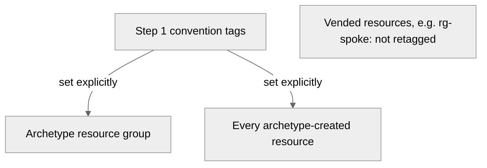

# 🛡️ Governance Constraints - university

<strong>📑 Governance Contents</strong>

- [🔍 Discovery Source](#-discovery-source)
- [📋 Azure Policy Compliance](#-azure-policy-compliance)
- [🔄 Plan Adaptations Based on Policies](#-plan-adaptations-based-on-policies)
- [🚫 Deployment Blockers](#-deployment-blockers)
- [🏷️ Required Tags](#-required-tags)
- [🔐 Security Policies](#-security-policies)
- [💰 Cost Policies](#-cost-policies)
- [🌐 Network Policies](#-network-policies)
- [📜 Compliance Frameworks](#-compliance-frameworks)
- [References](#references)

> Generated by 04g-Governance agent | 2026-10-06T10:16:59Z

| ⬅️ Previous | 📑 Index | Next ➡️ |
| --- | --- | --- |
| [02-architecture-assessment.md](02-architecture-assessment.md) | [README](README.md) | [04-implementation-plan.md](04-implementation-plan.md) |

## 🔍 Discovery Source

| Query | Results | Timestamp |
| --- | --- | --- |
| Policy Assignments | 25 policies discovered (28 total, 3 filtered) | 2026-10-06T10:16:59Z |
| Tag Policies | 0 tags required | 2026-10-06T10:16:59Z |
| Security Policies | 11 constraints | 2026-10-06T10:16:59Z |

**Assignment totals**: 28 assignments discovered, 25 retained, 3 filtered. The 3 filtered assignments are Defender for Cloud's automatic assignments, excluded as the discovery default (`--include-defender-auto` was not used); they are not workload blockers.

**Discovery Method**: Azure Policy REST API (discover.py)
**Subscription**: the workload subscription
**Scope**: Subscription + management-group inherited

> ⚠️ **19 blocker findings** (`blocker_count: 19` in the JSON) from **17 unique policy definitions**. Reconciled against the approved Step 2 design: none conflicts with it. `ALZ-lite: Allowed locations` is now an Audit policy and is no longer a blocker. See [Plan Adaptations Based on Policies](#-plan-adaptations-based-on-policies) and the [Deployment Blockers](#-deployment-blockers) dispositions.

### Policy Definition Analysis

| Policy Display Name | Assignment Scope | Effect | Classification | Category | Bicep Property Path | Required Value |
| --- | --- | --- | --- | --- | --- | --- |
| Block VM SKU Sizes | Tenant Root Group | deny | blocker | Compute |  | Standard_HB120-16rs_v2, Standard_HB120-16rs_v3, Standard_HB120-32rs_v2, Standard_HB120-32rs_v3, Standard_HB120-64rs_v2, Standard_HB120-64rs_v3, Standard_HB120-96rs_v2, Standard_HB120-96rs_v3, Standard_HB120rs_v2, Standard_HB120rs_v3, Standard_HB60-15rs, Standard_HB60-30rs, Standard_HB60-45rs, Standard_HB60rs, Standard_HC44-16rs, Standard_HC44-32rs, Standard_HC44rs |
| Deny AKS deployment with agent pool count greater than 10 | Tenant Root Group | deny | blocker | Compute | managedClusters::agentPoolProfiles[*] |  |
| Deny VMSS deployment with instance count greater than 10 | Tenant Root Group | deny | blocker | Compute | virtualMachineScaleSets::sku.capacity |  |
| Block Azure OpenAI Provisioned Capacity | Tenant Root Group | deny | blocker | Cognitive Services | accounts/deployments::sku.name |  |
| Block Azure Sentinel Commitment over 100 | Tenant Root Group | deny | blocker | Monitoring | workspaces::sku.capacityReservationLevel |  |
| SFI-ID4.2.2 SQL DB - Safe Secrets Standard | Tenant Root Group | deny | blocker | Uncategorized | sqlServers::administrators.azureADOnlyAuthentication | Ignore |
| SFI-ID4.2.4 SQL Managed Instance - Safe Secrets Standard | Tenant Root Group | deny | blocker | Uncategorized | managedInstances::administrators.azureADOnlyAuthentication | Ignore |
| Not allowed resource types | Tenant Root Group | deny | blocker | General |  | microsoft.classiccompute/virtualmachines, microsoft.classiccompute/virtualmachines/diagnosticsettings, microsoft.classiccompute/virtualmachines/metricdefinitions, microsoft.classiccompute/virtualmachines/metrics, microsoft.classicnetwork/virtualnetworks, microsoft.classicnetwork/virtualnetworks/remotevirtualnetworkpeeringproxies, microsoft.classicnetwork/virtualnetworks/virtualnetworkpeerings, microsoft.classicstorage/checkstorageaccountavailability, microsoft.classicstorage/storageaccounts, microsoft.classicstorage/storageaccounts/blobservices, microsoft.classicstorage/storageaccounts/fileservices, microsoft.classicstorage/storageaccounts/metricdefinitions, microsoft.classicstorage/storageaccounts/metrics, microsoft.classicstorage/storageaccounts/queueservices, microsoft.classicstorage/storageaccounts/services, microsoft.classicstorage/storageaccounts/services/diagnosticsettings, microsoft.classicstorage/storageaccounts/services/metricdefinitions, microsoft.classicstorage/storageaccounts/services/metrics, microsoft.classicstorage/storageaccounts/tableservices, microsoft.classicstorage/storageaccounts/vmimages … +37 more |
| Deny Azure Key Vault Managed HSM with Purge Protection Enabled | Tenant Root Group | deny | blocker | Key Vault |  | CostControl |
| Configure Azure Defender for servers to be enabled | Tenant Root Group | deployIfNotExists | auto-remediate | Security Center |  |  |
| Configure Microsoft Defender for Key Vault plan | Tenant Root Group | deployIfNotExists | auto-remediate | Security Center |  | PerKeyVault |
| Configure Microsoft Defender for Azure Cosmos DB to be enabled | Tenant Root Group | deployIfNotExists | auto-remediate | Security Center |  |  |
| Configure Azure Defender for Azure SQL database to be enabled | Tenant Root Group | deployIfNotExists | auto-remediate | Security Center |  |  |
| Configure Azure Defender for SQL servers on machines to be enabled | Tenant Root Group | deployIfNotExists | auto-remediate | Security Center |  |  |
| Configure Azure Defender for open-source relational databases to be enabled | Tenant Root Group | deployIfNotExists | auto-remediate | Security Center |  |  |
| Configure Microsoft Defender for Containers to be enabled | Tenant Root Group | deployIfNotExists | auto-remediate | Security Center |  |  |
| Configure Azure Defender for App Service to be enabled | Tenant Root Group | deployIfNotExists | auto-remediate | Security Center |  |  |
| Configure Azure Defender for Resource Manager to be enabled | Tenant Root Group | deployIfNotExists | auto-remediate | Security Center |  | PerSubscription |
| Configure Microsoft Defender for Storage to be enabled | Tenant Root Group | deployIfNotExists | auto-remediate | Security Center |  | true |
| Configure Microsoft Defender threat protection for AI Services | Tenant Root Group | deployIfNotExists | auto-remediate | Security Center |  | true |
| Deploy the Windows Guest Configuration extension to enable Guest Configuration assignments on Windows VMs | Tenant Root Group | deployIfNotExists | auto-remediate | Guest Configuration | virtualMachines::storageProfile.osDisk.osType |  |
| Add system-assigned managed identity to enable Guest Configuration assignments on virtual machines with no identities | Tenant Root Group | modify | auto-remediate | Managed Identity for Guest Configuration |  | SystemAssigned |
| Add system-assigned managed identity to enable Guest Configuration assignments on VMs with a user-assigned identity | Tenant Root Group | modify | auto-remediate | Managed identity for Guest Configuration |  | [concat(field('identity.type'), ',SystemAssigned')] |
| Ensure secure access to storage account containers | Tenant Root Group | modify | auto-remediate | Modify Allow Blob anonymous access | storageAccounts::allowBlobPublicAccess | false |
| SFI-ID4.3.2 Event Hub - Safe Secrets Standard | Tenant Root Group | modify | auto-remediate | Uncategorized | namespaces::disableLocalAuth | true |
| SFI-ID4.3.3 Service Bus - Safe Secrets Standard | Tenant Root Group | modify | auto-remediate | Uncategorized | namespaces::disableLocalAuth | true |
| SFI-ID4.2.1 Storage Accounts - Safe Secrets Standard | Tenant Root Group | modify | auto-remediate | Uncategorized | storageAccounts::allowSharedKeyAccess | false |
| SFI-ID4.2.3 Cosmos DB - Safe Secrets Standard | Tenant Root Group | modify | auto-remediate | Uncategorized | databaseAccounts::disableLocalAuth | true |
| AzTB 17 - Enable Diagnostics Settings for all Cognitive Services | Tenant Root Group | deployIfNotExists | auto-remediate | Uncategorized |  | setByPolicy-MCAPSGovernance |
| AzTB 17 - Azure_AIFoundry_Audit_Enable_Diagnostic_Settings - Hubs | Tenant Root Group | deployIfNotExists | auto-remediate | Uncategorized |  | setByPolicy-MCAPSGovernance |
| AzTB 17 - Azure_AIFoundry_Audit_Enable_Diagnostic_Settings - Projects | Tenant Root Group | deployIfNotExists | auto-remediate | Uncategorized |  | setByPolicy-MCAPSGovernance |
| Disable Local auth for all Cognitive Services | Tenant Root Group | modify | auto-remediate | Uncategorized | accounts::disableLocalAuth | true |
| Deploy Resource Group McapsGovernance | Tenant Root Group | deployIfNotExists | auto-remediate | Uncategorized |  | McapsGovernance |
| Deploy Log Analytics Workspace for Diagnostic Settings | Tenant Root Group | deployIfNotExists | auto-remediate | Uncategorized |  | McapsGovernance |
| AIFoundryHub_PublicNetwork_Modify | Tenant Root Group | modify | auto-remediate | Uncategorized | workspaces::publicNetworkAccess | Disabled |
| SFI - Disable public network access on Storage accounts (excluding NSP configured resources) | Tenant Root Group | modify | auto-remediate | Network | storageAccounts::publicNetworkAccess | Disabled |
| SFI - Disable public network access on Key Vaults (excluding NSP configured resources) | Tenant Root Group | modify | auto-remediate | Network | keyVaults::publicNetworkAccess | Disabled |
| SFI - Disable public network access on Cosmos DB accounts (excluding NSP configured resources) | Tenant Root Group | modify | auto-remediate | Network | databaseAccounts::publicNetworkAccess | Disabled |
| SFI - Disable public network access on SQL DB servers (excluding NSP configured resources) | Tenant Root Group | modify | auto-remediate | Network | sqlServers::publicNetworkAccess | Disabled |
| Configure Microsoft Defender CSPM plan | Tenant Root Group | deployIfNotExists | auto-remediate | Uncategorized |  |  |
| Configure Node OS Auto upgrade on Azure Kubernetes Cluster | Tenant Root Group | deployIfNotExists | auto-remediate | Uncategorized |  | NodeImage |
| AzTB 17 - Configure Diagnostics Setting for Logic app | Tenant Root Group | deployIfNotExists | auto-remediate | Uncategorized |  | setByPolicy-MCAPSGovernance |
| AzTB 17 - Configure Diagnostics Setting for Logic app Standard | Tenant Root Group | deployIfNotExists | auto-remediate | Uncategorized |  | setByPolicy-MCAPSGovernance |
| AzTB 17 - Configure Diagnostics Setting for Function apps | Tenant Root Group | deployIfNotExists | auto-remediate | Uncategorized |  | setByPolicy-MCAPSGovernance |
| Block Azure RM Resource Creation | Tenant Root Group | deny | blocker | Uncategorized |  | r0 |
| Resources should not be created in West Europe | Tenant Root Group | deny | blocker | System Policy |  |  |
| Storage accounts should disable public network access | /providers/Microsoft.Management/managementGroups/mg-factory-corp | deny | blocker | Storage | storageAccounts::publicNetworkAccess |  |
| Public network access should be disabled for Container registries | /providers/Microsoft.Management/managementGroups/mg-factory-corp | deny | blocker | Container Registry | registries::publicNetworkAccess |  |
| Azure Key Vault should disable public network access | /providers/Microsoft.Management/managementGroups/mg-factory-corp | deny | blocker | Key Vault | keyVaults::publicNetworkAccess |  |
| Service Bus Namespaces should disable public network access | /providers/Microsoft.Management/managementGroups/mg-factory-corp | deny | blocker | Service Bus | namespaces::networkRuleSets/publicNetworkAccess |  |
| Azure SQL Managed Instances should disable public network access | /providers/Microsoft.Management/managementGroups/mg-factory-corp | deny | blocker | SQL | managedInstances::publicDataEndpointEnabled |  |
| Network interfaces should not have public IPs | /providers/Microsoft.Management/managementGroups/mg-factory-corp | deny | blocker | Network | networkInterfaces::ipconfigurations[*].publicIpAddress.id |  |
| Configure Container registries to use private DNS zones | /providers/Microsoft.Management/managementGroups/mg-factory-corp | deployIfNotExists | auto-remediate | Container Registry | privateEndpoints::privateLinkServiceConnections[*].groupIds[*] | Zone `privatelink.azurecr.io` in the shared services subscription |
| Configure a private DNS Zone ID for blob groupID | /providers/Microsoft.Management/managementGroups/mg-factory-corp | deployIfNotExists | auto-remediate | Storage | privateEndpoints::privateLinkServiceConnections[*].groupIds[*] | Zone `privatelink.blob.core.windows.net` in the shared services subscription |
| Enable logging by category group for Application Insights (microsoft.insights/components) to Log Analytics | /providers/Microsoft.Management/managementGroups/mg-factory-corp | deployIfNotExists | auto-remediate | Monitoring |  | setByPolicy-LogAnalytics |
| Enable logging by category group for Service Bus Namespaces (microsoft.servicebus/namespaces) to Log Analytics | /providers/Microsoft.Management/managementGroups/mg-factory-corp | deployIfNotExists | auto-remediate | Monitoring |  | setByPolicy-LogAnalytics |
| Configure diagnostic settings for Blob Services to Log Analytics workspace | /providers/Microsoft.Management/managementGroups/mg-factory-corp | deployIfNotExists | auto-remediate | Storage |  | blobServicesDiagnosticsLogsToWorkspace |
| Enable logging by category group for Container registries (microsoft.containerregistry/registries) to Log Analytics | /providers/Microsoft.Management/managementGroups/mg-factory-corp | deployIfNotExists | auto-remediate | Monitoring |  | setByPolicy-LogAnalytics |
| Enable logging by category group for App Service (microsoft.web/sites) to Log Analytics | /providers/Microsoft.Management/managementGroups/mg-factory-corp | deployIfNotExists | auto-remediate | Monitoring |  | setByPolicy-LogAnalytics |
| Configure Azure Key Vaults to use private DNS zones | /providers/Microsoft.Management/managementGroups/mg-factory-corp | deployIfNotExists | auto-remediate | Key Vault | privateEndpoints::privateLinkServiceConnections[*].groupIds[*] | Zone `privatelink.vaultcore.azure.net` in the shared services subscription |
| Enable logging by category group for Key vaults (microsoft.keyvault/vaults) to Log Analytics | /providers/Microsoft.Management/managementGroups/mg-factory-corp | deployIfNotExists | auto-remediate | Monitoring |  | setByPolicy-LogAnalytics |
| Configure Service Bus namespaces to use private DNS zones | /providers/Microsoft.Management/managementGroups/mg-factory-corp | deployIfNotExists | auto-remediate | Service Bus | privateEndpoints::privateLinkServiceConnections[*].groupIds[*] | Zone `privatelink.servicebus.windows.net` in the shared services subscription |
| Enable logging by category group for SQL managed instances (microsoft.sql/managedinstances) to Log Analytics | /providers/Microsoft.Management/managementGroups/mg-factory-corp | deployIfNotExists | auto-remediate | Monitoring |  | setByPolicy-LogAnalytics |

## 📋 Azure Policy Compliance

> **Note**: Deny policies are reconciled against the approved design in [02-architecture-assessment.md](02-architecture-assessment.md); dispositions are in [Plan Adaptations Based on Policies](#-plan-adaptations-based-on-policies). Implementation detail stays with Step 4 (IaC Planning).

Status legend: ✅ compliant by design (Modify assignments stay ✅: Modify applies in the create or update request itself, owner-stated), ➖ not applicable to the approved design, ⚠️ DeployIfNotExists assignment discovered, runtime remediation unverified at plan time (the Step 2 post-deploy DNS and diagnostics readiness gates stay in force), ❌ conflict with the approved design (none found).

| Category | Constraint | Implementation | Status |
| --- | --- | --- | --- |
| Cognitive Services | Block Azure OpenAI Provisioned Capacity | Not applicable — no Cognitive Services in the approved design | ➖ |
| Compute | Block VM SKU Sizes | Not applicable — no virtual machines | ➖ |
| Compute | Deny AKS deployment with agent pool count greater than 10 | Not applicable — no AKS | ➖ |
| Compute | Deny VMSS deployment with instance count greater than 10 | Not applicable — no VMSS | ➖ |
| Container Registry | Public network access should be disabled for Container registries | Compliant — Premium ACR, private endpoint, public network access disabled | ✅ |
| Container Registry | Configure Container registries to use private DNS zones | Discovered DeployIfNotExists assignment; remediation unverified at plan time | ⚠️ |
| General | Not allowed resource types | Not applicable — the list holds only classic (ASM) resource types | ➖ |
| Guest Configuration | Deploy the Windows Guest Configuration extension to enable Guest Configuration assignments on Windows VMs | Discovered DeployIfNotExists assignment; remediation unverified at plan time | ⚠️ |
| Key Vault | Deny Azure Key Vault Managed HSM with Purge Protection Enabled | Not applicable — Standard Key Vault, no Managed HSM | ➖ |
| Key Vault | Azure Key Vault should disable public network access | Compliant — private endpoint, public network access disabled | ✅ |
| Key Vault | Configure Azure Key Vaults to use private DNS zones | Discovered DeployIfNotExists assignment; remediation unverified at plan time | ⚠️ |
| Managed Identity for Guest Configuration | Add system-assigned managed identity to enable Guest Configuration assignments on virtual machines with no identities | Discovered Modify assignment; applies in the create or update request | ✅ |
| Managed identity for Guest Configuration | Add system-assigned managed identity to enable Guest Configuration assignments on VMs with a user-assigned identity | Discovered Modify assignment; applies in the create or update request | ✅ |
| Modify Allow Blob anonymous access | Ensure secure access to storage account containers | Discovered Modify assignment; applies in the create or update request | ✅ |
| Monitoring | Block Azure Sentinel Commitment over 100 | Not applicable — the workload creates no workspace or Sentinel | ➖ |
| Monitoring | Enable logging by category group for Application Insights (microsoft.insights/components) to Log Analytics | Discovered DeployIfNotExists assignment; remediation unverified at plan time | ⚠️ |
| Monitoring | Enable logging by category group for Service Bus Namespaces (microsoft.servicebus/namespaces) to Log Analytics | Discovered DeployIfNotExists assignment; remediation unverified at plan time | ⚠️ |
| Monitoring | Enable logging by category group for Container registries (microsoft.containerregistry/registries) to Log Analytics | Discovered DeployIfNotExists assignment; remediation unverified at plan time | ⚠️ |
| Monitoring | Enable logging by category group for App Service (microsoft.web/sites) to Log Analytics | Discovered DeployIfNotExists assignment; remediation unverified at plan time | ⚠️ |
| Monitoring | Enable logging by category group for Key vaults (microsoft.keyvault/vaults) to Log Analytics | Discovered DeployIfNotExists assignment; remediation unverified at plan time | ⚠️ |
| Monitoring | Enable logging by category group for SQL managed instances (microsoft.sql/managedinstances) to Log Analytics | Discovered DeployIfNotExists assignment; remediation unverified at plan time | ⚠️ |
| Network | SFI - Disable public network access on Storage accounts (excluding NSP configured resources) | Discovered Modify assignment; applies in the create or update request | ✅ |
| Network | SFI - Disable public network access on Key Vaults (excluding NSP configured resources) | Discovered Modify assignment; applies in the create or update request | ✅ |
| Network | SFI - Disable public network access on Cosmos DB accounts (excluding NSP configured resources) | Discovered Modify assignment; applies in the create or update request | ✅ |
| Network | SFI - Disable public network access on SQL DB servers (excluding NSP configured resources) | Discovered Modify assignment; applies in the create or update request | ✅ |
| Network | Network interfaces should not have public IPs | Compliant — no public IPs; private-endpoint NICs are platform-managed | ✅ |
| SQL | Azure SQL Managed Instances should disable public network access | Compliant — public data endpoint disabled | ✅ |
| Security Center | Configure Azure Defender for servers to be enabled | Discovered DeployIfNotExists assignment; remediation unverified at plan time | ⚠️ |
| Security Center | Configure Microsoft Defender for Key Vault plan | Discovered DeployIfNotExists assignment; remediation unverified at plan time | ⚠️ |
| Security Center | Configure Microsoft Defender for Azure Cosmos DB to be enabled | Discovered DeployIfNotExists assignment; remediation unverified at plan time | ⚠️ |
| Security Center | Configure Azure Defender for Azure SQL database to be enabled | Discovered DeployIfNotExists assignment; remediation unverified at plan time | ⚠️ |
| Security Center | Configure Azure Defender for SQL servers on machines to be enabled | Discovered DeployIfNotExists assignment; remediation unverified at plan time | ⚠️ |
| Security Center | Configure Azure Defender for open-source relational databases to be enabled | Discovered DeployIfNotExists assignment; remediation unverified at plan time | ⚠️ |
| Security Center | Configure Microsoft Defender for Containers to be enabled | Discovered DeployIfNotExists assignment; remediation unverified at plan time | ⚠️ |
| Security Center | Configure Azure Defender for App Service to be enabled | Discovered DeployIfNotExists assignment; remediation unverified at plan time | ⚠️ |
| Security Center | Configure Azure Defender for Resource Manager to be enabled | Discovered DeployIfNotExists assignment; remediation unverified at plan time | ⚠️ |
| Security Center | Configure Microsoft Defender for Storage to be enabled | Discovered DeployIfNotExists assignment; remediation unverified at plan time | ⚠️ |
| Security Center | Configure Microsoft Defender threat protection for AI Services | Discovered DeployIfNotExists assignment; remediation unverified at plan time | ⚠️ |
| Service Bus | Service Bus Namespaces should disable public network access | Compliant — Premium, private endpoint, public network access disabled | ✅ |
| Service Bus | Configure Service Bus namespaces to use private DNS zones | Discovered DeployIfNotExists assignment; remediation unverified at plan time | ⚠️ |
| Storage | Storage accounts should disable public network access | Compliant — private endpoint, public network access disabled | ✅ |
| Storage | Configure a private DNS Zone ID for blob groupID | Discovered DeployIfNotExists assignment; remediation unverified at plan time | ⚠️ |
| Storage | Configure diagnostic settings for Blob Services to Log Analytics workspace | Discovered DeployIfNotExists assignment; remediation unverified at plan time | ⚠️ |
| System Policy | Resources should not be created in West Europe | Compliant — all resources in swedencentral | ✅ |
| Uncategorized | SFI-ID4.2.2 SQL DB - Safe Secrets Standard | Not applicable — no Azure SQL logical server | ➖ |
| Uncategorized | SFI-ID4.2.4 SQL Managed Instance - Safe Secrets Standard | Compliant — SQL MI is Entra-only | ✅ |
| Uncategorized | SFI-ID4.3.2 Event Hub - Safe Secrets Standard | Discovered Modify assignment; applies in the create or update request | ✅ |
| Uncategorized | SFI-ID4.3.3 Service Bus - Safe Secrets Standard | Discovered Modify assignment; applies in the create or update request | ✅ |
| Uncategorized | SFI-ID4.2.1 Storage Accounts - Safe Secrets Standard | Discovered Modify assignment; applies in the create or update request | ✅ |
| Uncategorized | SFI-ID4.2.3 Cosmos DB - Safe Secrets Standard | Discovered Modify assignment; applies in the create or update request | ✅ |
| Uncategorized | AzTB 17 - Enable Diagnostics Settings for all Cognitive Services | Discovered DeployIfNotExists assignment; remediation unverified at plan time | ⚠️ |
| Uncategorized | AzTB 17 - Azure_AIFoundry_Audit_Enable_Diagnostic_Settings - Hubs | Discovered DeployIfNotExists assignment; remediation unverified at plan time | ⚠️ |
| Uncategorized | AzTB 17 - Azure_AIFoundry_Audit_Enable_Diagnostic_Settings - Projects | Discovered DeployIfNotExists assignment; remediation unverified at plan time | ⚠️ |
| Uncategorized | Disable Local auth for all Cognitive Services | Discovered Modify assignment; applies in the create or update request | ✅ |
| Uncategorized | Deploy Resource Group McapsGovernance | Discovered DeployIfNotExists assignment; remediation unverified at plan time | ⚠️ |
| Uncategorized | Deploy Log Analytics Workspace for Diagnostic Settings | Discovered DeployIfNotExists assignment; remediation unverified at plan time | ⚠️ |
| Uncategorized | AIFoundryHub_PublicNetwork_Modify | Discovered Modify assignment; applies in the create or update request | ✅ |
| Uncategorized | Configure Microsoft Defender CSPM plan | Discovered DeployIfNotExists assignment; remediation unverified at plan time | ⚠️ |
| Uncategorized | Configure Node OS Auto upgrade on Azure Kubernetes Cluster | Discovered DeployIfNotExists assignment; remediation unverified at plan time | ⚠️ |
| Uncategorized | AzTB 17 - Configure Diagnostics Setting for Logic app | Discovered DeployIfNotExists assignment; remediation unverified at plan time | ⚠️ |
| Uncategorized | AzTB 17 - Configure Diagnostics Setting for Logic app Standard | Discovered DeployIfNotExists assignment; remediation unverified at plan time | ⚠️ |
| Uncategorized | AzTB 17 - Configure Diagnostics Setting for Function apps | Discovered DeployIfNotExists assignment; remediation unverified at plan time | ⚠️ |
| Uncategorized | Block Azure RM Resource Creation | Not applicable — the policy targets classic resource types only | ➖ |

## 🔄 Plan Adaptations Based on Policies

### Architectural Changes

Reconciled against [02-architecture-assessment.md](02-architecture-assessment.md): 17 unique Deny policies, 9 not applicable, 8 compliant by design, **0 conflicts**. No architectural change is required. Compliance rows rest on the approved design values; Step 4 verifies each property path in the plan.

| Original Design | Blocking Policy | Effect | Adaptation Applied |
| --- | --- | --- | --- |
| No virtual machines | Block VM SKU Sizes (3 findings) | deny | Not applicable |
| No AKS | Deny AKS deployment with agent pool count greater than 10 | deny | Not applicable |
| No VMSS | Deny VMSS deployment with instance count greater than 10 | deny | Not applicable |
| No Cognitive Services | Block Azure OpenAI Provisioned Capacity | deny | Not applicable |
| Application Insights uses the central `log-management` workspace; the workload creates no workspace | Block Azure Sentinel Commitment over 100 | deny | Not applicable |
| No Azure SQL logical server or database | SFI-ID4.2.2 SQL DB - Safe Secrets Standard | deny | Not applicable |
| SQL MI is Entra-only (`azureADOnlyAuthentication: true`, admin = deployer) | SFI-ID4.2.4 SQL Managed Instance - Safe Secrets Standard | deny | Compliant |
| Only current ARM resource types; the list holds classic (ASM) namespaces only | Not allowed resource types | deny | Not applicable |
| Standard Key Vault; no Managed HSM | Deny Azure Key Vault Managed HSM with Purge Protection Enabled | deny | Not applicable |
| No classic resources; the policy targets classic resource types only | Block Azure RM Resource Creation | deny | Not applicable |
| All resources in `swedencentral` | Resources should not be created in West Europe | deny | Compliant |
| Storage: private endpoint, `publicNetworkAccess: Disabled` | Storage accounts should disable public network access | deny | Compliant |
| ACR Premium: private endpoint, `publicNetworkAccess: Disabled` | Public network access should be disabled for Container registries | deny | Compliant |
| Key Vault: private endpoint, `publicNetworkAccess: Disabled` | Azure Key Vault should disable public network access | deny | Compliant |
| Service Bus Premium: private endpoint, `publicNetworkAccess: Disabled` | Service Bus Namespaces should disable public network access | deny | Compliant |
| SQL MI: `publicDataEndpointEnabled: false` | Azure SQL Managed Instances should disable public network access | deny | Compliant |
| No public IPs; private-endpoint NICs are platform-managed | Network interfaces should not have public IPs | deny | Compliant |

### Auto-Applied Resources

These are discovered DeployIfNotExists assignments, not completed deployments. Runtime remediation is unverified at plan time: assignment-identity permissions and remediation behavior were not checked in discovery. The owner states that B08 grants the DINE assignment identities their roles; that is not verified here. Step 4 plans against the discovered assignments. The Step 2 post-deploy readiness gates stay in force: private DNS registration for the four private endpoints (capability 15) and diagnostics landing in `log-management`.

| Policy | Effect | Runtime Status |
| --- | --- | --- |
| Configure Azure Defender for servers to be enabled | DeployIfNotExists | Discovered; remediation unverified at plan time |
| Configure Microsoft Defender for Key Vault plan | DeployIfNotExists | Discovered; remediation unverified at plan time |
| Configure Microsoft Defender for Azure Cosmos DB to be enabled | DeployIfNotExists | Discovered; remediation unverified at plan time |
| Configure Azure Defender for Azure SQL database to be enabled | DeployIfNotExists | Discovered; remediation unverified at plan time |
| Configure Azure Defender for SQL servers on machines to be enabled | DeployIfNotExists | Discovered; remediation unverified at plan time |
| Configure Azure Defender for open-source relational databases to be enabled | DeployIfNotExists | Discovered; remediation unverified at plan time |
| Configure Microsoft Defender for Containers to be enabled | DeployIfNotExists | Discovered; remediation unverified at plan time |
| Configure Azure Defender for App Service to be enabled | DeployIfNotExists | Discovered; remediation unverified at plan time |
| Configure Azure Defender for Resource Manager to be enabled | DeployIfNotExists | Discovered; remediation unverified at plan time |
| Configure Microsoft Defender for Storage to be enabled | DeployIfNotExists | Discovered; remediation unverified at plan time |
| Configure Microsoft Defender threat protection for AI Services | DeployIfNotExists | Discovered; remediation unverified at plan time |
| Deploy the Windows Guest Configuration extension to enable Guest Configuration assignments on Windows VMs | DeployIfNotExists | Discovered; remediation unverified at plan time |
| AzTB 17 - Enable Diagnostics Settings for all Cognitive Services | DeployIfNotExists | Discovered; remediation unverified at plan time |
| AzTB 17 - Azure_AIFoundry_Audit_Enable_Diagnostic_Settings - Hubs | DeployIfNotExists | Discovered; remediation unverified at plan time |
| AzTB 17 - Azure_AIFoundry_Audit_Enable_Diagnostic_Settings - Projects | DeployIfNotExists | Discovered; remediation unverified at plan time |
| Deploy Resource Group McapsGovernance | DeployIfNotExists | Discovered; remediation unverified at plan time |
| Deploy Log Analytics Workspace for Diagnostic Settings | DeployIfNotExists | Discovered; remediation unverified at plan time |
| Configure Microsoft Defender CSPM plan | DeployIfNotExists | Discovered; remediation unverified at plan time |
| Configure Node OS Auto upgrade on Azure Kubernetes Cluster | DeployIfNotExists | Discovered; remediation unverified at plan time |
| AzTB 17 - Configure Diagnostics Setting for Logic app | DeployIfNotExists | Discovered; remediation unverified at plan time |
| AzTB 17 - Configure Diagnostics Setting for Logic app Standard | DeployIfNotExists | Discovered; remediation unverified at plan time |
| AzTB 17 - Configure Diagnostics Setting for Function apps | DeployIfNotExists | Discovered; remediation unverified at plan time |
| Configure Container registries to use private DNS zones | DeployIfNotExists | Discovered; remediation unverified at plan time (DNS readiness gate) |
| Configure a private DNS Zone ID for blob groupID | DeployIfNotExists | Discovered; remediation unverified at plan time (DNS readiness gate) |
| Enable logging by category group for Application Insights (microsoft.insights/components) to Log Analytics | DeployIfNotExists | Discovered; remediation unverified at plan time (diagnostics readiness gate) |
| Enable logging by category group for Service Bus Namespaces (microsoft.servicebus/namespaces) to Log Analytics | DeployIfNotExists | Discovered; remediation unverified at plan time (diagnostics readiness gate) |
| Configure diagnostic settings for Blob Services to Log Analytics workspace | DeployIfNotExists | Discovered; remediation unverified at plan time (diagnostics readiness gate) |
| Enable logging by category group for Container registries (microsoft.containerregistry/registries) to Log Analytics | DeployIfNotExists | Discovered; remediation unverified at plan time (diagnostics readiness gate) |
| Enable logging by category group for App Service (microsoft.web/sites) to Log Analytics | DeployIfNotExists | Discovered; remediation unverified at plan time (diagnostics readiness gate) |
| Configure Azure Key Vaults to use private DNS zones | DeployIfNotExists | Discovered; remediation unverified at plan time (DNS readiness gate) |
| Enable logging by category group for Key vaults (microsoft.keyvault/vaults) to Log Analytics | DeployIfNotExists | Discovered; remediation unverified at plan time (diagnostics readiness gate) |
| Configure Service Bus namespaces to use private DNS zones | DeployIfNotExists | Discovered; remediation unverified at plan time (DNS readiness gate) |
| Enable logging by category group for SQL managed instances (microsoft.sql/managedinstances) to Log Analytics | DeployIfNotExists | Discovered; remediation unverified at plan time (diagnostics readiness gate) |

### Auto-Modified Configurations

These are discovered Modify assignments. Modify applies in the create or update request itself (owner-stated), so it has no separate remediation step to verify; the DeployIfNotExists rows above do.

| Policy | Effect | Runtime Status |
| --- | --- | --- |
| Add system-assigned managed identity to enable Guest Configuration assignments on virtual machines with no identities | Modify | Discovered; applies in the create or update request |
| Add system-assigned managed identity to enable Guest Configuration assignments on VMs with a user-assigned identity | Modify | Discovered; applies in the create or update request |
| Ensure secure access to storage account containers | Modify | Discovered; applies in the create or update request |
| SFI-ID4.3.2 Event Hub - Safe Secrets Standard | Modify | Discovered; applies in the create or update request |
| SFI-ID4.3.3 Service Bus - Safe Secrets Standard | Modify | Discovered; applies in the create or update request |
| SFI-ID4.2.1 Storage Accounts - Safe Secrets Standard | Modify | Discovered; applies in the create or update request |
| SFI-ID4.2.3 Cosmos DB - Safe Secrets Standard | Modify | Discovered; applies in the create or update request |
| Disable Local auth for all Cognitive Services | Modify | Discovered; applies in the create or update request |
| AIFoundryHub_PublicNetwork_Modify | Modify | Discovered; applies in the create or update request |
| SFI - Disable public network access on Storage accounts (excluding NSP configured resources) | Modify | Discovered; applies in the create or update request |
| SFI - Disable public network access on Key Vaults (excluding NSP configured resources) | Modify | Discovered; applies in the create or update request |
| SFI - Disable public network access on Cosmos DB accounts (excluding NSP configured resources) | Modify | Discovered; applies in the create or update request |
| SFI - Disable public network access on SQL DB servers (excluding NSP configured resources) | Modify | Discovered; applies in the create or update request |

## 🚫 Deployment Blockers

> **19** blocker findings (`blocker_count: 19` in the JSON) from **17** unique policy definitions. The two extra findings come from `Block VM SKU Sizes`: the MCAPSGov Deny Policies initiative references it three times (`BlockVMSKUs_H`, `BlockVMSKUs_M`, `BlockVMSKUs_N`), and this section consolidates them into one entry (19 − 2 = 17). The earlier Deny on `ALZ-lite: Allowed locations` is now Audit and no longer appears here. Each entry carries its disposition against the approved Step 2 design.

### Block VM SKU Sizes

- **Policy ID**: `VirtualMachine_SKU_Deny` (custom definition at Tenant Root Group)
- **Effect**: deny
- **Scope**: Tenant Root Group
- **Category**: Compute
- **Bicep Property Path**: ``
- **Required Value**: Standard_HB120-16rs_v2, Standard_HB120-16rs_v3, Standard_HB120-32rs_v2, Standard_HB120-32rs_v3, Standard_HB120-64rs_v2, Standard_HB120-64rs_v3, Standard_HB120-96rs_v2, Standard_HB120-96rs_v3, Standard_HB120rs_v2, Standard_HB120rs_v3, Standard_HB60-15rs, Standard_HB60-30rs, Standard_HB60-45rs, Standard_HB60rs, Standard_HC44-16rs, Standard_HC44-32rs, Standard_HC44rs

> **Resolution**: Not applicable — the approved design has no virtual machines. No change.

### Deny AKS deployment with agent pool count greater than 10

- **Policy ID**: `AKS_LimitNodeCount_Deny` (custom definition at Tenant Root Group)
- **Effect**: deny
- **Scope**: Tenant Root Group
- **Category**: Compute
- **Bicep Property Path**: `managedClusters::agentPoolProfiles[*]`
- **Required Value**: N/A — parameter values not available in cached baseline; run `--refresh` for live lookup

> **Resolution**: Not applicable — the approved design has no AKS. No change.

### Deny VMSS deployment with instance count greater than 10

- **Policy ID**: `VMSS_LimitNodesCount_Deny` (custom definition at Tenant Root Group)
- **Effect**: deny
- **Scope**: Tenant Root Group
- **Category**: Compute
- **Bicep Property Path**: `virtualMachineScaleSets::sku.capacity`
- **Required Value**: N/A — parameter values not available in cached baseline; run `--refresh` for live lookup

> **Resolution**: Not applicable — the approved design has no VMSS. No change.

### Block Azure OpenAI Provisioned Capacity

- **Policy ID**: `AzureOpenAI_ProvisionedCapacity_Deny` (custom definition at Tenant Root Group)
- **Effect**: deny
- **Scope**: Tenant Root Group
- **Category**: Cognitive Services
- **Bicep Property Path**: `accounts/deployments::sku.name`
- **Required Value**: N/A — parameter values not available in cached baseline; run `--refresh` for live lookup

> **Resolution**: Not applicable — the approved design has no Cognitive Services resources. No change.

### Block Azure Sentinel Commitment over 100

- **Policy ID**: `Sentinel_Commitment_Deny` (custom definition at Tenant Root Group)
- **Effect**: deny
- **Scope**: Tenant Root Group
- **Category**: Monitoring
- **Bicep Property Path**: `workspaces::sku.capacityReservationLevel`
- **Required Value**: N/A — parameter values not available in cached baseline; run `--refresh` for live lookup

> **Resolution**: Not applicable — the workload creates no Log Analytics workspace; Application Insights uses the central `log-management` workspace. No change.

### SFI-ID4.2.2 SQL DB - Safe Secrets Standard

- **Policy ID**: `AzureSQL_WithoutAzureADOnlyAuthentication_Deny` (custom definition at Tenant Root Group)
- **Effect**: deny
- **Scope**: Tenant Root Group
- **Category**: Uncategorized
- **Bicep Property Path**: `sqlServers::administrators.azureADOnlyAuthentication`
- **Required Value**: Ignore

> **Resolution**: Not applicable — the approved design has no Azure SQL logical server or database. The SQL MI is covered by the next policy. No change.

### SFI-ID4.2.4 SQL Managed Instance - Safe Secrets Standard

- **Policy ID**: `AzureSQLMI_WithoutAzureADOnlyAuthentication_Deny` (custom definition at Tenant Root Group)
- **Effect**: deny
- **Scope**: Tenant Root Group
- **Category**: Uncategorized
- **Bicep Property Path**: `managedInstances::administrators.azureADOnlyAuthentication`
- **Required Value**: Ignore

> **Resolution**: Compliant — the approved design makes SQL MI Entra-only (`azureADOnlyAuthentication: true`, admin = deployer). Step 4 verifies the property path in the plan.

### Not allowed resource types

- **Policy ID**: `/providers/Microsoft.Authorization/policyDefinitions/6c112d4e-5bc7-47ae-a041-ea2d9dccd749`
- **Effect**: deny
- **Scope**: Tenant Root Group
- **Category**: General
- **Bicep Property Path**: ``
- **Required Value**: microsoft.classiccompute/virtualmachines, microsoft.classiccompute/virtualmachines/diagnosticsettings, microsoft.classiccompute/virtualmachines/metricdefinitions, microsoft.classiccompute/virtualmachines/metrics, microsoft.classicnetwork/virtualnetworks, microsoft.classicnetwork/virtualnetworks/remotevirtualnetworkpeeringproxies, microsoft.classicnetwork/virtualnetworks/virtualnetworkpeerings, microsoft.classicstorage/checkstorageaccountavailability, microsoft.classicstorage/storageaccounts, microsoft.classicstorage/storageaccounts/blobservices, microsoft.classicstorage/storageaccounts/fileservices, microsoft.classicstorage/storageaccounts/metricdefinitions, microsoft.classicstorage/storageaccounts/metrics, microsoft.classicstorage/storageaccounts/queueservices, microsoft.classicstorage/storageaccounts/services, microsoft.classicstorage/storageaccounts/services/diagnosticsettings, microsoft.classicstorage/storageaccounts/services/metricdefinitions, microsoft.classicstorage/storageaccounts/services/metrics, microsoft.classicstorage/storageaccounts/tableservices, microsoft.classicstorage/storageaccounts/vmimages … +37 more

> **Resolution**: Not applicable — the policy parameter lists only classic (ASM) namespaces (`microsoft.classiccompute`, `microsoft.classicinfrastructuremigrate`, `microsoft.classicnetwork`, `microsoft.classicstorage`, `microsoft.classicsubscription`); the design uses none. No change.

### Deny Azure Key Vault Managed HSM with Purge Protection Enabled

- **Policy ID**: `KeyVaultManagedHSM_PurgeProtectionEnabled_Deny` (custom definition at Tenant Root Group)
- **Effect**: deny
- **Scope**: Tenant Root Group
- **Category**: Key Vault
- **Bicep Property Path**: ``
- **Required Value**: CostControl

> **Resolution**: Not applicable — the design uses a Standard Key Vault, not a Managed HSM. No change.

### Block Azure RM Resource Creation

- **Policy ID**: `a15944e7-86a5-4adf-a36c-d851916c9001` (custom definition at Tenant Root Group)
- **Effect**: deny
- **Scope**: Tenant Root Group
- **Category**: Uncategorized
- **Bicep Property Path**: ``
- **Required Value**: r0

> **Resolution**: Not applicable — the policy targets classic resource types only (ClassicCompute, ClassicNetwork, ClassicStorage, MarketplaceApps classic dev services). No change.

### Resources should not be created in West Europe

- **Policy ID**: `/providers/Microsoft.Authorization/policyDefinitions/7509877f-d414-4d79-8d1f-d600ea78d087`
- **Effect**: deny
- **Scope**: Tenant Root Group
- **Category**: System Policy
- **Bicep Property Path**: ``
- **Required Value**: N/A — parameter values not available in cached baseline; run `--refresh` for live lookup

> **Resolution**: Compliant — every resource deploys in `swedencentral`. No change.

### Storage accounts should disable public network access

- **Policy ID**: `/providers/Microsoft.Authorization/policyDefinitions/b2982f36-99f2-4db5-8eff-283140c09693`
- **Effect**: deny
- **Scope**: /providers/Microsoft.Management/managementGroups/mg-factory-corp
- **Category**: Storage
- **Bicep Property Path**: `storageAccounts::publicNetworkAccess`
- **Required Value**: N/A — parameter values not available in cached baseline; run `--refresh` for live lookup

> **Resolution**: Compliant — the design sets `publicNetworkAccess: Disabled` and reaches Blob through a private endpoint. Step 4 verifies the property path in the plan.

### Public network access should be disabled for Container registries

- **Policy ID**: `/providers/Microsoft.Authorization/policyDefinitions/0fdf0491-d080-4575-b627-ad0e843cba0f`
- **Effect**: deny
- **Scope**: /providers/Microsoft.Management/managementGroups/mg-factory-corp
- **Category**: Container Registry
- **Bicep Property Path**: `registries::publicNetworkAccess`
- **Required Value**: N/A — parameter values not available in cached baseline; run `--refresh` for live lookup

> **Resolution**: Compliant — Premium ACR with a private endpoint and `publicNetworkAccess: Disabled`. Step 4 verifies the property path in the plan.

### Azure Key Vault should disable public network access

- **Policy ID**: `/providers/Microsoft.Authorization/policyDefinitions/405c5871-3e91-4644-8a63-58e19d68ff5b`
- **Effect**: deny
- **Scope**: /providers/Microsoft.Management/managementGroups/mg-factory-corp
- **Category**: Key Vault
- **Bicep Property Path**: `keyVaults::publicNetworkAccess`
- **Required Value**: N/A — parameter values not available in cached baseline; run `--refresh` for live lookup

> **Resolution**: Compliant — private endpoint with `publicNetworkAccess: Disabled`. Step 4 verifies the property path in the plan.

### Service Bus Namespaces should disable public network access

- **Policy ID**: `/providers/Microsoft.Authorization/policyDefinitions/cbd11fd3-3002-4907-b6c8-579f0e700e13`
- **Effect**: deny
- **Scope**: /providers/Microsoft.Management/managementGroups/mg-factory-corp
- **Category**: Service Bus
- **Bicep Property Path**: `namespaces::networkRuleSets/publicNetworkAccess`
- **Required Value**: N/A — parameter values not available in cached baseline; run `--refresh` for live lookup

> **Resolution**: Compliant — Premium namespace with a private endpoint and public network access disabled. Step 4 verifies the property path in the plan.

### Azure SQL Managed Instances should disable public network access

- **Policy ID**: `/providers/Microsoft.Authorization/policyDefinitions/9dfea752-dd46-4766-aed1-c355fa93fb91`
- **Effect**: deny
- **Scope**: /providers/Microsoft.Management/managementGroups/mg-factory-corp
- **Category**: SQL
- **Bicep Property Path**: `managedInstances::publicDataEndpointEnabled`
- **Required Value**: N/A — parameter values not available in cached baseline; run `--refresh` for live lookup

> **Resolution**: Compliant — the design sets `publicDataEndpointEnabled: false` on the SQL MI. Step 4 verifies the property path in the plan.

### Network interfaces should not have public IPs

- **Policy ID**: `/providers/Microsoft.Authorization/policyDefinitions/83a86a26-fd1f-447c-b59d-e51f44264114`
- **Effect**: deny
- **Scope**: /providers/Microsoft.Management/managementGroups/mg-factory-corp
- **Category**: Network
- **Bicep Property Path**: `networkInterfaces::ipconfigurations[*].publicIpAddress.id`
- **Required Value**: N/A — parameter values not available in cached baseline; run `--refresh` for live lookup

> **Resolution**: Compliant — the design has no public IPs; private-endpoint NICs are platform-managed and the web app and SQL MI add none. No change.

## 🏷️ Required Tags

No tag-enforcement policy was discovered (`tags_required` is empty), so tags are a convention, not a policy blocker. Convention from Step 1 ([01-requirements.md](01-requirements.md)): the APEX fallback tag set, with `sla=best-effort`, `backup-policy=platform-default` and `maint-window=system-default`. Apply it to the resource group and every resource the archetype creates; never retag `rg-spoke` or other vended resources. Tag values carry no subscription or tenant identifiers.

No tag policy was discovered. The archetype sets the Step 1 convention tags explicitly on its resource group and every resource it creates; nothing propagates them automatically.

## 🔐 Security Policies

| Policy | Effect | Status |
| --- | --- | --- |
| SFI-ID4.2.2 SQL DB - Safe Secrets Standard | deny | ➖ |
| SFI-ID4.2.4 SQL Managed Instance - Safe Secrets Standard | deny | ✅ |
| Deny Azure Key Vault Managed HSM with Purge Protection Enabled | deny | ➖ |
| Configure Microsoft Defender for Key Vault plan | deployIfNotExists | ⚠️ |
| SFI-ID4.3.2 Event Hub - Safe Secrets Standard | modify | ✅ |
| SFI-ID4.3.3 Service Bus - Safe Secrets Standard | modify | ✅ |
| SFI-ID4.2.1 Storage Accounts - Safe Secrets Standard | modify | ✅ |
| SFI-ID4.2.3 Cosmos DB - Safe Secrets Standard | modify | ✅ |
| SFI - Disable public network access on Key Vaults (excluding NSP configured resources) | modify | ✅ |
| Azure Key Vault should disable public network access | deny | ✅ |
| Configure Azure Key Vaults to use private DNS zones | deployIfNotExists | ⚠️ |

DeployIfNotExists rows show ⚠️: remediation is unverified at plan time and is checked by the post-deploy readiness gates. Modify rows keep ✅: Modify applies in the create or update request itself (owner-stated).

## 💰 Cost Policies

> Live governance discovery preserved the inherited budget exception for this dev workload: `cost_monitoring_mode=deferred` with `cost_monitoring_exception.rationale`="Inherited from landing zone: vending (B08) creates subscription budget budget-factory-workload with 80% e-mail alert; archetype creates no budget or Action Group" and `expiry_date=2027-01-03`. This is the allowed exception carried from the project decision record; if the landing-zone budget changes, review before the expiry date.

| Policy | Effect | Constraint |
| --- | --- | --- |
| Block VM SKU Sizes | deny | Standard_HB120-16rs_v2, Standard_HB120-16rs_v3, Standard_HB120-32rs_v2, Standard_HB120-32rs_v3, Standard_HB120-64rs_v2, Standard_HB120-64rs_v3, Standard_HB120-96rs_v2, Standard_HB120-96rs_v3, Standard_HB120rs_v2, Standard_HB120rs_v3, Standard_HB60-15rs, Standard_HB60-30rs, Standard_HB60-45rs, Standard_HB60rs, Standard_HC44-16rs, Standard_HC44-32rs, Standard_HC44rs |
| Deny AKS deployment with agent pool count greater than 10 | deny | See policy parameters |
| Deny VMSS deployment with instance count greater than 10 | deny | See policy parameters |
| Block Azure OpenAI Provisioned Capacity | deny | See policy parameters |
| Block Azure Sentinel Commitment over 100 | deny | See policy parameters |

## 🌐 Network Policies

| Policy | Effect | Constraint |
| --- | --- | --- |
| SFI - Disable public network access on Storage accounts (excluding NSP configured resources) | modify | Disabled |
| SFI - Disable public network access on Key Vaults (excluding NSP configured resources) | modify | Disabled |
| SFI - Disable public network access on Cosmos DB accounts (excluding NSP configured resources) | modify | Disabled |
| SFI - Disable public network access on SQL DB servers (excluding NSP configured resources) | modify | Disabled |
| Network interfaces should not have public IPs | deny | See policy parameters |

Location: the only blocking location rule is the tenant-root Deny on West Europe (`Resources should not be created in West Europe`); the approved design deploys in `swedencentral`, so it does not apply. `ALZ-lite: Allowed locations` is now an Audit policy, not a blocker. Discovery does not itemize Audit-effect policies, so its allow-list contents are not recorded here and no list is claimed. Re-check of the Step 2 alternate: `germanywestcentral` is not blocked by any discovered Deny; outside the allow-list, a deployment is flagged, not blocked (owner-confirmed). The kit deploys in the hub's region. Same-region: the live Audit assignment `ALZ-lite: Audit resource location matches resource group location` is not a blocker. The design places the resource group and every regional resource in the hub's region, so no non-compliant resource is expected, and any non-compliance after deployment is a defect. Policy-created resources, such as those deployed by DINE policies, follow their own policy locations.
## 📜 Compliance Frameworks

> These audit/compliance assignments are active at subscription or management-group scope. 
> While they do not block deployments (audit effect), they may impose architecture constraints 
> (data residency, encryption, access logging, network segmentation).

| Assignment | Scope | Type |
| --- | --- | --- |
| Azure Security Baseline | Tenant Root Group | management-group |

## References

| Topic | Link |
| --- | --- |
| Azure Policy | [Overview](https://learn.microsoft.com/azure/governance/policy/overview) |
| Tag Governance | [Tagging Strategy](https://learn.microsoft.com/azure/cloud-adoption-framework/ready/azure-best-practices/resource-tagging) |

---

_Governance constraints discovered from Azure Policy REST API via discover.py._

