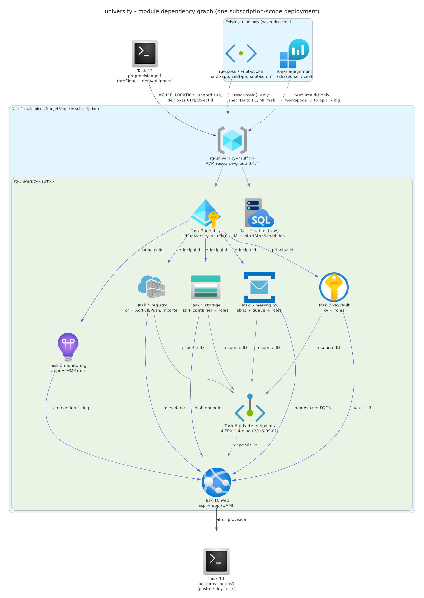
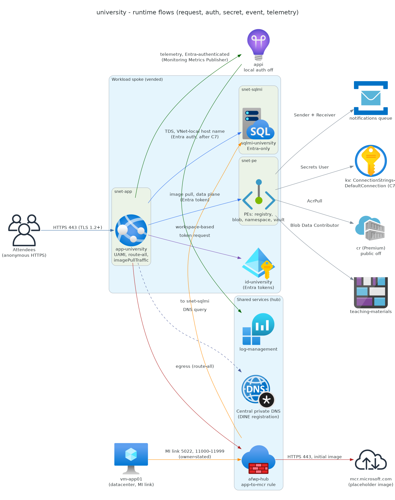

# 📀 Step 4: Implementation Plan - university


<details open>
<summary><strong>📑 Implementation Contents</strong></summary>

- [📋 Overview](#-overview)
- [📦 Resource Inventory](#-resource-inventory)
- [🛡️ Governance Compliance Matrix](#️-governance-compliance-matrix)
- [🗂️ Module Structure](#️-module-structure)
- [🔨 Implementation Tasks](#-implementation-tasks)
- [📤 Code-Generation Contract](#-code-generation-contract)
- [🚀 Deployment Phases](#-deployment-phases)
- [🔗 Dependency Graph](#-dependency-graph)
- [🔄 Runtime Flow Diagram](#-runtime-flow-diagram)
- [🏷️ Naming Conventions](#️-naming-conventions)
- [🔐 Security Configuration](#-security-configuration)
- [⏱️ Estimated Implementation Time](#️-estimated-implementation-time)
- [🔒 Approval Gate](#-approval-gate)
- [References](#references)

</details>

> Generated by IaC Planner agent | 2026-10-06

| ⬅️ Previous                                                  | 📑 Index            | Next ➡️                                        |
| ------------------------------------------------------------ | ------------------- | ---------------------------------------------- |
| [04-governance-constraints.md](04-governance-constraints.md) | [README](README.md) | [04-iac-contract.json](04-iac-contract.json)   |

## 📋 Overview

Bicep implementation of the approved B09 archetype: a Linux container web app on App Service P0v3, a private
Premium ACR, SQL Managed Instance General Purpose, Blob storage, a Service Bus Premium queue, Key Vault and
workspace-based Application Insights, placed in the existing vended spoke. The template is **one
subscription-scope deployment** (`az deployment sub` through `azd provision`). It creates the archetype resource
group `rg-university-<suffix>` and every workload resource inside it. It declares no VNet, subnet, NSG, route
table, private DNS zone or zone group.

**Inputs stay at three**: tenant ID, workload subscription ID and `suffix` (4–6 lowercase letters or digits). The
PowerShell 7 `preprovision` hook derives everything else read-only and writes it to the azd environment:
region (hub VNet location, approved regions only), the `log-management` workspace resource ID (shared services
subscription found through the spoke peering), the
deployer's object ID and UPN (signed-in user, SQL MI Entra admin). Schedule time zone and times are template
defaults the facilitator may change; they are not member inputs.

**Stable API versions**: every resource the archetype declares itself uses a stable API version. API versions
inside exact-pinned AVM modules are accepted as-is (owner rule 2026-10-06); the preview versions they carry are
listed under [Module Structure](#️-module-structure) for B09 `versions.md`. AVM is used wherever it supports the
brief's settings; SQL MI (`databaseFormat` missing in AVM 0.5.1) and its start/stop schedule are raw Bicep.

**Live validation against the `workload` subscription (read-only, 2026-10-06)**:

| Check | Result |
| --- | --- |
| Signed-in subscription is `workload`; matches `04-governance-constraints.json` | ✅ match |
| L0 envelope: `COMPLETE`, discovered 2026-10-06, TTL 7 days, signature = recorded `discovery_signature` | ✅ fresh |
| `rg-spoke/vnet-spoke` 10.20.1.0/24; `snet-app` /26 (Web delegation), `snet-pe` /26, `snet-sqlmi` /26 (MI delegation, NSG + route table) | ✅ matches `subnet_plan` |
| `peer-spoke-to-hub` Connected, FullyInSync; `vnet-hub` in `swedencentral` | ✅ approved region |
| `log-management` (rg-management, shared services) in `swedencentral`; public ingestion/query Enabled | ✅ capability 16 |
| `afwp-hub` (Standard, `swedencentral`): `rcg-member-1` rule `app-to-mcr` from 10.20.1.0/26 to `mcr.microsoft.com`, `*.data.mcr.microsoft.com`, HTTPS 443 | ✅ capability 18 |
| `afwp-hub` (read 2026-10-07, ecc6642f): `rcg-member-1` application rule `app-to-azure-monitor` from 10.20.1.0/26 to `*.in.applicationinsights.azure.com`, `dc.applicationinsights.azure.com`, `dc.applicationinsights.microsoft.com`, `dc.services.visualstudio.com`, `live.applicationinsights.azure.com`, `rt.applicationinsights.microsoft.com`, `rt.services.visualstudio.com`, `*.livediagnostics.monitor.azure.com`, HTTPS 443; network rule `app-to-entra-id` from 10.20.1.0/26 to service tag `AzureActiveDirectory`, TCP 443 | ✅ capability 18 (telemetry egress path present; B08-owned) |
| Budget `budget-factory-workload` present with an `actual80` notification | ✅ capability 17 (see note) |
| Resource providers Sql, Web, ContainerRegistry, ServiceBus, KeyVault, Insights, ManagedIdentity, Storage, Network, OperationalInsights | ✅ Registered |
| Spoke DNS servers | 10.100.0.4 (hub); private resolution is tested post-deploy |

> [!WARNING]
> The vended budget amount is 500 (currency not shown by the read). The workload's 24×7 run rate is
> about $1,321/month, so the 80% alert will fire within weeks if the platform runs continuously. This is
> informational: cost monitoring stays inherited (`cost_monitoring_mode = deferred`, exception expires
> 2027-01-03), and the plan creates no budget, Action Group or anomaly alert.

**Carried items**:

| Item | Disposition in this plan |
| --- | --- |
| 44e9df0f (DINE wording) | Every DeployIfNotExists row below is a *discovered assignment, remediation unverified at plan time*. Readiness is claimed only by the post-deploy DNS zone-group, resolution and diagnostics checks (Task 13). |
| 1d29a697 (Audit location effects) | Both ALZ-lite location assignments are **Audit, owner-confirmed**: owner-run `az policy assignment show` at `mg-factory-corp` on 2026-10-06 returned `effect: Audit`, `enforcementMode: Default` for "ALZ-lite: Allowed locations" and "ALZ-lite: Audit resource location matches resource group location". Discovery lists the assignments but does not itemize their effects; no allow-list is claimed. The template's `location` is restricted to the approved regions and the RG and all resources share it. |
| 6dec76b5 (Defender evidence) | Owner-run discovery with Defender auto-assignments retained (2026-10-06): three Defender for Cloud automatic assignments at the workload subscription, 11 policies, all `deployIfNotExists`, none Deny; `blocker_count` stays 19. Only "Defender for SQL managed instances" touches a planned type (enables a protection plan after deploy; not declared by IaC, so no drift conflict). Its charge is **outside the archetype estimate** (e48d6d77, owner 2026-10-06): it appears only because the build tenant's own Defender plans are on (owner decision: don't override tenant policies on build subscriptions; `-SkipDefender`). In event subscriptions ALZ-lite sets Defender for Cloud to Foundational CSPM only with every paid plan off, so members don't incur it. The Step 2 estimate stays as approved; B09 reports the build-environment cost in its PR. |
| 3ea4e2b0 (ADR-0004 quotation) | Verified 2026-10-06 against the current Learn page (updated 2026-08-27): "To import to or from a network-restricted Azure container registry, the restricted registry must allow access by trusted services to bypass the network." The ADR quotation is verbatim. Step 4 cannot edit the ADR; the evidence is recorded here and in recall. |
| Step 1 tag convention | No tag policy discovered. The 9 APEX fallback tags (values below) are set explicitly on the archetype RG and every taggable resource the deployment creates; vended resources are never retagged. |
| Requirement 11 names | App settings use `__` instead of `:` (Learn: App Service names allow letters, digits, `.` and `_`; Linux replaces `:` with `__`). .NET maps them back to the same keys. Owner-approved 2026-10-06. |

Tags (constants in `main.bicep`, not inputs): `environment=dev`, `owner=lab-admin`, `costcenter=apex-factory`,
`application=university`, `workload=university`, `sla=best-effort`, `backup-policy=platform-default`,
`maint-window=system-default`, `technical-contact=ghostbusters`.

---

## 📦 Resource Inventory

SKU rows are rendered from [sku-manifest.json](sku-manifest.json) rev 3 (all user pins, unchanged).

| Resource | Type | SKU | AVM Status | Dependencies | Status |
| --- | --- | --- | --- | --- | --- |
| `rg-university-<suffix>` | Microsoft.Resources/resourceGroups | — | ✅ AVM `br/public:avm/res/resources/resource-group:0.4.4` | preprovision outputs | ⬜ Todo |
| `id-university-<suffix>` | Microsoft.ManagedIdentity/userAssignedIdentities | — | ✅ AVM `br/public:avm/res/managed-identity/user-assigned-identity:0.6.0` | RG | ⬜ Todo |
| `appi-university-<suffix>` | Microsoft.Insights/components | Workspace-based | ✅ AVM `br/public:avm/res/insights/component:0.8.0` | UAMI, `log-management` | ⬜ Todo |
| `cruniversity<suffix>` | Microsoft.ContainerRegistry/registries | Premium | ✅ AVM `br/public:avm/res/container-registry/registry:0.13.1` | UAMI | ⬜ Todo |
| `stuniversity<suffix>` + container `teaching-materials` | Microsoft.Storage/storageAccounts | Standard_LRS (StorageV2, Hot) | ✅ AVM `br/public:avm/res/storage/storage-account:0.33.1` | UAMI | ⬜ Todo |
| `sbns-university-<suffix>` + queue `notifications` | Microsoft.ServiceBus/namespaces | Premium, 1 MU | ✅ AVM `br/public:avm/res/service-bus/namespace:0.17.1` | UAMI | ⬜ Todo |
| `kv-university-<suffix>` | Microsoft.KeyVault/vaults | standard | ✅ AVM `br/public:avm/res/key-vault/vault:0.14.2` | UAMI | ⬜ Todo |
| `sqlmi-university-<suffix>` | Microsoft.Sql/managedInstances | GP_Gen5, 4 vCores, 64 GB | ❌ No AVM (Justified: AVM 0.5.1 has no `databaseFormat`) — raw `@2025-01-01` | RG, `snet-sqlmi` | ⬜ Todo |
| `default` schedule | Microsoft.Sql/managedInstances/startStopSchedules | — | ❌ No AVM (Justified: no module) — raw `@2025-01-01` | SQL MI | ⬜ Todo |
| `asp-university-<suffix>` | Microsoft.Web/serverfarms | P0v3 (Linux), 1 instance | ✅ AVM `br/public:avm/res/web/serverfarm:0.7.0` | RG | ⬜ Todo |
| `app-university-<suffix>` | Microsoft.Web/sites | — | ✅ AVM `br/public:avm/res/web/site:0.24.0` | ASP, UAMI, all role assignments, PEs | ⬜ Todo |
| `pe-acr-university-<suffix>` | Microsoft.Network/privateEndpoints | — | ✅ AVM `br/public:avm/res/network/private-endpoint:0.12.1` | ACR, `snet-pe` | ⬜ Todo |
| `pe-blob-university-<suffix>` | Microsoft.Network/privateEndpoints | — | ✅ AVM `br/public:avm/res/network/private-endpoint:0.12.1` | Storage, `snet-pe` | ⬜ Todo |
| `pe-sbns-university-<suffix>` | Microsoft.Network/privateEndpoints | — | ✅ AVM `br/public:avm/res/network/private-endpoint:0.12.1` | Service Bus, `snet-pe` | ⬜ Todo |
| `pe-kv-university-<suffix>` | Microsoft.Network/privateEndpoints | — | ✅ AVM `br/public:avm/res/network/private-endpoint:0.12.1` | Key Vault, `snet-pe` | ⬜ Todo |
| `service` diagnostic setting ×6 (4 PEs, ASP, storage account) | Microsoft.Insights/diagnosticSettings | — | ❌ No AVM (Justified: extension resource) — raw `@2016-09-01` | target resource, `log-management` | ⬜ Todo |
| 12 role assignments (6 UAMI, 6 deployer) | Microsoft.Authorization/roleAssignments | — | ✅ via each AVM module's `roleAssignments` | UAMI, target | ⬜ Todo |

`requires[]` cross-check (sku-manifest rev 3): `vnet-integration` (P0v3, Premium v3 ≥ Standard) ✅;
`private-endpoints` (ACR Premium, StorageV2, Service Bus Premium) ✅; `managed-identity` (all) ✅. No unmet entry.

---

## 🛡️ Governance Compliance Matrix

> [!IMPORTANT]
> L1 attestation in the four-layer governance stack. Every Deny policy
> from `04-governance-constraints.json` MUST appear as at least one row
> here, bound to a specific resource and property. Generated from the
> constraints JSON; do not hand-author.

All 19 Deny entries from `04-governance-constraints.json` (L0 signature recorded in recall) are listed; definitions at
the tenant root management group are shown as "Tenant Root Group" so this file carries no tenant or subscription
IDs. No Deny is unsatisfiable.

| Resource ID | Policy ID | Effect | Satisfied By Property | Required Value | Status |
| --- | --- | --- | --- | --- | --- |
| `st` | `/providers/Microsoft.Authorization/policyDefinitions/b2982f36-99f2-4db5-8eff-283140c09693` | Deny | `properties.publicNetworkAccess` | `Disabled` | ✅ satisfied |
| `cr` | `/providers/Microsoft.Authorization/policyDefinitions/0fdf0491-d080-4575-b627-ad0e843cba0f` | Deny | `properties.publicNetworkAccess` | `Disabled` | ✅ satisfied |
| `kv` | `/providers/Microsoft.Authorization/policyDefinitions/405c5871-3e91-4644-8a63-58e19d68ff5b` | Deny | `properties.publicNetworkAccess` | `Disabled` | ✅ satisfied |
| `sbns` | `/providers/Microsoft.Authorization/policyDefinitions/cbd11fd3-3002-4907-b6c8-579f0e700e13` | Deny | `properties.publicNetworkAccess` | `Disabled` | ✅ satisfied |
| `sbns` (networkRuleSets/default) | `/providers/Microsoft.Authorization/policyDefinitions/cbd11fd3-3002-4907-b6c8-579f0e700e13` | Deny | `networkRuleSets.properties.publicNetworkAccess` | `Disabled` | ✅ satisfied |
| `sqlmi` | `/providers/Microsoft.Authorization/policyDefinitions/9dfea752-dd46-4766-aed1-c355fa93fb91` | Deny | `properties.publicDataEndpointEnabled` | `false` | ✅ satisfied |
| `sqlmi` | Tenant Root Group: `AzureSQLMI_WithoutAzureADOnlyAuthentication_Deny` | Deny | `properties.administrators.azureADOnlyAuthentication` | `true` | ✅ satisfied |
| `pe-*` (platform NICs) | `/providers/Microsoft.Authorization/policyDefinitions/83a86a26-fd1f-447c-b59d-e51f44264114` | Deny | `ipConfigurations[*].publicIpAddress.id` | absent | ✅ satisfied (no public IP declared anywhere) |
| `rg-workload` + all resources | `/providers/Microsoft.Authorization/policyDefinitions/7509877f-d414-4d79-8d1f-d600ea78d087` | Deny | `location` | not `westeurope` | ✅ satisfied (`@allowed` swedencentral, germanywestcentral) |
| n/a — no `Microsoft.Sql/servers` | Tenant Root Group: `AzureSQL_WithoutAzureADOnlyAuthentication_Deny` | Deny | `administrators.azureADOnlyAuthentication` | `true` | ✅ satisfied (type not deployed) |
| n/a — classic types | `/providers/Microsoft.Authorization/policyDefinitions/6c112d4e-5bc7-47ae-a041-ea2d9dccd749` | Deny | resource `type` | not in classic list | ✅ satisfied (no classic type) |
| n/a — classic types | Tenant Root Group: `a15944e7-86a5-4adf-a36c-d851916c9001` | Deny | resource `type` | not a classic type | ✅ satisfied (no classic type) |
| n/a — no VMs | Tenant Root Group: `VirtualMachine_SKU_Deny` (`BlockVMSKUs_H`) | Deny | `hardwareProfile.vmSize` | not in blocked list | ✅ satisfied (type not deployed) |
| n/a — no VMs | Tenant Root Group: `VirtualMachine_SKU_Deny` (`BlockVMSKUs_M`) | Deny | `hardwareProfile.vmSize` | not in blocked list | ✅ satisfied (type not deployed) |
| n/a — no VMs | Tenant Root Group: `VirtualMachine_SKU_Deny` (`BlockVMSKUs_N`) | Deny | `hardwareProfile.vmSize` | not in blocked list | ✅ satisfied (type not deployed) |
| n/a — no AKS | Tenant Root Group: `AKS_LimitNodeCount_Deny` | Deny | `agentPoolProfiles[*].count` | ≤ 10 | ✅ satisfied (type not deployed) |
| n/a — no VMSS | Tenant Root Group: `VMSS_LimitNodesCount_Deny` | Deny | `sku.capacity` | ≤ 10 | ✅ satisfied (type not deployed) |
| n/a — no OpenAI | Tenant Root Group: `AzureOpenAI_ProvisionedCapacity_Deny` | Deny | `deployments.sku.name` | not provisioned | ✅ satisfied (type not deployed) |
| n/a — no workspace | Tenant Root Group: `Sentinel_Commitment_Deny` | Deny | `sku.capacityReservationLevel` | ≤ 100 | ✅ satisfied (type not deployed; `log-management` is read only) |
| n/a — no Managed HSM | Tenant Root Group: `KeyVaultManagedHSM_PurgeProtectionEnabled_Deny` | Deny | `enablePurgeProtection` | not `true` on HSM | ✅ satisfied (type not deployed) |

**Status legend**:

- ✅ `satisfied` — property is wired in the plan with the required value
- ⚠️ `pending` — property declared but value not yet finalised
- ❌ `unsatisfiable` — no plan shape satisfies this Deny; **return to
  04g-Governance** via `▶ Refresh Governance` per
  [governance-drift-routing.md](../../.github/skills/apex-iac-common/references/governance-drift-routing.md)

**Coverage check**: every Deny policy in
`04-governance-constraints.json` MUST appear in at least one row. The
Phase 4.3 challenger pass 1 (security-governance lens) verifies coverage.

**Modify assignments on planned types** (values set explicitly to the same outcome, so no conflict or drift):
Storage `allowBlobPublicAccess=false`, `allowSharedKeyAccess=false`, `publicNetworkAccess=Disabled`; Service Bus
`disableLocalAuth=true`; Key Vault `publicNetworkAccess=Disabled`.

**DeployIfNotExists assignments on planned types** — discovered assignments, remediation unverified at plan time
(44e9df0f). The archetype does not duplicate what they own and does not claim readiness until Task 13 confirms it.

- **Private DNS** (ALZ-lite: Container registries, blob groupID, Service Bus namespaces, Key Vaults): owns the zone
  group on each PE pointing to the central zones. Plan: no `privateDnsZoneGroup` on any PE. Evidence (Task 13): zone
  group present on all 4 PEs and the FQDNs resolve to private IPs.
- **Resource logs** (ALZ-lite "Enable logging by category group" for App Service, Service Bus, Container registries,
  Key vaults, SQL MI, Application Insights; "Configure diagnostic settings for Blob Services"): owns a diagnostic
  setting to `log-management`. Plan: no IaC diagnostic setting on these types or on `blobServices/default` (avoids
  duplicate sink/category conflicts). Evidence (Task 13): a setting targeting `log-management` exists on each.
- **Defender for Cloud** (MCAPSGov plans and the 3 automatic assignments, incl. Defender for SQL MI): owns protection
  plans. Plan: nothing declared. Not a readiness gate (6dec76b5).

---

## 🗂️ Module Structure

```text
infra/bicep/university/
├── main.bicep                    # targetScope = 'subscription'; RG + module calls + outputs
├── main.bicepparam               # readEnvironmentVariable() for suffix + derived values
├── azure.yaml                    # azd manifest (infra.path: .; hooks: pwsh)
├── modules/
│   ├── identity.bicep            # UAMI
│   ├── monitoring.bicep          # Application Insights + Monitoring Metrics Publisher
│   ├── registry.bicep            # ACR + AcrPull / AcrPush / Data Importer
│   ├── storage.bicep             # Storage + container + roles + account metrics setting
│   ├── messaging.bicep           # Service Bus + queue + roles
│   ├── keyvault.bicep            # Key Vault + roles
│   ├── private-endpoints.bicep   # 4 PEs + 4 metrics settings
│   ├── sql-mi.bicep              # raw SQL MI + startStopSchedules
│   └── web.bicep                 # ASP + web app + ASP metrics setting
└── scripts/
    ├── preflight.ps1             # capabilities 14-18, region gate, derivation (standalone)
    ├── postdeploy-tests.ps1      # MCR, routing, DNS, ACR import, ACR pull, diagnostics (standalone)
    └── hooks/
        ├── preprovision.ps1      # azd wrapper: runs preflight.ps1, sets azd env values
        └── postprovision.ps1     # azd wrapper: runs postdeploy-tests.ps1
```

No `deploy.ps1` is generated here: the kit's no-agent fallback `archetype/deploy.ps1` calls the same standalone
`preflight.ps1` and `postdeploy-tests.ps1`.

| Module | AVM Source | Version | Purpose |
| --- | --- | --- | --- |
| main.bicep | `br/public:avm/res/resources/resource-group` | 0.4.4 | Archetype RG with the 9 tags |
| identity.bicep | `br/public:avm/res/managed-identity/user-assigned-identity` | 0.6.0 | Web app UAMI |
| monitoring.bicep | `br/public:avm/res/insights/component` | 0.8.0 | Workspace-based App Insights, local auth off |
| registry.bicep | `br/public:avm/res/container-registry/registry` | 0.13.1 | Private Premium ACR with trusted-services bypass |
| storage.bicep | `br/public:avm/res/storage/storage-account` | 0.33.1 | Blob storage, shared key off |
| messaging.bicep | `br/public:avm/res/service-bus/namespace` | 0.17.1 | Premium namespace + `notifications` queue |
| keyvault.bicep | `br/public:avm/res/key-vault/vault` | 0.14.2 | RBAC vault, purge protection off |
| private-endpoints.bicep | `br/public:avm/res/network/private-endpoint` | 0.12.1 | 4 PEs in `snet-pe`, no zone groups |
| web.bicep | `br/public:avm/res/web/serverfarm` | 0.7.0 | P0v3 Linux plan |
| web.bicep | `br/public:avm/res/web/site` | 0.24.0 | Container web app |
| sql-mi.bicep | raw | — | `Microsoft.Sql/managedInstances@2025-01-01`, `.../startStopSchedules@2025-01-01` |

Every pin is the latest stable tag on MCR (`tags/list`, 2026-10-06).

**Archetype-declared API versions (all stable)**: `Microsoft.Sql/managedInstances@2025-01-01`,
`Microsoft.Sql/managedInstances/startStopSchedules@2025-01-01`, `Microsoft.Insights/diagnosticSettings@2016-09-01`,
and `existing` references `Microsoft.Network/privateEndpoints@2025-05-01`, `Microsoft.Web/serverfarms@2025-03-01`,
`Microsoft.Storage/storageAccounts@2025-06-01` (scope targets for the diagnostic settings). Subnet and workspace
IDs are built with `resourceId()`, so no other `existing` reference is needed.

**Preview API versions inside the pinned AVM modules (for B09 `versions.md`)**:

| Module | Preview API versions it contains | Deployed with our inputs? |
| --- | --- | --- |
| container-registry/registry 0.13.1 | `Microsoft.ContainerRegistry/registries@2025-06-01-preview`; `registries/tasks@2025-03-01-preview`; `Microsoft.Insights/diagnosticSettings@2021-05-01-preview` | Registry: **yes** (the registry itself); tasks and diagnostics: no |
| insights/component 0.8.0 | `Microsoft.Insights/diagnosticSettings@2021-05-01-preview`; `microsoft.insights/components/linkedStorageAccounts@2020-03-01-preview` | No |
| web/serverfarm 0.7.0, web/site 0.24.0, storage/storage-account 0.33.1, service-bus/namespace 0.17.1, key-vault/vault 0.14.2 | `Microsoft.Insights/diagnosticSettings@2021-05-01-preview` | No (no `diagnosticSettings` input) |
| managed-identity/user-assigned-identity 0.6.0, network/private-endpoint 0.12.1, resources/resource-group 0.4.4 | none | — |

**AVM defaults overridden explicitly** (each is a contract input, not a module default):

| Module | Module default | Plan value |
| --- | --- | --- |
| web/serverfarm | `zoneRedundant: true`, `skuCapacity: 3` for P SKUs | `false`, `1` |
| storage/storage-account | `skuName: Standard_GRS`, `allowSharedKeyAccess: true`, `defaultToOAuthAuthentication: false` | `Standard_LRS`, `false`, `true` |
| key-vault/vault | `sku: premium`, `enablePurgeProtection: true`, `publicNetworkAccess: ''` | `standard`, `false`, `Disabled` |
| service-bus/namespace | `skuObject.capacity: 2`, `authorizationRules: [RootManageSharedAccessKey]`, `publicNetworkAccess` Enabled without PE input | `1`, `[]`, `Disabled` |
| insights/component | `disableLocalAuth: false`, `kind: ''` | `true`, `web` |
| container-registry/registry | `retentionPolicyStatus: enabled` | `disabled` |

**AVM values forced and accepted** (az_posture decision): container-registry/registry 0.13.1 always sends
`zoneRedundancy: 'Enabled'` for Premium (parameter not nullable); service-bus/namespace 0.17.1 always sends
`zoneRedundant: true` (default kept). Both match the accepted platform-automatic zone redundancy. Storage and
Service Bus modules expose key/connection-string outputs as `securestring`; CodeGen must never consume them.

---

## 🔨 Implementation Tasks

### Task 1: main.bicep (Orchestration)

**Purpose**: Single subscription-scope entry point; creates the RG and calls every module.

**Parameters**:

- `suffix` (string, `@minLength(4)`, `@maxLength(6)`; preflight enforces `^[a-z0-9]{4,6}$`)
- `tenantId` (string; preflight asserts it equals the signed-in tenant)
- `location` (string, `@allowed(['swedencentral','germanywestcentral'])`; derived = hub region)
- `logAnalyticsWorkspaceId` (string; derived: `rg-management/log-management` in the shared services subscription
  found through the spoke peering)
- `deployerObjectId`, `deployerPrincipalName` (string; derived, signed-in user only)
- `containerImage` (string, default `mcr.microsoft.com/dotnet/samples:aspnetapp-10.0`)
- `sqlMiScheduleTimeZoneId` (default `W. Europe Standard Time`), `sqlMiScheduleStartTime` (`07:30`),
  `sqlMiScheduleStopTime` (`18:30`), `sqlMiScheduleDays` (default Monday–Friday)

**Variables**:

- `tags` — the 9 Step 1 tags (constant)
- `rgName = 'rg-university-${suffix}'`; `spokeSubnetId(name) = resourceId('rg-spoke', 'Microsoft.Network/virtualNetworks/subnets', 'vnet-spoke', name)`
- `logAnalyticsWorkspaceId` is passed unchanged to monitoring, storage, private-endpoints and web
- role definition IDs via `subscriptionResourceId('Microsoft.Authorization/roleDefinitions', <guid>)`

**Modules Called** (in dependency order; ARM parallelizes independent branches):

1. resource group (AVM)
2. identity.bicep
3. monitoring.bicep, registry.bicep, storage.bicep, messaging.bicep, keyvault.bicep (need UAMI `principalId`)
4. sql-mi.bicep (independent of 2–3)
5. private-endpoints.bicep (needs ACR, storage, Service Bus, Key Vault IDs)
6. web.bicep (needs UAMI, outputs of step 3, and `dependsOn` private-endpoints)

```yaml
task: main
avm: avm/res/resources/resource-group:0.4.4
scope: subscription
deployment: single
```

### Task 2: modules/identity.bicep

**Resources**: UAMI `id-university-<suffix>`, tags.

**Outputs**: `resourceId`, `principalId`, `clientId`.

```yaml
task: identity
avm: avm/res/managed-identity/user-assigned-identity:0.6.0
```

### Task 3: modules/monitoring.bicep

**Resources**: Application Insights `appi-university-<suffix>` — `kind: web`, `applicationType: web`,
`workspaceResourceId: logAnalyticsWorkspaceId`, `disableLocalAuth: true`, `publicNetworkAccessForIngestion: Enabled`,
`publicNetworkAccessForQuery: Enabled` (Entra-authenticated; baseline Azure Monitor allowance). Role assignment:
Monitoring Metrics Publisher → UAMI.

**Outputs**: `resourceId`, `connectionString` (endpoint metadata, not a credential).

```yaml
task: monitoring
avm: avm/res/insights/component:0.8.0
```

### Task 4: modules/registry.bicep

**Key Configuration**:

```bicep
acrSku: 'Premium'
acrAdminUserEnabled: false
anonymousPullEnabled: false
dataEndpointEnabled: false
publicNetworkAccess: 'Disabled'
networkRuleBypassOptions: 'AzureServices'   // ADR-0004, owner-accepted exception
networkRuleSetDefaultAction: 'Deny'
roleAssignmentMode: 'LegacyRegistryPermissions'
retentionPolicyStatus: 'disabled'
// zoneRedundancy: forced 'Enabled' by the module (recorded, accepted)
```

**Role assignments**: AcrPull → UAMI; AcrPush and Container Registry Data Importer and Data Reader → deployer
(`principalType: User`).

**Outputs**: `resourceId`, `name`, `loginServer`.

```yaml
task: registry
avm: avm/res/container-registry/registry:0.13.1
```

### Task 5: modules/storage.bicep

**Key Configuration**: `kind: StorageV2`, `skuName: Standard_LRS`, `accessTier: Hot`, `publicNetworkAccess: Disabled`,
`allowBlobPublicAccess: false`, `allowSharedKeyAccess: false`, `defaultToOAuthAuthentication: true`,
`minimumTlsVersion: TLS1_2`, `supportsHttpsTrafficOnly: true`, `allowCrossTenantReplication: false`,
`isLocalUserEnabled: false`, `networkAcls: { defaultAction: 'Deny', bypass: 'None' }`,
`blobServices.containers: [{ name: 'teaching-materials', publicAccess: 'None' }]`.
Raw `Microsoft.Insights/diagnosticSettings@2016-09-01` named `service` on the storage account (account-level
metrics: `metrics: [{ timeGrain: 'PT1M', enabled: true }]`, `workspaceId`, `location`).

**Role assignments**: Storage Blob Data Contributor → UAMI and → deployer.

**Outputs**: `resourceId`, `name`, `primaryBlobEndpoint`.

```yaml
task: storage
avm: avm/res/storage/storage-account:0.33.1
```

### Task 6: modules/messaging.bicep

**Key Configuration**: `skuObject: { name: 'Premium', capacity: 1 }`, `disableLocalAuth: true`,
`publicNetworkAccess: 'Disabled'`, `minimumTlsVersion: '1.2'`, `authorizationRules: []`,
`networkRuleSets: { publicNetworkAccess: 'Disabled', defaultAction: 'Deny', trustedServiceAccessEnabled: false }`,
`queues: [{ name: 'notifications' }]`, `zoneRedundant` left at the module value (`true`, accepted).

**Role assignments**: Azure Service Bus Data Sender and Data Receiver → UAMI and → deployer.

**Outputs**: `resourceId`, `name` (FQDN = `${name}.servicebus.windows.net`).

```yaml
task: messaging
avm: avm/res/service-bus/namespace:0.17.1
```

### Task 7: modules/keyvault.bicep

**Key Configuration**: `sku: 'standard'`, `enableRbacAuthorization: true`, `enableSoftDelete: true`,
`softDeleteRetentionInDays: 90`, `enablePurgeProtection: false`, `publicNetworkAccess: 'Disabled'`,
`networkAcls: { defaultAction: 'Deny', bypass: 'None' }`, `enableVaultForDeployment/DiskEncryption/TemplateDeployment: false`.
No secret is created (C7 writes `ConnectionStrings--DefaultConnection`).

**Role assignments**: Key Vault Secrets User → UAMI; Key Vault Secrets Officer → deployer.

**Outputs**: `resourceId`, `name`, `uri`.

```yaml
task: keyvault
avm: avm/res/key-vault/vault:0.14.2
```

### Task 8: modules/private-endpoints.bicep

**Resources**: four AVM private endpoints in `snet-pe` (`subnetResourceId = spokeSubnetId('snet-pe')`), no
`privateDnsZoneGroup` (DINE-owned), `customNetworkInterfaceName: nic-<pe-name>`, tags:

| PE | Target | `groupIds` |
| --- | --- | --- |
| `pe-acr-university-<suffix>` | ACR | `registry` |
| `pe-blob-university-<suffix>` | Storage | `blob` |
| `pe-sbns-university-<suffix>` | Service Bus | `namespace` |
| `pe-kv-university-<suffix>` | Key Vault | `vault` |

For each PE, an `existing` reference (`Microsoft.Network/privateEndpoints@2025-05-01`) is the `scope` of a raw
`Microsoft.Insights/diagnosticSettings@2016-09-01` named `service`: `location` = PE region,
`workspaceId = logAnalyticsWorkspaceId`, `metrics: [{ timeGrain: 'PT1M', enabled: true }]`, no logs (PEs have no
log categories). **Pre-approved fallback (owner, 2026-10-06)**: if `az deployment sub validate` or what-if rejects
`2016-09-01` on `privateEndpoints`, switch these four to `2021-05-01-preview` with `metrics: [{ category: 'AllMetrics', enabled: true }]`
and record it in `05-iac-handoff.json`; no stop.

**Outputs**: PE names and resource IDs.

```yaml
task: private-endpoints
avm: avm/res/network/private-endpoint:0.12.1
```

### Task 9: modules/sql-mi.bicep (raw)

**Key Configuration**:

```bicep
resource mi 'Microsoft.Sql/managedInstances@2025-01-01' = {
  name: 'sqlmi-university-${suffix}'
  location: location
  tags: tags
  identity: { type: 'SystemAssigned' }
  sku: { name: 'GP_Gen5', tier: 'GeneralPurpose', family: 'Gen5', capacity: 4 }
  properties: {
    subnetId: spokeSubnetId('snet-sqlmi')
    vCores: 4
    storageSizeInGB: 64
    licenseType: 'BasePrice'
    requestedBackupStorageRedundancy: 'Local'
    databaseFormat: 'SQLServer2022'
    zoneRedundant: false
    isGeneralPurposeV2: false
    publicDataEndpointEnabled: false
    minimalTlsVersion: '1.2'
    administrators: {
      administratorType: 'ActiveDirectory'
      principalType: 'User'
      login: deployerPrincipalName
      sid: deployerObjectId
      tenantId: tenantId
      azureADOnlyAuthentication: true
    }
  }
}

resource schedule 'Microsoft.Sql/managedInstances/startStopSchedules@2025-01-01' = {
  parent: mi
  name: 'default'
  properties: {
    timeZoneId: sqlMiScheduleTimeZoneId
    scheduleList: [for d in sqlMiScheduleDays: {
      startDay: d, startTime: sqlMiScheduleStartTime, stopDay: d, stopTime: sqlMiScheduleStopTime
    }]
  }
}
```

No Directory Readers or Graph grant; no NSG or route table on `snet-sqlmi`. The schedule takes effect only
after C7 removes the MI link. **Outputs**: `name`, `fullyQualifiedDomainName` (VNet-local host name).

### Task 10: modules/web.bicep

**Resources**: ASP `asp-university-<suffix>` (`skuName: P0v3`, `skuCapacity: 1`, `kind: linux`, `reserved: true`,
`zoneRedundant: false`) with a raw `service` metrics setting (`2016-09-01`, `PT1M`); web app `app-university-<suffix>`.

**Key Configuration** (web app):

```bicep
kind: 'app,linux,container'
managedIdentities: { userAssignedResourceIds: [ uamiResourceId ] }   // no system-assigned
keyVaultAccessIdentityResourceId: uamiResourceId
httpsOnly: true
clientCertEnabled: false
publicNetworkAccess: 'Enabled'            // requirement exception 1 (public HTTPS front end)
virtualNetworkSubnetResourceId: spokeSubnetId('snet-app')
outboundVnetRouting: { allTraffic: true, imagePullTraffic: true }
basicPublishingCredentialsPolicies: [ { name: 'ftp', allow: false }, { name: 'scm', allow: false } ]
siteConfig: {
  linuxFxVersion: 'DOCKER|${containerImage}'
  acrUseManagedIdentityCreds: startsWith(containerImage, '${acrLoginServer}/')
  acrUserManagedIdentityID: uamiClientId
  alwaysOn: true
  http20Enabled: true
  minTlsVersion: '1.2'
  scmMinTlsVersion: '1.2'
  ftpsState: 'Disabled'
  healthCheckPath: '/'
  remoteDebuggingEnabled: false
}
// no App Service Authentication, no ipSecurityRestrictions
```

**App settings** (`configs: [{ name: 'appsettings', ... }]`): `WEBSITES_PORT=8080`,
`WEBSITES_ENABLE_APP_SERVICE_STORAGE=false`, `Storage__BlobServiceUri`, `Storage__ContainerName=teaching-materials`,
`ServiceBus__FullyQualifiedNamespace`, `ServiceBus__QueueName=notifications`, `KeyVault__VaultUri`,
`APPLICATIONINSIGHTS_CONNECTION_STRING`, `AZURE_CLIENT_ID`.

**Outputs**: `name`, `defaultHostname`, `resourceId`.

```yaml
task: web
avm:
  - avm/res/web/serverfarm:0.7.0
  - avm/res/web/site:0.24.0
```

### Task 11: main.bicepparam + azure.yaml

`main.bicepparam` reads `SUFFIX`, `AZURE_TENANT_ID`, `AZURE_LOCATION`, `LOG_ANALYTICS_WORKSPACE_ID`,
`DEPLOYER_OBJECT_ID`, `DEPLOYER_UPN` and `CONTAINER_IMAGE` (optional) with `readEnvironmentVariable()`.
`azure.yaml`: `name: university`, `infra: { provider: bicep, path: . }`, hooks `preprovision` and `postprovision`
with `shell: pwsh`, `run: ./scripts/hooks/<hook>.ps1`, `continueOnError: false`. Environment name `university-dev`.

### Task 12: scripts/preflight.ps1 + hooks/preprovision.ps1

PowerShell 7, cross-platform (no Windows-only cmdlets), `az` CLI only, `$ErrorActionPreference = 'Stop'`, no
prompts. Runs on `vm-dev01`, the dev container (pwsh 7.6.6, azd 1.34.1) and Cloud Shell. Fails closed with a
message naming the missing item; nothing is created before all checks pass.

1. **Inputs and names** (e6c5e56c): `AZURE_TENANT_ID`, `AZURE_SUBSCRIPTION_ID`, `SUFFIX`; validated first:
   suffix matches `^[a-z0-9]{4,6}$`, generated Storage name is alphanumeric and ≤ 24 chars, Key Vault name ≤ 24
   chars; `az account show` tenant and subscription equal the inputs.
2. **Spoke** (cap. 1): `rg-spoke/vnet-spoke` with `snet-app` (delegated `Microsoft.Web/serverFarms`), `snet-pe`,
   `snet-sqlmi` (delegated `Microsoft.Sql/managedInstances`). **Leftover virtual cluster** (b9e56ee6): if a SQL
   virtual cluster on `snet-sqlmi` holds no managed instance (being released after a deleted MI), stop and explain
   that the subnet stays held until the platform releases it; re-run later. A virtual cluster hosting this member's
   own `sqlmi-university-<suffix>` is OK (re-run).
3. **Hub and region** (cap. 16): first peering `Connected` → hub VNet ID → shared services subscription and hub
   location; location ∈ {swedencentral, germanywestcentral} else stop (no silent move).
4. **Workspace** (cap. 16): `rg-management/log-management` in the shared services subscription exists and its
   region is approved.
5. **Budget** (cap. 17): `az rest` GET `Microsoft.Consumption/budgets/budget-factory-workload` (stable API, because
   the `az consumption` group is preview) with ≥ 1 contact e-mail.
6. **Hub egress** (cap. 18, ecc6642f): `az rest` GET of `afwp-hub` rule collection groups (stable
   `Microsoft.Network` API) has, each with the `snet-app` prefix as source and port 443:
   - application rule `app-to-mcr` to `mcr.microsoft.com` and `*.data.mcr.microsoft.com` (HTTPS 443);
   - application rule `app-to-azure-monitor` to the Application Insights ingestion and live-metrics FQDNs
     (including `*.in.applicationinsights.azure.com` and `*.livediagnostics.monitor.azure.com`, HTTPS 443);
   - network rule `app-to-entra-id` to service tag `AzureActiveDirectory` (TCP 443).

   Any rule missing, or with a different source or port, fails closed with "rerun vending (B08)". The rules are
   B08-owned; the archetype never creates or edits firewall rules.
7. **Deployer** (cap. 14): signed-in principal is a user (else stop: service principals not supported); read
   objectId + UPN; effective-permissions read (`Microsoft.Authorization/permissions`, stable API) at subscription,
   `rg-spoke`, `afwp-hub`, `vnet-hub` and `log-management` for: RG and deployment write, `roleAssignments/write`,
   `virtualNetworks/subnets/join/action` on the three subnets, budget read, firewall-policy and hub VNet read,
   `workspaces/read` and `workspaces/sharedKeys/action` (linked-scope check for diagnostic settings).
   **Accepted risk (57f85f8d, owner 2026-10-06)**: preflight checks generic `roleAssignments/write` only. By
   landing-zone design vending (B08) grants each member Owner on their own dedicated, short-lived workload
   subscription and no role on the shared services subscription; the archetype assigns only the fixed role set in
   this plan, at resource scope, and no role definition ID is a Bicep parameter. A constrained-delegation role is a
   possible future vending change, not an archetype requirement.
8. **Name collisions** (e6c5e56c): name-availability checks for the ACR, Storage account, Service Bus namespace,
   Key Vault and web app names (`az acr check-name`, `az storage account check-name`, `az keyvault check-name`, and
   `az rest` POST to the Service Bus and `Microsoft.Web` `checkNameAvailability` APIs, stable versions). A name that
   is "not available" because the resource already exists in this member's own `rg-university-<suffix>` is OK, so
   re-runs converge. If the vault name is held by a soft-deleted vault in this subscription (redeploy after
   teardown), stop and print the `az keyvault purge` command (purge protection is off; never purge automatically).
   Any other collision fails before anything is created and tells the user to choose a different suffix.
9. **DINE assignments** (23c33d49, read-only on the workload subscription): `az policy assignment list
   --disable-scope-strict-match` must show the 4 ALZ-lite private DNS assignments (Container registries, blob
   groupID, Service Bus namespaces, Key Vaults) and the 7 ALZ-lite diagnostics assignments (Application Insights,
   Service Bus, Blob Services, Container registries, App Service, Key vaults, SQL managed instances), each with
   `enforcementMode: Default`. Their `privateDnsZoneId` parameters must name the expected zones in `rg-hub`
   (`privatelink.azurecr.io`, `privatelink.blob.core.windows.net`, `privatelink.servicebus.windows.net`,
   `privatelink.vaultcore.azure.net`) and their workspace parameter must name `log-management`. Assignment
   identities' role assignments are not checked (B08's responsibility; the post-deploy checks confirm the outcome).
   Anything missing or wrong fails with "Re-run ALZ-lite (B08)".
10. **Outputs**: `azd env set` `AZURE_LOCATION`, `LOG_ANALYTICS_WORKSPACE_ID`, `DEPLOYER_OBJECT_ID`, `DEPLOYER_UPN`.

### Task 13: scripts/postdeploy-tests.ps1 + hooks/postprovision.ps1

Same runtime rules as Task 12. Readiness is claimed only when every test passes; failures exit non-zero and never
widen access or fall back to another image source.

1. **MCR placeholder** (cap. 3, 18): `https://<defaultHostname>/` returns HTTP 200 (bounded retry).
2. **Routing**: web app reports `outboundVnetRouting.allTraffic = true`, `imagePullTraffic = true`, subnet `snet-app`.
3. **DINE DNS** (cap. 15, 44e9df0f): each of the 4 PEs has a private DNS zone group; ACR, Blob, Service Bus and
   Key Vault FQDNs resolve to private IPs from the `snet-app` path (Kudu command API with an Entra token; hub DNS
   10.100.0.4). Failure blocks the readiness claim.
4. **ACR import** (cap. 4): `az acr import` of `mcr.microsoft.com/dotnet/samples:aspnetapp-10.0` into the registry.
5. **Private pull**: `azd env set CONTAINER_IMAGE <loginServer>/dotnet/samples:aspnetapp-10.0`; set
   `linuxFxVersion`, `acrUseManagedIdentityCreds=true` and `acrUserManagedIdentityID`; restart; expect HTTP 200.
   The env value keeps later `azd provision` runs on the ACR copy (no drift); C6 then changes only image and tag.
6. **Diagnostics readiness** (44e9df0f): a diagnostic setting targeting `log-management` exists on the web app,
   ACR, Service Bus, Key Vault, SQL MI, App Insights and the blob service (DINE), and on the 6 archetype settings.
   DINE evaluation is asynchronous; a missing DINE setting is reported as "readiness pending", not a deploy failure.
7. **Application telemetry** (eaecc85f, owner 2026-10-06): reported as **"pending the app image (B06/B10)"**, never
   claimed at deploy time. The placeholder image sends no Application Insights telemetry. The modernized app (B06)
   sets the Azure Monitor distro credential to `DefaultAzureCredential` in code, which uses the UAMI through
   `AZURE_CLIENT_ID`; B06 validated Entra-authenticated ingestion with local auth off. The 7 requirement-11 app
   settings stay as listed (no `APPLICATIONINSIGHTS_AUTHENTICATION_STRING`); the Monitoring Metrics Publisher assignment and the
   diagnostic-settings check stay. The network path (`app-to-azure-monitor`, `app-to-entra-id`) is checked by
   preflight step 6, not here; local auth stays off and no key-based fallback is added.

---

## 📤 Code-Generation Contract

> [!IMPORTANT]
> Per-resource enumeration of inputs CodeGen (Step 5) MUST wire. This
> contract is frozen with the plan at gate-3; CodeGen refuses to invent
> parameters not listed here and returns to Planner if a needed param is
> missing.

Common to every block: `location`, `tags` (9 Step 1 tags), names from [Naming Conventions](#️-naming-conventions).
No secrets exist anywhere in this archetype (no keys, SAS, connection strings with keys, passwords or service
principals). Role definition GUIDs: AcrPull `7f951dda-4ed3-4680-a7ca-43fe172d538d`, AcrPush
`8311e382-0749-4cb8-b61a-304f252e45ec`, Container Registry Data Importer and Data Reader
`577a9874-89fd-4f24-9dbd-b5034d0ad23a`, Storage Blob Data Contributor `ba92f5b4-2d11-453d-a403-e96b0029c9fe`,
Azure Service Bus Data Sender `69a216fc-b8fb-44d8-bc22-1f3c2cd27a39`, Azure Service Bus Data Receiver
`4f6d3b9b-027b-4f4c-9142-0e5a2a2247e0`, Key Vault Secrets User `4633458b-17de-408a-b874-0445c86b69e6`, Key Vault
Secrets Officer `b86a8fe4-44ce-4948-aee5-eccb2c155cd7`, Monitoring Metrics Publisher `3913510d-42f4-4e42-8a64-420c390055eb`.

### Microsoft.Resources/resourceGroups:rg-workload

- **Required parameters**: `suffix` — string — 4–6 lowercase letters/digits; `location` — string — approved region
- **Secrets**: _None._ **Environment variables**: _None._
- **Managed identity bindings**: _None._
- **External dependencies**: preprovision outputs (`AZURE_LOCATION`, `LOG_ANALYTICS_WORKSPACE_ID`)

### Microsoft.ManagedIdentity/userAssignedIdentities:id-web

- **Required parameters**: `suffix`, `location`
- **Secrets**: _None._ **Environment variables**: _None._
- **Managed identity bindings**: Type `user-assigned-shared`; identity ref = this resource (`principalId`, `clientId`)
- **External dependencies**: `rg-workload`

### Microsoft.Insights/components:appi

- **Required parameters**: `logAnalyticsWorkspaceId` — string — derived by preflight (`rg-management/log-management`)
- **Secrets**: _None._ (connection string is endpoint metadata)
- **Managed identity bindings**: Monitoring Metrics Publisher → `id-web.principalId` (`ServicePrincipal`)
- **External dependencies**: `log-management` (read; linked-scope permission checked by preflight)

### Microsoft.ContainerRegistry/registries:cr

- **Required parameters**: `suffix`; `deployerObjectId` — string — deployer data-plane roles
- **Secrets**: _None._ (admin user off)
- **Managed identity bindings**: AcrPull → `id-web.principalId`; AcrPush + Data Importer → `deployerObjectId` (`User`)
- **External dependencies**: `pe-cr` (consumer)

### Microsoft.Storage/storageAccounts:st

- **Required parameters**: `suffix`; `deployerObjectId`; `logAnalyticsWorkspaceId` (account metrics setting)
- **Secrets**: _None._ (shared key off; key outputs never consumed)
- **Managed identity bindings**: Storage Blob Data Contributor → `id-web.principalId` and → `deployerObjectId`
- **External dependencies**: container `teaching-materials`; `pe-st-blob`

### Microsoft.ServiceBus/namespaces:sbns

- **Required parameters**: `suffix`; `deployerObjectId`
- **Secrets**: _None._ (local auth off; `authorizationRules: []`)
- **Managed identity bindings**: Data Sender + Data Receiver → `id-web.principalId` and → `deployerObjectId`
- **External dependencies**: queue `notifications`; `pe-sbns`

### Microsoft.KeyVault/vaults:kv

- **Required parameters**: `suffix`; `tenantId`; `deployerObjectId`
- **Secrets**: `ConnectionStrings--DefaultConnection` — `https://kv-university-<suffix>.vault.azure.net/secrets/ConnectionStrings--DefaultConnection` — value set by C7, not here
- **Managed identity bindings**: Key Vault Secrets User → `id-web.principalId`; Secrets Officer → `deployerObjectId`
- **External dependencies**: `pe-kv`

### Microsoft.Sql/managedInstances:sqlmi

- **Required parameters**: `tenantId`, `deployerObjectId`, `deployerPrincipalName`; subnet `snet-sqlmi` via `resourceId()`
- **Secrets**: _None._ (Entra-only; no `administratorLogin` / password)
- **Managed identity bindings**: Type `system-assigned` (platform default); no Directory Readers or Graph grant
- **External dependencies**: `rg-spoke/vnet-spoke/snet-sqlmi` (vended NSG + route table, never declared)

### Microsoft.Web/serverfarms:asp

- **Required parameters**: `suffix`; `logAnalyticsWorkspaceId` (plan metrics setting)
- **Secrets**: _None._ **Managed identity bindings**: _None._
- **External dependencies**: `app`

### Microsoft.Web/sites:app

- **Required parameters**: `containerImage` — string — default MCR placeholder; `acrLoginServer`, `uamiResourceId`, `uamiClientId`
- **Secrets**: _None._ (the app reads Key Vault through the SDK with the UAMI)
- **Environment variables**: `WEBSITES_PORT`=`8080`; `WEBSITES_ENABLE_APP_SERVICE_STORAGE`=`false`;
  `Storage__BlobServiceUri`=`st.primaryBlobEndpoint`; `Storage__ContainerName`=`teaching-materials`;
  `ServiceBus__FullyQualifiedNamespace`=`${sbns.name}.servicebus.windows.net`; `ServiceBus__QueueName`=`notifications`;
  `KeyVault__VaultUri`=`kv.uri`; `APPLICATIONINSIGHTS_CONNECTION_STRING`=`appi.connectionString`; `AZURE_CLIENT_ID`=`id-web.clientId`
- **Managed identity bindings**: Type `user-assigned-shared`; `id-web` for ACR pull and Key Vault references; no system-assigned
- **External dependencies**: `snet-app` (VNet integration); all UAMI role assignments and the 4 PEs complete first;
  `afwp-hub` rules `app-to-mcr`, `app-to-azure-monitor` and `app-to-entra-id` (B08-owned, read-only preflight step 6)

### Microsoft.Network/privateEndpoints:pe-cr

- **Required parameters**: target `cr.resourceId`, `groupIds: ['registry']`, subnet `snet-pe`
- **Secrets**: _None._ **Managed identity bindings**: _None._
- **External dependencies**: DINE zone group (not declared); `diag-pe-cr`

### Microsoft.Network/privateEndpoints:pe-st-blob

- **Required parameters**: target `st.resourceId`, `groupIds: ['blob']`, subnet `snet-pe`
- **Secrets**: _None._ **Managed identity bindings**: _None._
- **External dependencies**: DINE zone group; `diag-pe-st-blob`

### Microsoft.Network/privateEndpoints:pe-sbns

- **Required parameters**: target `sbns.resourceId`, `groupIds: ['namespace']`, subnet `snet-pe`
- **Secrets**: _None._ **Managed identity bindings**: _None._
- **External dependencies**: DINE zone group; `diag-pe-sbns`

### Microsoft.Network/privateEndpoints:pe-kv

- **Required parameters**: target `kv.resourceId`, `groupIds: ['vault']`, subnet `snet-pe`
- **Secrets**: _None._ **Managed identity bindings**: _None._
- **External dependencies**: DINE zone group; `diag-pe-kv`

### Microsoft.Insights/diagnosticSettings:diag-pe-cr

- **Required parameters**: `logAnalyticsWorkspaceId`; scope `pe-cr`; name `service`; `location`; `timeGrain` `PT1M`
- **Secrets**: _None._ **Managed identity bindings**: _None._
- **External dependencies**: fallback `2021-05-01-preview` + `AllMetrics` pre-approved for PE targets only

### Microsoft.Insights/diagnosticSettings:diag-pe-st-blob

- **Required parameters**: as `diag-pe-cr`, scope `pe-st-blob`
- **Secrets**: _None._ **Managed identity bindings**: _None._
- **External dependencies**: same fallback

### Microsoft.Insights/diagnosticSettings:diag-pe-sbns

- **Required parameters**: as `diag-pe-cr`, scope `pe-sbns`
- **Secrets**: _None._ **Managed identity bindings**: _None._
- **External dependencies**: same fallback

### Microsoft.Insights/diagnosticSettings:diag-pe-kv

- **Required parameters**: as `diag-pe-cr`, scope `pe-kv`
- **Secrets**: _None._ **Managed identity bindings**: _None._
- **External dependencies**: same fallback

### Microsoft.Insights/diagnosticSettings:diag-asp

- **Required parameters**: `logAnalyticsWorkspaceId`; scope `asp`; name `service`; `location`; `timeGrain` `PT1M`
- **Secrets**: _None._ **Managed identity bindings**: _None._
- **External dependencies**: if validate rejects `2016-09-01` here, CodeGen returns to Step 4 (fallback not pre-approved for this type)

### Microsoft.Insights/diagnosticSettings:diag-st

- **Required parameters**: `logAnalyticsWorkspaceId`; scope `st`; name `service`; `location`; `timeGrain` `PT1M`
- **Secrets**: _None._ **Managed identity bindings**: _None._
- **External dependencies**: as `diag-asp`

### Microsoft.Authorization/roleAssignments:ra-web-acrpull

- **Required parameters**: scope `cr`; role AcrPull; principal `id-web.principalId`; `principalType: ServicePrincipal`
- **Secrets**: _None._ **Managed identity bindings**: `id-web`
- **External dependencies**: before `app`

### Microsoft.Authorization/roleAssignments:ra-web-blob

- **Required parameters**: scope `st`; Storage Blob Data Contributor; `id-web.principalId`; `ServicePrincipal`
- **Secrets**: _None._ **Managed identity bindings**: `id-web`
- **External dependencies**: before `app`

### Microsoft.Authorization/roleAssignments:ra-web-sb-sender

- **Required parameters**: scope `sbns`; Azure Service Bus Data Sender; `id-web.principalId`; `ServicePrincipal`
- **Secrets**: _None._ **Managed identity bindings**: `id-web`
- **External dependencies**: before `app`

### Microsoft.Authorization/roleAssignments:ra-web-sb-receiver

- **Required parameters**: scope `sbns`; Azure Service Bus Data Receiver; `id-web.principalId`; `ServicePrincipal`
- **Secrets**: _None._ **Managed identity bindings**: `id-web`
- **External dependencies**: before `app`

### Microsoft.Authorization/roleAssignments:ra-web-kv-secrets-user

- **Required parameters**: scope `kv`; Key Vault Secrets User; `id-web.principalId`; `ServicePrincipal`
- **Secrets**: _None._ **Managed identity bindings**: `id-web`
- **External dependencies**: before `app`

### Microsoft.Authorization/roleAssignments:ra-web-mmp

- **Required parameters**: scope `appi`; Monitoring Metrics Publisher; `id-web.principalId`; `ServicePrincipal`
- **Secrets**: _None._ **Managed identity bindings**: `id-web`
- **External dependencies**: before `app`

### Microsoft.Authorization/roleAssignments:ra-dep-acrpush

- **Required parameters**: scope `cr`; AcrPush; `deployerObjectId`; `principalType: User`
- **Secrets**: _None._ **Managed identity bindings**: _None._
- **External dependencies**: _None._

### Microsoft.Authorization/roleAssignments:ra-dep-acr-importer

- **Required parameters**: scope `cr`; Container Registry Data Importer and Data Reader; `deployerObjectId`; `User`
- **Secrets**: _None._ **Managed identity bindings**: _None._
- **External dependencies**: needed by Task 13 step 4

### Microsoft.Authorization/roleAssignments:ra-dep-blob

- **Required parameters**: scope `st`; Storage Blob Data Contributor; `deployerObjectId`; `User`
- **Secrets**: _None._ **Managed identity bindings**: _None._
- **External dependencies**: _None._

### Microsoft.Authorization/roleAssignments:ra-dep-sb-sender

- **Required parameters**: scope `sbns`; Azure Service Bus Data Sender; `deployerObjectId`; `User`
- **Secrets**: _None._ **Managed identity bindings**: _None._
- **External dependencies**: _None._

### Microsoft.Authorization/roleAssignments:ra-dep-sb-receiver

- **Required parameters**: scope `sbns`; Azure Service Bus Data Receiver; `deployerObjectId`; `User`
- **Secrets**: _None._ **Managed identity bindings**: _None._
- **External dependencies**: _None._

### Microsoft.Authorization/roleAssignments:ra-dep-kv-secrets-officer

- **Required parameters**: scope `kv`; Key Vault Secrets Officer; `deployerObjectId`; `User`
- **Secrets**: _None._ **Managed identity bindings**: _None._
- **External dependencies**: C7 writes the secret with this role

Child resources wired inside their parent blocks: blob container `st-container` (`teaching-materials`, public
access `None`), queue `sbns-queue` (`notifications`), schedule `sqlmi-schedule` (`default`, Mon–Fri 07:30–18:30
`W. Europe Standard Time`, parameters).

**Contract enforcement**:

- CodeGen Phase 2 reads this section ONCE; agents do not invent
  parameters absent from this list.
- If a needed input is missing, CodeGen returns to Planner via
  `↩ Return to Step 4` per
  [governance-drift-routing.md](../../.github/skills/apex-iac-common/references/governance-drift-routing.md).

---

## 🚀 Deployment Phases

> Deployment strategy: **Single** (owner instruction: one deployment)

One `azd provision` = preprovision hook → one subscription-scope ARM deployment → postprovision hook. ARM orders
resources by dependency inside that deployment; there is no `phase` parameter and no `-target` style split.

### Phase 1: Foundation

| Order | Module | Resources | Validation |
| ----- | ------ | --------- | ---------- |
| 0 | hooks/preprovision.ps1 | none (read-only) | Inputs, names, capabilities 14–18, region gate and DINE assignments pass; derived azd env values set |
| 1 | main.bicep (AVM RG) | `rg-university-<suffix>` | RG in hub region with 9 tags |
| 2 | identity.bicep | UAMI | `principalId` output |

**Approval Gate**: none inside the single deployment; the preprovision hook fails closed before anything is created.

### Phase 2: Security & Data

| Order | Module | Resources | Validation |
| ----- | ------ | --------- | ---------- |
| 3 | monitoring, registry, storage, messaging, keyvault | App Insights, ACR, Storage + container, Service Bus + queue, Key Vault, 12 role assignments, storage metrics setting | `publicNetworkAccess` Disabled on all four data services; local auth off |
| 3 | sql-mi.bicep | SQL MI + schedule (longest-running branch) | Entra-only, public endpoint off, `SQLServer2022` |
| 4 | private-endpoints.bicep | 4 PEs + 4 metrics settings | PEs `Succeeded`, no zone group declared |

**Approval Gate**: none inside the deployment; ARM fails the whole deployment on any Deny.

### Phase 3: Compute & Verification

| Order | Module | Resources | Validation |
| ----- | ------ | --------- | ---------- |
| 5 | web.bicep | ASP + metrics setting, web app | Starts on the MCR placeholder |
| 6 | hooks/postprovision.ps1 | none (tests, image switch) | Task 13 tests 1–6 |

### Failure and recovery (b9e56ee6)

ARM does not roll back: resources created before a failure stay in `rg-university-<suffix>`.

- **Default recovery**: fix the cause, then re-run `azd provision`. The template is idempotent and preflight treats
  the member's own existing resources as OK (Task 12 steps 2 and 8).
- **Diagnosis**: `az deployment operation sub list --name <deployment> --query "[?properties.provisioningState=='Failed']"`.
  azd has no on-failure hook, so preprovision prints this command and the cost note below before provisioning
  starts; the kit's `archetype/deploy.ps1` prints them again when the deployment fails.
- **Cost while blocked**: a partially created SQL MI bills at its full hourly rate, about $0.68/hour (Step 2
  estimate, AHB, 24×7 basis); the message says so.
- **Cleanup is never automatic** and always needs a human decision. If the member deletes the RG or a failed SQL MI,
  the MI's virtual cluster can hold `snet-sqlmi` for a long time after deletion, so the next deployment fails until
  it is released; the preflight leftover-cluster check stops with that explanation.

### Phase Summary

| Phase | Resources | Est. Deploy Time | Approval Gate |
| ----- | --------- | ---------------- | ------------- |
| 1 | 2 (+ read-only preflight) | ~5 min | ✅ preflight fail-closed |
| 2 | 30 (incl. 12 role assignments, 5 settings, 2 children) | dominated by SQL MI (see below) | ✅ Deny = deployment failure |
| 3 | 3 (+ post-deploy tests) | ~10 min + tests | ✅ readiness claim only after tests |

---

## 🔗 Dependency Graph



Source: [04-dependency-diagram.py](./04-dependency-diagram.py) (Python `diagrams` library)

> Map each node label to an Implementation Task heading in the task table below.

Node labels map 1:1 to Tasks 1–13 above. Dashed edges from the read-only cluster are `resourceId()` strings,
not `existing` resources.

---

## 🔄 Runtime Flow Diagram



Source: [04-runtime-diagram.py](./04-runtime-diagram.py) (Python `diagrams` library)

> Keep this runtime view focused on request/auth/secret/event/telemetry paths only.

---

## 🏷️ Naming Conventions

Evaluate each generated name with the complete uniqueness suffix and every allowed environment before review.
Record character rules, maximum length and the bounded project segment in the pattern; a generic prefix pattern
is not proof that Storage or Key Vault fits its 24-character limit. Mirror the derivation in the IaC contract.

`suffix` is the owner's input (4–6 of `[a-z0-9]`); it is the only uniqueness source (no `uniqueString()`). The
project segment is the fixed literal `university` (10 chars); the only environment is `dev`, which does not appear
in names. Lengths below use the maximum 6-char suffix; example suffix `ab12cd`.

| Resource | Pattern | Example | Generated Name |
| --- | --- | --- | --- |
| Resource Group | `rg-university-{suffix}` (≤ 90) | rg-university-ab12cd | 20 chars |
| UAMI | `id-university-{suffix}` (3–128) | id-university-ab12cd | 20 chars |
| App Insights | `appi-university-{suffix}` (1–255) | appi-university-ab12cd | 22 chars |
| Container registry | `cruniversity{suffix}` (5–50, alphanumeric, global) | cruniversityab12cd | 18 chars |
| Storage account | `stuniversity{suffix}` (3–24, lowercase alphanumeric, global) | stuniversityab12cd | 18 chars ✅ ≤ 24 |
| Service Bus | `sbns-university-{suffix}` (6–50, global) | sbns-university-ab12cd | 22 chars |
| Key Vault | `kv-university-{suffix}` (3–24, global) | kv-university-ab12cd | 20 chars ✅ ≤ 24 |
| SQL MI | `sqlmi-university-{suffix}` (1–63, lowercase, global) | sqlmi-university-ab12cd | 23 chars |
| App Service plan | `asp-university-{suffix}` (1–60) | asp-university-ab12cd | 21 chars |
| Web app | `app-university-{suffix}` (2–60, global DNS) | app-university-ab12cd | 21 chars |
| Private endpoints | `pe-{acr\|blob\|sbns\|kv}-university-{suffix}` (≤ 80) | pe-blob-university-ab12cd | ≤ 25 chars |
| PE NICs | `nic-pe-{target}-university-{suffix}` (≤ 80) | nic-pe-blob-university-ab12cd | ≤ 29 chars |
| Diagnostic settings | `service` (fixed by API 2016-09-01) | service | 7 chars |

---

## 🔐 Security Configuration

| Resource | Security Setting | Value |
| --- | --- | --- |
| Web app | `httpsOnly`, `minTlsVersion`, `scmMinTlsVersion`, `ftpsState`, `http20Enabled` | `true`, `1.2`, `1.2`, `Disabled`, `true` |
| Web app | Basic publishing credentials (FTP, SCM); remote debugging; client certs; App Service Authentication; IP restrictions | off; off; off; none (`public_edge_auth=none`); none |
| Web app | Identity; public network access; outbound routing | UAMI only; Enabled (exception 1); `allTraffic` + `imagePullTraffic` |
| ACR | Public access; bypass; admin; anonymous pull; data endpoint; export | Disabled; `AzureServices` (ADR-0004); off; off; off; disabled (module default) |
| Storage | Public access; blob public access; shared key; OAuth default; TLS; HTTPS-only; network ACL | Disabled; false; false; true; `TLS1_2`; true; Deny/None |
| Service Bus | Public access (namespace + network rule set); local auth; TLS; SAS rules | Disabled; off; `1.2`; none declared |
| Key Vault | Public access; RBAC; soft delete; purge protection; network ACL | Disabled; on; 90 days; off (teardown, Step 1); Deny/None |
| SQL MI | Public data endpoint; auth; TLS; identity | off; Entra-only, admin = deployer; `1.2`; system-assigned |
| App Insights | Local auth; ingestion; query | disabled; public, Entra-authenticated (exception 2); public, Entra-authenticated |
| Private endpoints | Zone groups; public IPs | DINE-owned (not declared); none |
| All | Secrets in app settings; keys; service principals | none; none consumed; none |
| All | Diagnostics | DINE (logs) for App Service, ACR, Service Bus, Key Vault, SQL MI, App Insights, blob service; archetype metrics settings on 4 PEs, ASP, storage account |

---

## ⏱️ Estimated Implementation Time

| Task | Estimated Duration |
| ------------- | ------------------ |
| Bicep modules | 60 minutes |
| PowerShell hooks (preflight + post-deploy tests) | 45 minutes |
| Testing (build, lint, validate, what-if) | 20 minutes |
| Deployment | SQL MI creation dominates; first MI in an empty subnet commonly takes under an hour, Learn's management-operations duration table governs the upper bound |
| **Total** | **~2 hours plus SQL MI creation** |

---

## 🔒 Approval Gate

> [!IMPORTANT]
> **📋 Implementation Plan Ready**
>
> | Metric                           | Value   |
> | -------------------------------- | ------- |
> | Azure resources planned          | 35 (incl. 12 role assignments, 6 diagnostic settings, 3 child resources) |
> | Bicep modules to create          | 9 modules + `main.bicep` |
> | Governance constraints addressed | ✅ |
> | CAF naming conventions applied   | ✅ |
>
> - [ ] Required plan reviews are current and blocking findings resolved
> - [ ] **Approved** — offer the graph-selected Bicep or Terraform CodeGen human handoff
> - **Approver**: **\*\***\_\_\_**\*\***
> - **Date**: **\*\***\_\_\_**\*\***
>
> Request approval only with current plan-readiness evidence; route using
> `decisions.iac_tool`. Template completion alone does not complete Step 4.

---

## References

> [!NOTE]
> 📚 The following Microsoft Learn resources inform this implementation.

| Topic | Link |
| --- | --- |
| Azure Verified Modules | [AVM Index](https://aka.ms/avm/index) |
| Bicep Best Practices | [Documentation](https://learn.microsoft.com/azure/azure-resource-manager/bicep/best-practices) |
| CAF Naming Conventions | [Naming Rules](https://learn.microsoft.com/azure/cloud-adoption-framework/ready/azure-best-practices/resource-naming) |
| Resource Abbreviations | [Abbreviations](https://learn.microsoft.com/azure/cloud-adoption-framework/ready/azure-best-practices/resource-abbreviations) |
| App settings names on Linux | [Configure app settings](https://learn.microsoft.com/azure/app-service/configure-common) |
| ACR import, trusted services | [Import container images](https://learn.microsoft.com/azure/container-registry/container-registry-import-images) |
| Diagnostic settings | [Diagnostic settings in Azure Monitor](https://learn.microsoft.com/azure/azure-monitor/platform/diagnostic-settings) |
| VNet integration routing | [Configure routing](https://learn.microsoft.com/azure/app-service/configure-vnet-integration-routing) |
| SQL MI stop and start | [Stop and start an instance](https://learn.microsoft.com/azure/azure-sql/managed-instance/instance-stop-start-how-to) |
| DINE evaluation | [DeployIfNotExists effect](https://learn.microsoft.com/azure/governance/policy/concepts/effect-deploy-if-not-exists) |

---

_Plan generated by IaC Planner agent following Azure Well-Architected Framework guidelines._

---

<div align="center">

| ⬅️ [04-governance-constraints.md](04-governance-constraints.md) | 🏠 [Project Index](README.md) | ➡️ [04-iac-contract.json](04-iac-contract.json) |
| --------------------------------------------------------------- | ----------------------------- | ----------------------------------------------- |

</div>
