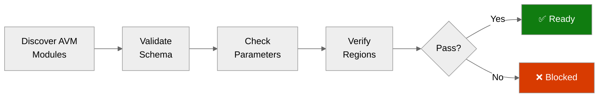

# ✅ Step 4b: Pre-Flight AVM Check - university

<strong>📑 Pre-Flight Contents</strong>

- [🎯 Purpose](#-purpose)
- [✅ AVM Schema Validation Results](#-avm-schema-validation-results)
- [🔎 Parameter Type Analysis](#-parameter-type-analysis)
- [🌍 Region Limitations Identified](#-region-limitations-identified)
- [⚠️ Pitfalls Checklist](#️-pitfalls-checklist)
- [🚀 Ready for Implementation](#-ready-for-implementation)

> Generated by bicep-code agent | 2026-10-07
> Status: **PASS**

| ⬅️ Previous                                            | 📑 Index            | Next ➡️                                                          |
| ------------------------------------------------------ | ------------------- | ---------------------------------------------------------------- |
| [04-implementation-plan.md](04-implementation-plan.md) | [README](README.md) | [05-implementation-reference.md](05-implementation-reference.md) |

## 🎯 Purpose

> [!IMPORTANT]
> This checkpoint validates AVM module schemas BEFORE Bicep code generation.

Prevents parameter type mismatches, deprecated parameter usage, region availability issues and object structure
errors. Evidence: the compiled `main.json` of each exact pinned module in the local Bicep cache (restored from MCR
for the approved pins only), the three Step 4 contract validators, and read-only live reads of the `workload`
subscription on 2026-10-07. No tenant, subscription or object IDs are recorded here.

Contract integrity gate (all exit 0): `validate:iac-contract` (35 resources), `validate:policy-property-map`
(22 policies), `validate:iac-contract-consistency` (plan hash OK; 3 cosmetic heading warnings carried to the handoff,
see the implementation reference).

## ✅ AVM Schema Validation Results

| Resource                | AVM Module Path                                         | Version  | Status                                                   |
| ----------------------- | ------------------------------------------------------- | -------- | -------------------------------------------------------- |
| Resource group          | `br/public:avm/res/resources/resource-group`            | `0.4.4`  | ✅ exact pin cached                                      |
| User-assigned identity  | `br/public:avm/res/managed-identity/user-assigned-identity` | `0.6.0` | ✅                                                       |
| Application Insights    | `br/public:avm/res/insights/component`                  | `0.8.0`  | ✅                                                       |
| Container registry      | `br/public:avm/res/container-registry/registry`         | `0.13.1` | ✅                                                       |
| Storage account         | `br/public:avm/res/storage/storage-account`             | `0.33.1` | ✅                                                       |
| Service Bus namespace   | `br/public:avm/res/service-bus/namespace`               | `0.17.1` | ✅                                                       |
| Key Vault               | `br/public:avm/res/key-vault/vault`                     | `0.14.2` | ✅                                                       |
| App Service plan        | `br/public:avm/res/web/serverfarm`                      | `0.7.0`  | ✅                                                       |
| Web app                 | `br/public:avm/res/web/site`                            | `0.24.0` | ✅                                                       |
| Private endpoints (×4)  | `br/public:avm/res/network/private-endpoint`            | `0.12.1` | ✅                                                       |
| SQL MI + schedule       | raw `Microsoft.Sql/managedInstances@2025-01-01`         | n/a      | ✅ justified in plan (no `databaseFormat` in AVM 0.5.1) |
| Diagnostic settings ×6  | raw `Microsoft.Insights/diagnosticSettings@2016-09-01`  | n/a      | ✅ extension resource, no AVM                            |

Pins were not changed; no newer version was substituted.

## 🔎 Parameter Type Analysis

<strong>Interface evidence (compiled schema of the pinned versions)</strong>

| Module / parameter                                    | Observed type and default                              | Wiring in this tree                                  |
| ----------------------------------------------------- | ------------------------------------------------------ | ---------------------------------------------------- |
| `web/serverfarm` `zoneRedundant`, `skuCapacity`       | `bool` default `true` for P SKUs; `int` default `3`    | set `false` and `1`                                  |
| `web/serverfarm` `reserved`                           | `bool`, default `kind == 'linux'`                      | `kind: 'linux'` so it resolves `true`                |
| `web/site` `kind`                                     | enum includes `app,linux,container`                    | `app,linux,container`                                |
| `web/site` `outboundVnetRouting`                      | untyped `object`                                       | `{ allTraffic, imagePullTraffic }` (checked by validate) |
| `web/site` `siteConfig`                               | untyped `object` (replaces the default)                | every hardening key set explicitly                   |
| `web/site` `managedIdentities`                        | `{ systemAssigned?, userAssignedResourceIds? }`        | user-assigned only                                   |
| `storage-account` `skuName`                           | enum, default `Standard_GRS`                           | `Standard_LRS`                                       |
| `storage-account` `publicNetworkAccess`               | nullable enum, default null                            | `Disabled`                                           |
| `service-bus/namespace` `skuObject`                   | `{ name, capacity? }`, default capacity `2`            | `Premium`, capacity `1`                              |
| `service-bus/namespace` `zoneRedundant`               | `bool` default `true` (always emitted)                 | left at module value (accepted, recorded)            |
| `service-bus/namespace` `authorizationRules`          | array, default `RootManageSharedAccessKey`             | `[]`                                                 |
| `service-bus/namespace` `networkRuleSets`             | object with `publicNetworkAccess`, `defaultAction`, `trustedServiceAccessEnabled` | all set                  |
| `container-registry/registry` `zoneRedundancy`        | enum, default `Enabled` (never null)                   | left at module value (accepted, recorded)            |
| `container-registry/registry` `publicNetworkAccess`   | nullable enum                                          | `Disabled`                                           |
| `container-registry/registry` `retentionPolicyStatus` | enum, default `enabled`                                | `disabled`                                           |
| `key-vault/vault` `sku`, `enablePurgeProtection`      | default `premium`, `true`                              | `standard`, `false`                                  |
| `key-vault/vault` `enableVaultFor*`                   | `enableVaultForDeployment`, `...TemplateDeployment`, `...DiskEncryption` | all `false`                |
| `insights/component` `disableLocalAuth`, `kind`       | defaults `false`, empty                                | `true`, `web`                                        |
| `network/private-endpoint` `privateLinkServiceConnections` | nullable array of the ARM type                    | one entry per PE; no `privateDnsZoneGroup`           |
| `resources/resource-group` outputs                    | `name`, `resourceId`, `location`                       | used for module scoping                              |

Output evidence: `storage-account` and `service-bus/namespace` expose key and connection-string outputs as
`securestring`. Nothing in this tree reads them.

## 🌍 Region Limitations Identified

| Resource                  | Region            | Limitation                                                         | Action                                                      |
| ------------------------- | ----------------- | ------------------------------------------------------------------ | ----------------------------------------------------------- |
| All resources             | `swedencentral`   | Hub VNet region; West Europe is denied at the tenant root          | `location` is `@allowed` swedencentral, germanywestcentral  |
| Workspace `log-management` | `swedencentral`  | Must be an approved region                                         | Preflight script stops otherwise                            |
| ACR, Service Bus          | `swedencentral`   | Platform zone redundancy forced by the pinned modules              | Accepted and recorded (az_posture decision)                 |
| Regional SKU manifest     | `germanywestcentral` | Manifest is priced for swedencentral                            | Deploy there only if the hub is there and the owner re-approves |

Live reads on 2026-10-07 (workload subscription, read-only): spoke `rg-spoke/vnet-spoke` in `swedencentral`,
10.20.1.0/24, peering `Connected`, DNS 10.100.0.4; `snet-app` delegated to `Microsoft.Web/serverFarms` with a route
table; `snet-pe` with a route table; `snet-sqlmi` delegated to `Microsoft.Sql/managedInstances` with an NSG and a route
table; all ten required resource providers `Registered`.

## ⚠️ Pitfalls Checklist

Based on [Azure Defaults Skill](../../.github/skills/apex-azure-defaults/SKILL.md):

- [x] Storage and Key Vault names fit 24 characters with the maximum 6-character suffix (18 and 20)
- [x] Storage name has no hyphens
- [x] `APPLICATIONINSIGHTS_CONNECTION_STRING` is used, not an instrumentation key
- [x] AVM defaults that conflict with policy are overridden explicitly (serverfarm zones/capacity, storage SKU and shared key, Key Vault SKU and purge protection, Service Bus capacity/rules/public access)
- [x] Key Vault `enableVaultFor*` flags are false, so `networkAcls.bypass: 'None'` is allowed
- [x] Subscription-scope entry point uses `resourceId()` with explicit subscription and RG for the vended spoke
- [x] No `uniqueString()`: the owner-supplied `suffix` is the only uniqueness source
- [x] RBAC assigned inside the target resource's module, not in `identity.bicep` (no circular dependency)
- [x] No subnet, NSG, route table, private DNS zone or zone group declared (landing-zone owned)

## 🚀 Ready for Implementation

| Check                      | Status | Notes                                                                 |
| -------------------------- | ------ | --------------------------------------------------------------------- |
| All AVM modules verified   | ✅     | Exact pins restored and inspected                                     |
| Parameter types confirmed  | ✅     | Limited to interfaces used by the planned bindings; server-side rules are checked by validate and what-if |
| Region limitations handled | ✅     | Hub region swedencentral, approved                                    |
| Pitfalls addressed         | ✅     |                                                                       |

> [!IMPORTANT]
> **Go / No-Go Verdict**
>
> | Signal      | Status       |
> | ----------- | ------------ |
> | AVM Modules | ✅           |
> | Parameters  | ✅           |
> | Regions     | ✅           |
> | Pitfalls    | ✅           |
> | **Overall** | **✅ READY** |

---

_Pre-flight validation for university Bicep implementation_

---

| ⬅️ [04-implementation-plan.md](04-implementation-plan.md) | 🏠 [Project Index](README.md) | ➡️ [05-implementation-reference.md](05-implementation-reference.md) |
| --------------------------------------------------------- | ----------------------------- | ------------------------------------------------------------------- |

