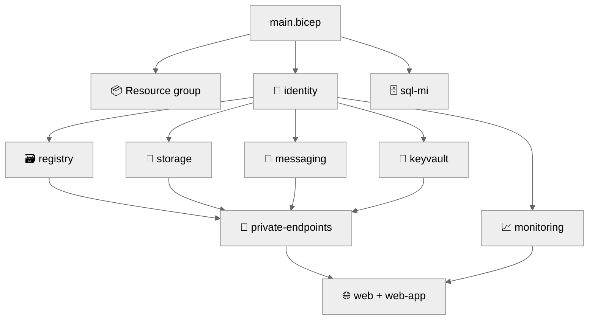

# 💻 Step 5: Implementation Reference - university


<details open>
<summary><strong>📑 Implementation Reference</strong></summary>

- [📁 IaC Templates Location](#-iac-templates-location)
- [🗂️ File Structure](#️-file-structure)
- [✅ Validation Status](#-validation-status)
- [🏗️ Resources Created](#️-resources-created)
- [🚀 Deployment Instructions](#-deployment-instructions)
- [📝 Key Implementation Notes](#-key-implementation-notes)

</details>

> Generated by bicep-code agent | 2026-10-07

| ⬅️ Previous                                    | 📑 Index            | Next ➡️                                         |
| ---------------------------------------------- | ------------------- | ----------------------------------------------- |
| [04-preflight-check.md](04-preflight-check.md) | [README](README.md) | [06-deployment-summary.md](06-deployment-summary.md) |

## 📁 IaC Templates Location

📁 **Code Location**: [`infra/bicep/university/`](../../infra/bicep/university/)

Generated only from the approved Step 4 plan and contracts. Nothing was deployed.

## 🗂️ File Structure

```text
infra/bicep/university/
├── main.bicep                     # Subscription-scope entry point: RG + module calls + outputs
├── main.bicepparam                # readEnvironmentVariable() inputs only (no IDs)
├── azure.yaml                     # azd manifest (infra.path: .; pwsh hooks)
├── README.md                      # Inputs, hooks, Azure Hybrid Benefit assumption and how to turn it off
├── modules/
│   ├── identity.bicep             # UAMI (AVM)
│   ├── monitoring.bicep           # Application Insights (AVM) + Monitoring Metrics Publisher
│   ├── registry.bicep             # Premium ACR (AVM) + AcrPull / AcrPush / Data Importer
│   ├── storage.bicep              # Storage (AVM) + container + roles + account metrics setting
│   ├── messaging.bicep            # Service Bus (AVM) + queue + roles
│   ├── keyvault.bicep             # Key Vault (AVM) + roles
│   ├── private-endpoints.bicep    # 4 PEs (AVM) + 4 metrics settings
│   ├── sql-mi.bicep               # raw SQL MI + startStopSchedules
│   ├── web.bicep                  # App Service plan (AVM) + metrics setting + web-app call
│   └── web-app.bicep              # Public HTTPS web app (AVM), isolated for the scanner scope
└── scripts/
    ├── preflight.ps1              # Read-only checks and derivation (standalone, PowerShell 7)
    ├── postdeploy-tests.ps1       # Readiness tests (standalone, PowerShell 7)
    ├── write-deployment-summary.ps1 # Writes 06-deployment-summary.md + apex-recall Step 6 (owner-approved, 2026-10-08: azd bypasses 07b, which would otherwise write it)
    └── hooks/
        ├── preprovision.ps1       # azd wrapper for preflight.ps1
        └── postprovision.ps1      # azd wrapper for postdeploy-tests.ps1, then write-deployment-summary.ps1
```

No `deploy.ps1` is generated, as the plan states; the kit's `archetype/deploy.ps1` calls the standalone scripts.

## ✅ Validation Status

| Check                                            | Result                  | Details                                                                                          |
| ------------------------------------------------ | ----------------------- | ------------------------------------------------------------------------------------------------ |
| `bicep build` / `bicep lint`                     | ✅                      | 0 errors, 0 warnings on `main.bicep`                                                             |
| `az deployment sub validate` (`workload`)        | ✅ exit 0, `Succeeded`  | Output sha256 `8b4bebd36c83f5cab2c8abd01c1c2af0c3eed1a6f790a2f3dfdf2f28e58d3c95` (plan `5a4b96e4`) |
| `az deployment sub what-if` (`workload`)         | ✅ exit 0, `Succeeded`  | Output sha256 `894516e13cc76529aad0abd198c70ea57ab21ea786331f0937b31a11bbb954b4`; against the member's existing deployment: 15 NoChange, 19 Modify, 5 Ignore, 6 Unsupported role-definition lookups, no resource Delete; no ACR or SQL MI identity delta |
| Zone and GRS scan of the what-if                 | ✅                      | Only recorded settings (see notes); Storage is `Standard_LRS`                                    |
| Private endpoint diagnostics `2016-09-01`        | ✅ accepted             | Validate and what-if accepted it on all four PEs; the `2021-05-01-preview` fallback was not used |
| `validate:iac-security-baseline`                 | ✅ with scoped flag     | Passes with `--public-web-app infra/bicep/university/modules/web-app.bicep`                      |
| `validate:sku-iac-coverage`                      | ✅                      | Symbols match the SKU manifest logical names                                                     |
| Contract validators (contract, policy map, consistency) | ✅ with 3 warnings | Warnings: `st-container`, `sbns-queue`, `sqlmi-schedule` headings (see notes)                    |
| `bicep-validate-subagent`                        | ✅ APPROVED             | Rerun after the plan `5a4b96e4` changes: APPROVED, lint 0 errors, L2 attestation 20 of 20 satisfied. Earlier NEEDS_REVISION (Key Vault `tenantId`) closed by the owner-accepted variance |
| Preflight script against the live subscription   | ✅                      | All ten check groups pass, including the new SQL MI directory identity check (read-only, no IDs recorded) |

Preflight, validate and what-if used the suffix of the member's existing deployment, because `snet-sqlmi` already hosts
that managed instance and the preflight stops on any other suffix. The what-if resolves every module, but a successful
validate or what-if does not prove apply, SQL MI capacity or private DNS outcomes.

## 🏗️ Resources Created

| Resource                                 | Bicep Type                                       | Module                      |
| ---------------------------------------- | ------------------------------------------------ | --------------------------- |
| Resource group                           | `Microsoft.Resources/resourceGroups`             | `main.bicep` (AVM)          |
| User-assigned identity                   | `Microsoft.ManagedIdentity/userAssignedIdentities` | `identity.bicep`          |
| Application Insights                     | `Microsoft.Insights/components`                  | `monitoring.bicep`          |
| Container registry                       | `Microsoft.ContainerRegistry/registries`         | `registry.bicep`            |
| Storage account + container              | `Microsoft.Storage/storageAccounts`              | `storage.bicep`             |
| Service Bus namespace + queue            | `Microsoft.ServiceBus/namespaces`                | `messaging.bicep`           |
| Key Vault                                | `Microsoft.KeyVault/vaults`                      | `keyvault.bicep`            |
| SQL managed instance + schedule          | `Microsoft.Sql/managedInstances`                 | `sql-mi.bicep`              |
| Private endpoints (×4)                   | `Microsoft.Network/privateEndpoints`             | `private-endpoints.bicep`   |
| App Service plan                         | `Microsoft.Web/serverfarms`                      | `web.bicep`                 |
| Web app                                  | `Microsoft.Web/sites`                            | `web-app.bicep`             |
| Diagnostic settings (×6: 4 PEs, plan, storage) | `Microsoft.Insights/diagnosticSettings`    | `private-endpoints`, `web`, `storage` |
| Role assignments (×12)                   | `Microsoft.Authorization/roleAssignments`        | via each AVM module         |



## 🚀 Deployment Instructions

<details>
<summary><strong>🟢 Quick Deploy (azd — hand off to Step 6, do not run here)</strong></summary>

```bash
cd infra/bicep/university
azd env new university-dev
azd env set AZURE_TENANT_ID <tenant-id>
azd env set AZURE_SUBSCRIPTION_ID <subscription-id>
azd env set SUFFIX <suffix>
azd env set AZURE_LOCATION swedencentral
azd provision --preview
```

</details>

<details>
<summary><strong>🔍 Validate and preview (no deployment)</strong></summary>

```bash
az deployment sub validate --location <region> --template-file main.bicep --parameters main.bicepparam
az deployment sub what-if  --location <region> --template-file main.bicep --parameters main.bicepparam
```

Run `scripts/preflight.ps1` first in the same PowerShell session: it exports the derived environment values the
parameter file reads.

</details>

## 📝 Key Implementation Notes

| Note                                                                 | Impact                      | Reference                                          |
| -------------------------------------------------------------------- | --------------------------- | -------------------------------------------------- |
| Azure Hybrid Benefit (`BasePrice`) assumption and opt-out documented | SQL MI licence cost         | `README.md`, `modules/sql-mi.bicep` (handoff 5d241bcc) |
| What-if zone and GRS settings are exactly the recorded ones          | Reliability posture         | ASP `zoneRedundant` false; SQL MI `zoneRedundant` false, backup `Local`; ACR `zoneRedundancy` Enabled and Service Bus `zoneRedundant` true (forced by AVM, accepted); Storage `Standard_LRS`; web app `redundancyMode` `None` (module default, not zone or geo) |
| Private endpoint diagnostics use `2016-09-01`                        | Metrics to `log-management` | `modules/private-endpoints.bicep`; fallback unused |
| Preflight step 9 reads inherited assignments with the ARM `atScope()` filter | Landing-zone DINE check | `scripts/preflight.ps1`; `az policy assignment list` omitted the management-group ALZ-lite assignments in this tenant |
| ACR `azureADAuthenticationAsArmPolicyStatus: 'enabled'` | UAMI image pull | `modules/registry.bicep` (module default is `disabled`); `postdeploy-tests.ps1` fails before the image switch unless `az acr config authentication-as-arm show` returns `enabled`; Audit result from policy 42781ec6 is expected, not a block |
| SQL MI `SystemAssigned,UserAssigned`, primary identity `id-sqlmi-directory` | C7 creates Entra users | `modules/sql-mi.bicep`; `sqlMiDirectoryIdentityId` derived by preflight step 10 (exists and the deployer holds `userAssignedIdentities/*/assign/action`); Graph grant is B08-owned and not read here |
| A provision run without `CONTAINER_IMAGE` previews the web app back on the MCR placeholder | Image drift | The postprovision hook persists the registry copy; provision from an azd environment that has it |
| Web app isolated in `web-app.bicep`                                  | Scanner scope               | Needed for `--public-web-app`; plan listed it inside `web.bicep` |
| Key Vault `tenantId` not wired                                       | Contract wording variance   | Owner-approved 2026-10-07. Pinned AVM 0.14.2 sets the vault tenant to `subscription().tenantId`; `tenantId` still feeds the SQL MI admin and the preflight tenant check |
| Plan-heading warnings (`st-container`, `sbns-queue`, `sqlmi-schedule`) | Cosmetic traceability     | Not changed: resolving them edits the frozen plan or contract (plan-lock). Owner chose to leave them as cosmetic warnings (2026-10-07) |
| What-if resolved every module; 6 role-definition lookups report `Unsupported` | Evidence limit     | Provider limitation, not a template defect         |

```bicep
// Names derive from the owner-supplied suffix only (no uniqueString):
var rgName = 'rg-${projectName}-${suffix}'
```

---

_Implementation reference generated from Bicep templates._

---

<div align="center">

| ⬅️ [04-preflight-check.md](04-preflight-check.md) | 🏠 [Project Index](README.md) | ➡️ [06-deployment-summary.md](06-deployment-summary.md) |
| ------------------------------------------------- | ----------------------------- | ------------------------------------------------------- |

</div>
