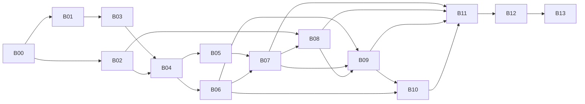

# Backlog

The work items that build v1 of the kit. Scope is in the [PRD](../prd.md) and phases are in the [roadmap](../roadmap.md). Each item is a spec: what to build, the decisions already made and how to prove it works. The executor, a coding agent, writes the code. Rules for the executor are in [AGENTS.md](AGENTS.md).

## How to run an item

1. Pick an item whose **Depends on** items are all closed: `gh issue list --milestone "<milestone>"`.
2. Start a new Copilot session in this repo. B00 is the exception: it runs in the local folder, before the repo exists.
3. Send the kickoff prompt:

   ```text
   Execute backlog item BNN. Follow docs/backlog/AGENTS.md.
   ```

4. Answer the 🧑 HUMAN steps and approval questions as they come up.
5. Review the draft PR, mark it ready and squash-merge it. The merge closes the item's issue.

Issue number N is item BNN: B00 creates issues #1–#13 in order, before any PR exists.

## Items

| ID | Title | Milestone | Type | Depends on | Status |
|---|---|---|---|---|---|
| [B00](B00-create-repo.md) | Create the repo, milestones and issues | P1 | Both | — | Ready |
| [B01](B01-scaffold-site.md) | Scaffold the repo tooling and the site | P1 | Both | B00 | Ready |
| [B02](B02-build-sub-preflight.md) | Prepare the build subscriptions and write the preflight script | P1 | Agent | B00 | Ready |
| [B03](B03-import-app.md) | Import Contoso University and publish the legacy package | P1 | Both | B01 | Ready |
| [B04](B04-datacenter.md) | Build the datacenter kit | P1 | Both | B02, B03 | Ready |
| [B05](B05-db-perf-kit.md) | Build the DB perf kit | P1 | Both | B04 | Ready |
| [B06](B06-spike-ghcp.md) | Spike: GHCP golden path on the dev VM | P2 | Both | B04 | Ready |
| [B07](B07-spike-arc-mi-link.md) | Spike: Arc onboarding and MI link migration | P2 | Both | B05, B06 | Ready |
| [B08](B08-foundation.md) | Build the foundation: ALZ-lite, vending, probes and exemptions | P3 | Both | B02, B07 | Ready |
| [B09](B09-archetype.md) | Build the CoE archetype with APEX | P3 | Both | B06, B07, B08 | Ready |
| [B10](B10-playbook-lifelines.md) | Build the modernization playbook, skills and lifelines | P3 | Both | B06, B09 | Ready |
| [B11](B11-challenge-content.md) | Write the challenges, module contracts and templates | P4 | Agent | B07, B08, B09, B10 | Ready |
| [B12](B12-facilitator-kit.md) | Build the facilitator kit | P4 | Both | B11 | Ready |
| [B13](B13-dry-run-v1.md) | Dry run, tune and release v1.0 | P5 | Both | B12 | Ready |

**Type:** *Agent* items need the owner only for approvals and the merge. *Both* items also have 🧑 HUMAN steps.



B01 and B02 can run in parallel, and so can B05 and B06. Everything from B04 to B10 runs in order in the build subscriptions, because the items share them.

## Conventions

These apply to every runbook. A runbook may add to them but never contradicts them.

### Repo layout

Everything lives in this one repo. Attendees create their own copy from it as a template. APEX is the exception: attendees run it from their own repo, created from `jonathan-vella/apex-accelerator`, and copy the archetype into it.

```text
apex-factory-hackathon/
├── README.md, LICENSE, NOTICE, versions.md
├── docs/                   Kit-builder docs, not published: PRD, roadmap, backlog, spikes
├── site/                   Starlight site, published to factory.apexops.pro
├── app/ContosoUniversity/  Legacy app, the modernization starting state (B03)
├── infra/datacenter/       Pre-work "on-premises" datacenter Bicep and in-VM scripts (B04)
├── infra/foundation/       ALZ-lite, vending, DNS and firewall rules Bicep (B08)
├── archetype/              CoE archetype: APEX project output, copied into an APEX repo (B09)
├── db/perf-kit/            Volume data, legacy DB objects and workload (B05)
├── scripts/                PowerShell tools (deploy, preflight, probes, cleanup) and site checks
├── templates/              Attendee and team templates (B11)
├── facilitator/            Facilitator guide, scoring rubric (SSOT), curveballs, costs (B12)
├── coach/                  Answer keys, lifeline index, golden-path notes (B05, B10)
├── test/                   Node tests for the site scripts
└── .github/                Workflows, plus the modernization instructions, skills and playbook (B10)
```

Coach material is public, on the honor system. Lifelines are branches named `lifeline/*` in this repo (B10).

### Build environment

The kit is built and validated in **two Azure subscriptions** that the owner controls, mirroring one team at an event:

- the **shared services subscription**, which holds the team's ALZ-lite hub and Log Analytics workspace;
- the **workload subscription**, which holds member `1`'s datacenter, spoke and archetype.

Both subscriptions also hold unrelated resources. Items only touch what they create, and teardown moves both subscriptions back to their original management group. Full portal ALZ isn't part of the kit: a coach demos it live at the event.

### Names and IP plan

`n` is the member index, 1–20. It's the `memberIndex` parameter everywhere.

| Item | Value |
|---|---|
| Region | `swedencentral` (parameter `location`). Fallback: `germanywestcentral` |
| Management groups | `mg-factory` with `mg-factory-platform` (shared services subscription) and `mg-factory-corp` (workload subscriptions), created by ALZ-lite (B08). Prefix parameter `mgPrefix` |
| Shared services subscription | One per team. `rg-management` with `log-management`; `rg-hub` with `vnet-hub` `10.100.0.0/16`, `afw-hub`, `afwp-hub` and the private DNS zones (B08) |
| Workload subscription | One per member. Holds the datacenter, the spoke and the archetype |
| Datacenter | `rg-datacenter`, `vnet-datacenter` `10.10.n.0/24`, `snet-servers` `10.10.n.0/25`, `AzureBastionSubnet` `10.10.n.192/26` |
| Datacenter VMs | `vm-app01` `10.10.n.4` (IIS, SQL Server 2022 Developer, MSMQ, legacy app). `vm-dev01` `10.10.n.5` (Windows 11 dev workstation) |
| Datacenter edge | `nat-datacenter` with `pip-nat-datacenter`, `bas-datacenter` (Bastion **Standard**, never Developer) with `pip-bas-datacenter`, `nsg-servers`. These two are the datacenter's only public IPs |
| Spoke | `rg-spoke`, `vnet-spoke` `10.20.n.0/24` |
| Spoke subnets | `snet-app` `10.20.n.0/26` (delegated to `Microsoft.Web/serverFarms`), `snet-pe` `10.20.n.64/26`, `snet-sqlmi` `10.20.n.128/26` (delegated to `Microsoft.Sql/managedInstances`) |
| Workload resources | CAF abbreviation + `university` + suffix, the APEX default (for example `app-university-<suffix>`) |
| Suffix | 4–6 lowercase letters and digits, unique per member |
| Database and app login | `ContosoUniversity`, SQL login `contosoapp` (source only) |
| VM admin | `labadmin` |
| Datacenter lab password | `FactoryLab-2026-Pw`, for `labadmin` on the datacenter VMs and the SQL login `contosoapp`. Fixed and documented: see **Secrets** |

Connection strings use the app VM's IP, `10.10.n.4`, not its name, because name resolution changes once the datacenter uses the hub's DNS.

### Local settings

Executors keep environment-specific values in `.local/settings.json` at the repo root. The folder is gitignored and never committed. The owner creates the file with the tenant and subscription IDs, and B02 adds the suffix. Later runbooks add keys when they need them:

```json
{
  "tenantId": "<tenant-id>",
  "sharedSubscriptionId": "<shared-services-subscription-id>",
  "subscriptionId": "<workload-subscription-id>",
  "location": "swedencentral",
  "memberIndex": 1,
  "suffix": "<suffix>"
}
```

`subscriptionId` is always the workload subscription.

Read a value with `(Get-Content .local/settings.json | ConvertFrom-Json).subscriptionId`.

### Secrets

- Scripts generate passwords; people never type them. They save them outside the repo, in `$HOME/.apex-factory/<subscription-id>/<component>.json`.
- **Exception: the datacenter's lab credentials are fixed and documented.** `labadmin` on `vm-app01` and `vm-dev01`, and the SQL login `contosoapp`, use `FactoryLab-2026-Pw`, so attendees and coaches don't have to look anything up. This applies to the datacenter only, never to the foundation, the archetype or any Azure secret. It's safe because the datacenter has no public IPs and is reachable only through Bastion, behind Entra ID and Azure RBAC, and it's a throwaway lab that's never production. The deploy script still writes the values to `$HOME/.apex-factory/<subscription-id>/datacenter.json`.
- Azure secrets that the workload needs go into Key Vault.
- Pass secure Bicep parameters through a temporary parameters file in `$env:TEMP` (or `/tmp` in Cloud Shell), and delete it afterwards. Don't pass them on the command line: special characters break quoting.

### Licensing: Azure Hybrid Benefit on by default

Every resource that supports Azure Hybrid Benefit (AHB) or a bring-your-own-licence setting deploys with it **on**, through a parameter that defaults to on. Partners in CSP usually have the licences, and it roughly halves the cost of Windows VMs.

| Resource | Setting | Notes |
|---|---|---|
| Windows Server VM (`vm-app01`) | `licenseType: 'Windows_Server'` | AHB for Windows Server |
| Windows 11 VM (`vm-dev01`) | `licenseType: 'Windows_Client'` | Multitenant hosting rights, needed to run Windows 11 on Azure |
| SQL Server Developer on the VM | None | Developer edition is free |
| Arc-enabled SQL Server Developer | None | Developer edition is free |
| SQL Managed Instance | `licenseType: 'BasePrice'` | B09 checks how it interacts with the free offer |
| App Service for Linux, Azure Firewall, other PaaS | None | AHB doesn't apply |

Every script or page that deploys one of these says that AHB is on, what it assumes (the partner holds eligible licences) and how to turn it off after deployment, for example `az vm update -g rg-datacenter -n vm-app01 --license-type None`.

### Availability zones: never pinned, never turned on

The kit never pins a resource to an availability zone and never turns zone redundancy on. Don't set `zones` on any resource, and leave zone redundancy off wherever it's optional:

| Resource | Setting |
|---|---|
| VMs and their disks, NAT gateway, Azure Firewall | No zone |
| SQL Managed Instance, App Service plan | Zone redundancy off |
| Storage accounts | LRS |
| Azure Container Registry, Service Bus, Standard public IPs | Zone-redundant automatically in regions with zones, at no extra cost, and it can't be turned off. Accepted: don't set `zones` on them |

Other services that are zone-redundant automatically are accepted the same way. Every runbook that deploys one of these resources states its zone setting. Zone-only SKU restrictions don't block the kit's VMs, because they're non-zonal.

### Cost and teardown

- Each runbook's field table states the hourly cost of what it deploys, at list price with AHB on.
- VMs have no auto-shutdown. Teams stop them when they're idle, and every deploy script prints how. Bastion Standard keeps billing (about $0.29/hour) while the VMs are stopped.
- The executor tears down what an item deployed at the end of the item. The exception is the datacenter, which B04 deploys and B07 tears down, so that B05–B07 can build on it. The **Teardown** row in each runbook says which applies.
- Teardown covers subscription-level artifacts too, not just resource groups: policy assignments and their managed identities' role assignments, exemptions, other role assignments, budgets, firewall policy rule collection groups, Arc resources, soft-deleted Key Vaults, and management groups and subscription placement. Verify each is gone with a query, and put the results in the PR.
- **Private-only backends, two exceptions:** the web app's front end accepts public HTTPS inbound traffic, and Application Insights ingestion stays public, with the hub firewall allowing the Azure Monitor ingestion endpoints. Every other service has public network access off. Both exceptions are documented wherever they apply.

### Scripts

- Scripts the attendee runs (in `scripts/`) are PowerShell 7 and must also work in Azure Cloud Shell, which runs on Linux. Use `Join-Path` and don't use Windows-only cmdlets. Each one starts with `#Requires -Version 7.4`, uses `[CmdletBinding()]` with typed parameters, sets `$ErrorActionPreference = 'Stop'`, and has comment-based help with at least one example.
- Scripts that run inside the VMs (run commands and anything under `infra/**/scripts/`) are Windows PowerShell 5.1. Start them with `$ErrorActionPreference = 'Stop'`, `$ProgressPreference = 'SilentlyContinue'` and `[Net.ServicePointManager]::SecurityProtocol = [Net.SecurityProtocolType]::Tls12`. Use `Invoke-WebRequest -UseBasicParsing`. Make them idempotent, and log to `C:\LabTools\logs\<script-name>.log`.
- Every script is clean under PSScriptAnalyzer with its default rules.
- Bicep: `az bicep build` and `az bicep lint` must be clean, with no warnings. Pin API versions, and don't use preview API versions unless the runbook says so. Use Azure Verified Modules only where a runbook names them.

### Spike reports

Spikes write their report to `docs/spikes/BNN-<slug>/README.md`, with evidence in the same folder (scrubbed of IDs and secrets). The report has a field table (Date, Result as ✅ Pass / ⚠️ Pass with changes / ❌ Fail, Region, Versions), then these sections: Question, What we did, Timings, Findings, Decisions, Evidence, Follow-ups.

**Decisions** lists only what the owner approved, with the PRD section or runbook it changes.

### versions.md

`versions.md` at the repo root is the compatibility manifest (PRD §7). Any item that pins a version adds or updates its row: component, version or commit, where it's used, and the date it was validated.

### Runbook format

Every runbook has the same parts:

- A field table with Milestone, Type, Depends on, Unblocks, Effort, Cost, Teardown and PRD. B00 parses the Milestone and Depends on rows, so keep their format.
- **Outcome:** what exists when the item is done, in a few bullets.
- **Before you start:** checks to run first.
- **Requirements:** numbered and grouped. Each one is a testable statement of what to build. 🧑 HUMAN marks a step for the owner and 🔎 VERIFY marks a fact to check against the linked page.
- **Deliverables:** every file the item creates or changes, with its path.
- **Verify:** the checks that prove the requirements are met, with the commands to run where they're simple.
- **Done when**, **Commit message**, **Stop and ask if** and **Notes and traps**.

Runbooks don't contain implementation code. Code blocks hold only commands to run for checks, exact values that must match (IDs, commit SHAs, messages) and the commit message.
