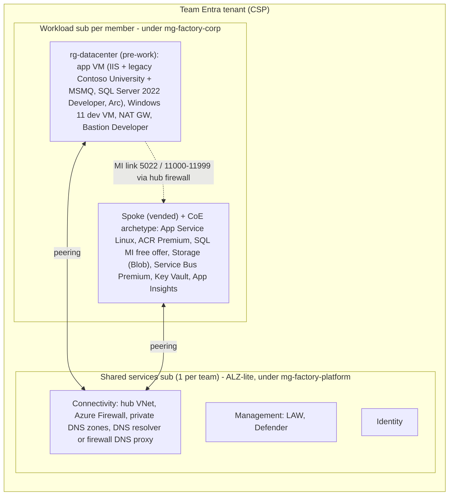

# Partner Modernization Factory hackathon: PRD

> **Modernize today. Enable AI tomorrow.** A repeatable framework that helps partners build, validate and scale Azure modernization practices, using existing skills, reusable assets and AI-assisted assessments.

**Status:** draft (pre-v1) · **Owner:** [@jonathan-vella](https://github.com/jonathan-vella) · **Last updated:** 2026-09-24 · **Delivery:** [roadmap](roadmap.md) and [backlog](https://github.com/jonathan-vella/apex-factory-hackathon/issues)

## 1. Problem and approach

Partners need a CoE-style, repeatable way to deliver modernization at scale. Today the building blocks are separate labs: the APEX microhack, the GitHub Copilot (GHCP) app modernization microhack, the Arc SQL lab and Azure Landing Zones (ALZ). The approach is to combine them into **one end-to-end, challenge-based, 2-day hackathon** on a single app: Contoso University, the sample the official GHCP .NET quickstarts use. It's packaged as a forkable monorepo plus a Starlight site, so partners can run and redistribute it themselves.

**Storyline:** secure foundation (ALZ-lite, with a live portal ALZ demo) → assess (GHCP + Arc) → choose target state (ADRs) → deploy the CoE archetype (APEX) → modernize app (GHCP) → migrate data (Arc + MI link) → validate → optimize DB (GHCP) → package, operate, and review AI readiness.

- **Goals:** partners can run the event without the author. Every member reaches a live cutover on the golden path. Every artifact can be reused in customer delivery.
- **Non-goals (v1):** attendees deploying full portal ALZ (a coach demos it live), deploying AI services, an AKS archetype, WebForms/WCF, production CI/CD, multi-region.
- **Success metrics:** ≥90% of members green at T-3 (3 days before the event). ≥80% of members reach cutover. Lifeline use tracked per challenge. A partner runs a pilot unaided.

## 2. Decisions

| Topic | Decision |
|---|---|
| Format | 2 days plus pre-work. Modular: each module can also run standalone |
| Audience | Mostly Azure infra architects/engineers. App and DB work is Copilot-assisted |
| Licensing | Partners bring their own Azure in CSP and their own GitHub Copilot. Nothing else is supported |
| Hybrid Benefit | Azure Hybrid Benefit is on by default for every resource that supports it: Windows Server VMs, the Windows 11 dev VM (multitenant hosting rights) and SQL MI. It's documented wherever it's deployed, with how to turn it off after deployment |
| Tenancy | 1 Entra tenant per team, with 1 shared services sub per team plus 1 workload sub per member, so team size + 1 subs |
| Kit build | The kit is built and validated in two subscriptions (one shared services, one workload) in the owner's tenant, mirroring one team |
| IaC | Bicep only |
| Foundation | **ALZ-lite** Bicep only: a small management group hierarchy, the hub and central services in the shared services sub, and core policies at the Corp management group. "Vending" means placing each pre-created workload sub under Corp and applying spoke, peering, firewall rules, RBAC and budget. Full portal ALZ is a live coach demo, with no kit scripts |
| Datacenter | Two VMs: one app server (IIS and SQL Server 2022 Developer) and one dev VM. Each member deploys it into their own workload sub by T-3. It connects to the hub via **VNet peering** (simulated ExpressRoute) |
| Availability zones | Never pinned, never turned on. VMs, disks, the NAT gateway and the firewall have no zone; zone redundancy is off wherever it's optional (SQL MI, App Service), and storage is LRS. Services that are zone-redundant automatically at no extra cost and can't opt out (ACR, Service Bus, Standard public IPs) are accepted |
| Dev environment | Windows 11 Enterprise dev VM per member, inside the datacenter. APEX runs in Codespaces or Docker |
| App scope | Contoso University only (.NET Framework 4.8 MVC with EF Core 3.1). It replaced eShop, whose hard parts were .NET plumbing (EF6, Autofac, legacy logging). Contoso's legacy dependencies (LocalDB, local files, MSMQ) each map to a GHCP predefined task. WebForms/WCF later |
| Messaging | MSMQ → Service Bus Premium (1 MU) with a private endpoint, deployed by the archetype |
| Compute | App Service for Linux (containers) only. AKS is a future archetype that teams can argue for in a C4 ADR |
| Archetype | Pre-built by the CoE with APEX (steps 1–5 done) and demoed by the event deliverer. Members only run APEX Deploy and As-Built, supplying tenant ID, subscription ID and a unique suffix |
| Data migration | Arc portal migration with **MI link** (online, read-only replica, planned cutover). Rollback means aborting before cutover; a real failback is a bonus. Log Replay Service (LRS) is the fallback |
| AI | AI-readiness review only. No AI services are deployed |
| Copilot models | No model is pinned, because models and their behaviour change. Guidance by phase, dated: a balanced model (Sonnet- or Terra-class) for assessment, the most capable (Opus- or Sol-class) for planning, and an efficient model at maximum reasoning effort (Luna-class) to explore for execution |
| Scoring | Markdown rubric as the single source of truth (SSOT), with coach sign-off and light gamification. Team score = platform challenges + member workload points averaged across the team |
| Home | This monorepo and its site (factory.apexops.pro), one folder per module. APEX microhack patterns are reused, not duplicated |
| Repos | One public template repo, owner `jonathan-vella`, MIT (§7). Coach material is public, on the honor system |
| Regions | Default swedencentral, fallback germanywestcentral. Both are parameters. No automated quota checks |

## 3. Personas

- **Attendee:** a partner infra architect or engineer. Builds the team platform, then runs the full workload path in their own sub.
- **Coach:** a partner CoE lead or Microsoft PSA. Demos APEX, signs off rubric evidence, triggers curveballs and hands out lifelines (checkpoint branches).
- **Event owner:** a partner practice lead who forks the kit to run their own events.

## 4. Environment model

- Each team and member gets a non-overlapping IP plan, with datacenter and spoke ranges derived from the member index. Vending creates the spoke with all its subnets (including the delegated MI subnet), UDRs and firewall rules. The archetype only references them by naming convention.
- All PaaS services are private-only, with one documented exception: Application Insights ingestion stays public, and the hub firewall allows the Azure Monitor ingestion endpoints. The dev VM reaches the services through the hub firewall and DNS. This is how attendees push images, browse the app and run DB tooling. A probe script checks DNS and ports from the dev VM and the app VM.
- The pre-work datacenter exists before ALZ does, so ALZ policies will flag it once the sub moves to Corp. An exemption script (with owner and expiry) runs right after the move. It's a deliberate lesson: "deferred work needs owner, target, timeline". Arc on Azure VMs is labelled lab-only, not a customer pattern.

## 5. Journey, modules and challenges

| Day | Module (standalone) | Challenge | Scope | Time box | Outcome / evidence |
|---|---|---|---|---|---|
| Pre | M0 Pre-work | C0 Ready to hack | Member | 2–3 h | Go/no-go preflight green by T-14 (RBAC, MFA registered, providers, Copilot policies, APEX runtime). Datacenter deployed by T-3, SQL onboarded to Arc, first Arc migration assessment done, legacy Contoso University running |
| 1 | M1 Foundation | C1 Define the opportunity | Team | 45 m | Opportunity and 6-dimension modernization plan (done while ALZ deploys) |
| 1 | M1 Foundation | C2 Secure, AI-ready foundation | Team | 2 h | Live portal ALZ demo by a coach. ALZ-lite deployed by the platform lead (management groups, hub, central services, policies). Member subs vended to Corp (spoke, subnets, peering, UDRs, firewall rules, DNS). Exemptions recorded. Probes green |
| 1 | M2 Assess and decide | C3 Assess the source | Member | 1 h | Inputs authorized. GHCP assessment of Contoso University and Arc SQL migration assessment (can run while ALZ deploys). Findings reviewed by a human |
| 1 | M2 Assess and decide | C4 Choose target states | Team + member | 45 m | ADRs for app, data, platform and migration method, including fit with the CoE archetype. Deferred-work register |
| 1 | M3 Archetype | C5 Deploy the CoE archetype with APEX | Member | 30 m demo + 1 h | Archetype repo from the CoE template. APEX Deploy and As-Built run with only tenant ID, subscription ID and suffix. Policy-compliant App Service, ACR, SQL MI, Blob storage, Service Bus, Key Vault and monitoring (MI provisions in the background) |
| 1–2 | M4 Modernize the app | C6 Modernize with GHCP | Member | 1.5 h + 1.5 h | .NET 10 ASP.NET Core running on the dev VM against the source DB. Uploads moved to Blob and MSMQ to Service Bus, both with Entra auth (GHCP predefined tasks). Image in private ACR. App Service identity, Key Vault and OpenTelemetry configured |
| 2 | M5 Migrate the data | C7 Migrate and go live | Member | 2 h | Link seeded, read-only replica validated, go/no-go, planned cutover (link removed), DB user for the app identity created, app live on App Service against MI, runbook written |
| 2 | M6 Validate and optimize | C8 Validate the pattern | Member | 45 m | Fixed acceptance pack: smoke, load and security checks, including an upload and a notification round-trip over private endpoints |
| 2 | M6 Validate and optimize | C9 Optimize the DB with GHCP | Member | 1 h | Planted issues fixed with the MSSQL extension or SSMS Copilot. Query Store before and after |
| 2 | M7 Package and operate | C10 Package, hand over, review AI readiness | Team | 1 h | One reusable asset, acceptance and handover, AI-readiness gap register, showcase |

- **Parallel work:** ALZ deploys while teams do C1 and C3; the dev VM is reachable through Bastion Developer without ALZ. The MI provisions while C6 starts on Day 1. The MI link starts first thing on Day 2, so seeding overlaps the end of C6. Time boxes are targets, tuned in the dry run.
- **Standalone modules:** each module ships a contract: prerequisites, bootstrap (e.g. ALZ-lite, the archetype template or a lifeline branch), exit evidence, reset steps, time box and last-validated date.
- **AKS:** not built in v1. Teams may argue for it in a C4 ADR as a future archetype.
- **Curveballs** (one per day):
  - Day 1: a new deny policy lands mid-build.
  - Day 2: the go/no-go check on the replica fails, so the team aborts and re-plans the cutover.
- **Scoring rules:** rosters lock at kickoff, and the member average uses the kickoff roster. A lifeline caps that challenge's points but keeps later challenges eligible.
- **Badges:** zero public endpoints, policy clean, rollback ready, trust but verify (every AI change reviewed and validated), cost guardian, reusable-asset contributor.
- **Framework mapping:**
  - 6 dimensions → C1.
  - Assess with GHCP → C3.
  - Target states → C4.
  - Secure foundations → C2 and C10.
  - Delivery-ready patterns → C5, C7, C8 and C10.
  - Practice journey → the whole storyline.

## 6. Key technical design

- **Datacenter (pre-work Bicep):** two AMD VMs, a NAT gateway (no default outbound access), Bastion Developer (free, one VM at a time, available in swedencentral) and an NSG.
  - **Sizing:** both VMs are `Standard_D8as_v6` by default (a `vmSize` parameter, so v7 or another size is a one-line change). Non-zonal. Gen2, Trusted Launch and the NVMe disk controller. No public IPs. Disks: the app VM has a Premium SSD OS disk plus one P30 data disk; the dev VM has only a Premium SSD OS disk, at the image's default size and performance tier P30. No auto-shutdown: teams stop the VMs when idle.
  - **App VM (`vm-app01`):** Windows Server 2022 with SQL Server 2022 Developer, from the SQL marketplace image. It plays both on-premises servers:
    - **SQL Server:** data and logs on the data disk. Arc-enabled using the Jumpstart pattern for Azure VMs, without the SQL IaaS Agent. The AG feature and MI link trace flags are pre-set. The ContosoUniversity DB is seeded with volume and planted performance issues (B05).
    - **IIS:** runs the legacy Contoso University build with a SQL-auth secret in Web.config, as a deliberate finding. The MSMQ feature is installed and the private queue is pre-created with rights for the app pool identity, because the app won't start without it.
  - **Dev VM (`vm-dev01`):** the latest Windows 11 Enterprise image, with multitenant hosting rights. It also runs the DB workload generator (B05). It has:
    - VS Code, plus VS Build Tools with the web workload, which the legacy WAP project needs. VS 2026 is optional, licensed via partner benefits.
    - The .NET 10 SDK and the .NET Framework 4.8 developer pack.
    - SSMS 22, Git, the GitHub CLI, PowerShell 7, Az CLI, Bicep and the GHCP extensions.
- **Foundation:**
  - ALZ-lite Bicep, run by the team's platform lead: management groups `mg-factory` → `mg-factory-platform` (shared services sub) and `mg-factory-corp` (workload subs); in the shared services sub, the hub VNet with Azure Firewall Standard (DNS proxy on), central private DNS zones and the central LAW; core policies at `mg-factory-corp` (allowed locations, no public IPs on NICs, no public network access on PaaS, private DNS registration, diagnostics to the LAW); Defender for Cloud on Foundational CSPM only (free; every paid plan off). DDoS off.
  - Vending Bicep, also run by the platform lead: workload sub placement under `mg-factory-corp`, the spoke and all its subnets, cross-sub peering (spoke and datacenter to the hub), UDRs, DNS, firewall rules, RBAC (Owner on the member's own workload sub) and budget.
  - Full portal ALZ is shown in a live demo by a coach, in the coach's own tenant. The kit has no scripts for it.
- **CoE archetype (`archetype/`):** an APEX project, pinned to an APEX release, with steps 1–5 pre-completed (artifacts, challenger reviews and workflow state).
  - A small `deploy-archetype` prompt asks for tenant ID, subscription ID and suffix, then hands off to APEX Deploy (agent `07b`, workflow step 6) and As-Built (agent `08`, workflow step 7). A plain `az deployment` is the no-agent fallback.
  - Nothing else is typed. Values are derived by convention or discovered:
    - region and hub from the spoke's peering to the hub;
    - spoke and subnets from vending;
    - the datacenter from the same sub;
    - the MI Entra admin from the signed-in user.
  - Secrets are generated into Key Vault.
  - Encoded constraints (APEX security baseline):
    - no public endpoints (except Application Insights ingestion, as above);
    - central private DNS via policy;
    - diagnostics go to the central LAW;
    - managed identity;
    - Entra-only SQL.
  - SQL MI free offer:
    - The update policy is pinned to SQL Server 2022, which failback needs.
    - The time zone and schedule are set for the event, and the public endpoint is off.
    - AHB is on (`licenseType: 'BasePrice'`), subject to how it interacts with the free offer.
    - An MI with an active link can't be stopped, so the schedule only applies once cutover removes the link.
  - App Service pulls from the private ACR with its managed identity (AcrPull) and VNet image pull.
  - Storage (Blob) and Service Bus Premium (1 MU), both with private endpoints. The app identity gets Blob Data Contributor and Service Bus Data Sender/Receiver. The signed-in member gets the same data roles, for local runs from the dev VM.
  - Deploys are control-plane only, so Codespaces works. Data-plane checks run from the dev VM.
- **App modernization (`app/`):** the legacy starting state, plus the modernization aids in `.github/`.
  - Copilot instructions and a playbook that sequences the predefined tasks: SQL MI with managed identity, Blob, Service Bus and Key Vault. Custom skills cover the gaps: Global.asax and bundling → Program.cs, the `new NotificationService()` in BaseController → DI, and Trace → OpenTelemetry.
  - Lifeline checkpoint branches (`lifeline/*`) after each major step, plus a known-good image as the last resort. They're public, on the honor system; a coach points a member to one on request.
  - Images built without Docker, via .NET SDK container publishing from the dev VM. The playbook steers GHCP's containerize task to this path.
  - Config per environment: on the dev VM, SQL auth to the source DB; on App Service, managed identity to MI. Blob and Service Bus use Entra in both, via the member's identity locally and the app identity on App Service.
- **Migration:**
  - Arc portal MI link, with hub firewall and NSG rules for 5022 and 11000–11999, plus certificates.
  - Validate the read-only replica with the admin login. The replica stays read-only until cutover, so the DB user for the App Service identity is created only after cutover removes the link. Then switch the app over.
  - Rollback means aborting before cutover (the app stays on the source). Bonus: a real failback, which keeps the link and fails back, then cuts over again before C9.
  - SQL Agent jobs and logins move separately (a teaching point).
  - LRS is the fallback. It's promoted to the golden path if the free-offer spike fails.
- **DB optimization:** planted issues live in DB objects and the workload, so they survive the app upgrade. The schema has real targets: TPH `Person`, many-to-many course assignments, a `LIKE '%x%'` student search, multi-Include instructor queries and enrollment statistics. A workload generator runs the load, and Query Store provides the before/after evidence.
- **CI/CD:** the golden path deploys from the dev VM. A pipeline with a self-hosted runner on the dev VM is a bonus, because GitHub-hosted runners can't reach private endpoints.

## 7. Deliverables

1. **Repository:** `jonathan-vella/apex-factory-hackathon`, a public template repo, MIT, with a NOTICE for third-party material. Layout in the [backlog conventions](backlog/README.md#repo-layout):
   - `site/` (Starlight, published to factory.apexops.pro);
   - `app/` (Contoso University from a pinned commit of `Azure-Samples/dotnet-migration-copilot-samples`, copied unchanged), with the Copilot playbook and skills in `.github/`;
   - `archetype/` (the CoE archetype, §6, built from a pinned `apex-accelerator` release);
   - `infra/`, `db/perf-kit/`, `scripts/`, `templates/`, `facilitator/` and `coach/`;
   - `lifeline/*` branches with checkpoints of the golden path.

   At the event, each member creates a private repo from the template in the partner's GitHub org, plus an APEX repo from `apex-accelerator` into which they copy `archetype/`. Each team creates one private team repo from `templates/team/`.
2. **Bicep:** datacenter, ALZ-lite and vending.
3. **Scripts:** preflight (go/no-go), probes, exemptions and cleanup. Cleanup covers the re-run traps: Key Vault purge and MI subnet release.
4. **Attendee templates:** opportunity canvas, ADRs, deferred-work register, cutover/rollback runbook, acceptance/handover, AI-readiness gap register and factory-kit checklist.
5. **Compatibility manifest (`versions.md`):** the versions of APEX, GHCP tooling, .NET, ALZ, AVM, the Arc extension, SSMS, Az CLI, Bicep and the VM images, with the date and region each was last validated. Components the kit controls (commits, releases, modules) are pinned; marketplace images and vendor installers use the latest version at deploy time, so their rows record what was validated, and drift is accepted.

## 8. Risks and validation spikes

| Risk | Mitigation / spike |
|---|---|
| The GHCP upgrade is non-deterministic, even on the quickstart sample. Hot spots: the MSMQ → Service Bus receive path, uploads → Blob, Global.asax/bundling, Razor helpers | Golden-path spike in VS Code and Copilot CLI. Tuned playbook/skills, lifelines, known-good image |
| ALZ-lite in fresh CSP tenants: the platform lead needs rights at Tenant Root to create management groups and move subs; CSP RBAC gaps | T-14 preflight checks both. Start ALZ-lite first on Day 1 |
| The pre-built archetype drifts from the tenant's ALZ policies or from new APEX releases | Pin the APEX release and ALZ options. Re-validate per release (`versions.md`). Plain deploy fallback |
| ALZ policies hit the pre-existing datacenter (e.g. deployIfNotExists policies on VMs without a guest agent) | Effective-policy list from the spike. Exemption script right after the move |
| Arc on Azure VMs needs a workaround. Arc features vary by edition and licence | Reuse the Jumpstart pattern. Compare Developer with Standard PAYG |
| MI link on a free-offer MI: support, no stop while linked, update policy for failback, provisioning time | End-to-end spike first. Pin the SQL Server 2022 update policy. Deploy the MI on Day 1. Promote LRS if the spike fails |
| Private-only networking: spoke-to-spoke via firewall (UDRs), MI subnet routes, ACR push/pull, DNS | Vending owns the network contract. Probe script. Spike through the hub |
| New CSP subs have low vCPU or MI quota | No automated quota checks. VM size and region are parameters, with germanywestcentral as the fallback region. Pre-work tells members to deploy early and request quota if a deployment fails |
| Bring-your-own Copilot: org policies (agent mode, MCP, CLI), premium requests. Codespaces isn't included in Copilot licensing | Preflight, model guidance, local dev container as the alternative |
| Bring-your-own CSP cost: Firewall, Defender, VMs, App Service, ACR Premium | Cost estimate per member and per team, AHB on by default, budgets, cleanup scripts |

The kit is built and validated in two subscriptions (shared services and workload) in the owner's tenant. See the [roadmap](roadmap.md).

## 9. Assumptions and open questions

- Teams of 3–5. Content in English.
- Default region swedencentral, fallback germanywestcentral (both parameterized).
- SQL Server 2022 Developer on Windows Server 2022 in the datacenter.
- The app stays private and attendees browse it from the dev VM. Public ingress with WAF is a bonus.
- Microsoft-internal content is excluded from partner-facing materials.
- The event date is TBD. Gates are relative to it: T-14 (preflight green), T-3 (datacenter ready), T-0 (event).
