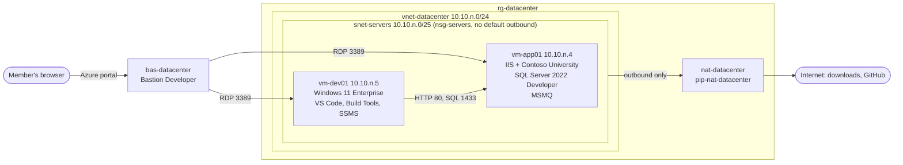

# Datacenter kit

The datacenter is each member's simulated on-premises estate, the starting point of the modernization. It runs in the member's workload subscription, in `rg-datacenter`, and nothing in it is reachable from the internet:

- `vm-app01` plays both on-premises servers: Windows Server 2022 with IIS running the legacy Contoso University (.NET Framework 4.8, MSMQ for notifications) and SQL Server 2022 Developer holding its database. SQL Server is prepared for MI link: the availability groups feature and the trace flags `-T1800` and `-T9567` are on.
- `vm-dev01` is the member's Windows 11 Enterprise workstation, with the tools for the modernization.
- The VNet has a NAT gateway for outbound traffic and Bastion Developer for access. Later, vending peers it to the hub (simulated ExpressRoute).

Members deploy it as pre-work, by T-3, and check it with `scripts/Test-Datacenter.ps1`.



## Resources

`n` is the member index, 1–20.

| Resource | Name | Notes |
|---|---|---|
| Resource group | `rg-datacenter` | In `location` (default `swedencentral`) |
| VNet | `vnet-datacenter` | `10.10.n.0/24` |
| Subnet | `snet-servers` | `10.10.n.0/25`, default outbound access off, NAT gateway and NSG attached |
| NSG | `nsg-servers` | Allows RDP (TCP 3389) from `168.63.129.16`, the address Bastion Developer connects from. No inbound rules from the internet |
| NAT gateway | `nat-datacenter` | Standard, no zone |
| Public IP | `pip-nat-datacenter` | Standard, static, outbound only. No `zones` set: it's zone-redundant automatically in regions with zones |
| Bastion | `bas-datacenter` | Developer SKU: free, no subnet or public IP, one session at a time |
| App VM | `vm-app01` | `10.10.n.4`. `MicrosoftSQLServer:sql2022-ws2022:sqldev-gen2:latest`. NIC `nic-vm-app01`, OS disk `osdisk-vm-app01` (image default size), data disk `disk-data-vm-app01` (P30, 1,024 GiB, LUN 0, `ReadOnly` caching) as `F:` |
| Dev VM | `vm-dev01` | `10.10.n.5`. `MicrosoftWindowsDesktop:windows-11:win11-25h2-ent:latest`. NIC `nic-vm-dev01`, OS disk `osdisk-vm-dev01` (127 GiB) at performance tier P30. No data disk |

Both VMs are `Standard_D8as_v6` (AMD, 8 vCPU, 32 GiB) by default, Gen2 with Trusted Launch (Secure Boot and vTPM), the platform's default disk controller (NVMe on v6 and v7), Premium SSD disks, boot diagnostics with managed storage, no public IP, no zone and no auto-shutdown. The admin user is `labadmin` on both. `vm-app01` has no SQL IaaS Agent extension, because it conflicts with Arc onboarding later.

### What the VMs are configured with

The deployment configures both VMs through run commands. Each downloads its script from `infra/datacenter/scripts/` in this repo at the `-ScriptsRef` git ref, logs to `C:\LabTools\logs`, and can be re-run safely.

| VM | Run command | Script | What it does |
|---|---|---|---|
| `vm-app01` | `app-00-admin-password` | `Set-LabAdminPassword.ps1` | Sets the `labadmin` password to the deployed value, so an existing VM converges (ARM sets it only at creation) |
| `vm-app01` | `app-01-data-disk` | `Initialize-AppDataDisk.ps1` | The only raw disk becomes `F:` (GPT, NTFS, 64 KB clusters, label `SQLData`) |
| `vm-app01` | `app-02-sql-server` | `Set-AppSqlServer.ps1` | Default data, log and backup folders `F:\SQLData`, `F:\SQLLog` and `F:\SQLBackup`; mixed-mode authentication; TCP 1433; availability groups on; trace flags `-T1800` and `-T9567`; `labadmin` and `SYSTEM` are sysadmins |
| `vm-app01` | `app-03-database` | `New-AppDatabase.ps1` | Empty `ContosoUniversity` database on `F:`, and the SQL login `contosoapp` as its `db_owner`. Changes the login's password if it differs from the deployed value |
| `vm-app01` | `app-04-web-features` | `Install-AppWebFeatures.ps1` | IIS with ASP.NET 4.8, and the MSMQ server feature |
| `vm-app01` | `app-05-legacy-site` | `Install-AppLegacySite.ps1` | `ContosoUniversity-legacy.zip` from the `legacy-v1` release in `C:\inetpub\ContosoUniversity`; site and app pool `ContosoUniversity` on port 80 instead of the Default Web Site; `DefaultConnection` pointed at `10.10.n.4`; the private queue `.\Private$\ContosoUniversityNotifications`; firewall rules for TCP 80 and 1433 from `10.0.0.0/8`; a warm-up request that creates and seeds the database |
| `vm-dev01` | `dev-00-admin-password` | `Set-LabAdminPassword.ps1` | Same as `app-00-admin-password` |
| `vm-dev01` | `dev-01-tools` | `Install-DevTools.ps1` | `C:\src`, VS Code (system installer), Git, the GitHub CLI, PowerShell 7, the Azure CLI, Bicep, the .NET 10 SDK, the .NET Framework 4.8 Developer Pack and the NuGet CLI |
| `vm-dev01` | `dev-02-build-tools` | `Install-DevBuildTools.ps1` | Visual Studio Build Tools (current release) with the web build tools workload and its recommended components |
| `vm-dev01` | `dev-03-ssms` | `Install-DevSsms.ps1` | SSMS 22 |
| `vm-dev01` | `dev-04-first-logon` | `Register-DevFirstLogon.ps1` | A logon task that installs the VS Code extensions for each user (see below) |
| `vm-dev01` | `dev-05-versions` | `Write-DevVersions.ps1` | The installed versions, in `C:\LabTools\versions.txt` |

VS Code extensions install per user, so they install when you sign in, not during the deployment: GitHub Copilot, GitHub Copilot Chat, GitHub Copilot upgrade, C# Dev Kit, SQL Server (mssql), PowerShell and Bicep. The first sign-in takes a minute or two longer while they install.

The app's `Web.config` connects to SQL Server as `contosoapp` with the password in plain text, and has `debug="true"`. Both are deliberate: they're findings for the assessment.

## Deploy

You need PowerShell 7.4 or later and the Azure CLI, signed in to the member's tenant. Azure Cloud Shell has both. From the repo root:

```powershell
./scripts/Deploy-Datacenter.ps1 -SubscriptionId '<workload-subscription-id>' -MemberIndex <n>
```

| Parameter | Default | Notes |
|---|---|---|
| `SubscriptionId` | Required | The member's workload subscription |
| `MemberIndex` | `1` | 1–20. Sets the address space `10.10.n.0/24` |
| `Location` | `swedencentral` | Fallback: `germanywestcentral`, which also offers Bastion Developer |
| `VmSize` | `Standard_D8as_v6` | Any Gen2 size that supports Trusted Launch, for example a v7 size |
| `DevImageSku` | `win11-25h2-ent` | Windows 11 Enterprise image SKU for `vm-dev01` |
| `ScriptsRef` | `main` | Git ref the VMs download their scripts from |
| `NoHybridBenefit` | Off | Deploy `vm-app01` without Azure Hybrid Benefit |
| `AdminPassword` | Lab password | Secure string. Overrides the `labadmin` password on both VMs |
| `SqlAppPassword` | Lab password | Secure string. Overrides the `contosoapp` password |

The script:

1. Saves the credentials it deploys (the lab password, or your overrides) in `$HOME/.apex-factory/<subscription-id>/datacenter.json`, with the keys `adminUsername`, `adminPassword`, `sqlAppLogin` and `sqlAppPassword`. Later items read this file.
2. Prints what it deploys, the cost and the Hybrid Benefit setting. It doesn't check quota.
3. Deploys `infra/datacenter/main.bicep` at subscription scope, passing the passwords in a temporary parameters file that it deletes afterwards. This takes up to 60 minutes, unattended.
4. Sets the `vm-dev01` OS disk to performance tier P30. The VM's `osDisk` block has no tier property, so it's set on the disk. It changes without downtime.
5. Prints how to connect, where the credentials are saved, and how to stop and start the VMs.

Running it again converges: nothing is replaced, and the run commands skip work that's already done. It also brings an existing datacenter to the deployed credentials: `labadmin` on both VMs, the `contosoapp` login and the app's `DefaultConnection`.

### Connect

In the Azure portal, open `rg-datacenter` > `vm-dev01` > **Connect** > **Bastion**, and sign in as `labadmin` with the lab password (see **Credentials**). From `vm-dev01`, browse to `http://10.10.n.4/` for the app, and connect SSMS to `10.10.n.4` with SQL authentication as `contosoapp`.

## Credentials

The datacenter uses fixed, documented lab credentials, so attendees and coaches never have to look anything up:

| Account | Where | Password |
|---|---|---|
| `labadmin` | Local admin on `vm-app01` and `vm-dev01`, and a SQL Server sysadmin on `vm-app01` | `FactoryLab-2026-Pw` |
| `contosoapp` | SQL login on `vm-app01`, `db_owner` of `ContosoUniversity`, used by the legacy app | `FactoryLab-2026-Pw` |

This is an exception to the kit's rule that passwords are generated, and it applies to the datacenter only. It's acceptable because the datacenter has no public IPs and is reachable only through Bastion, behind Entra ID and Azure RBAC, and because it's a throwaway lab, never production. Don't reuse this password anywhere else. To use your own, pass `-AdminPassword` and `-SqlAppPassword` (secure strings) to `Deploy-Datacenter.ps1`; a re-run applies them to an existing datacenter.

## Test

```powershell
./scripts/Test-Datacenter.ps1 -SubscriptionId '<workload-subscription-id>' -MemberIndex <n>
```

It checks, without changing anything:

- **Azure:** both VMs running, with the expected size, `licenseType`, Trusted Launch, no zone and private IP; the `vm-app01` P30 data disk; no data disk on `vm-dev01` and its OS disk at tier P30; no public IP in `rg-datacenter` except `pip-nat-datacenter`.
- **`vm-app01`**, through a run command: the app returns HTTP 200 with "Contoso University"; `F:` exists; the database files are on `F:`; the app's tables exist with at least 8 students (the app's seed data); availability groups are on; trace flags 1800 and 9567 are on; the MSMQ queue exists.
- **`vm-dev01`**, through a run command: `http://10.10.n.4/` returns 200; TCP 1433 on `10.10.n.4` is open; `git`, `gh`, `pwsh`, `az`, `bicep`, the .NET 10 SDK, `code`, `msbuild` and SSMS are installed; outbound HTTPS to `github.com` works.

It prints PASS or FAIL per check and an overall verdict, and exits `0` only if every check passes. If you deployed with another size or without Hybrid Benefit, pass `-VmSize` or `-NoHybridBenefit` to the test too. The in-VM checks need the VMs running: start them first if they're deallocated.

## Cost

List prices in `swedencentral`, per hour:

| State | With Azure Hybrid Benefit (default) | Without |
|---|---|---|
| Running | About $1.25 | About $2.00 |
| Stopped (deallocated) | About $0.48 | About $0.48 |

Running means 2 × D8as_v6 at the Linux rate ($0.39 each with Hybrid Benefit), 2 × P30 ($0.20: the `vm-app01` data disk and the `vm-dev01` OS disk, billed at its P30 tier), 1 × P10 OS disk ($0.03), and the NAT gateway and its IP ($0.05). Bastion Developer is free. Stopped VMs still pay for their disks, the NAT gateway and the IP.

There's no auto-shutdown. Stop the VMs when you're not using them:

```powershell
az vm deallocate -g rg-datacenter -n vm-app01 --no-wait
az vm deallocate -g rg-datacenter -n vm-dev01 --no-wait
```

Start them again with `az vm start -g rg-datacenter -n vm-app01` and `az vm start -g rg-datacenter -n vm-dev01`.

## Azure Hybrid Benefit

Hybrid Benefit is **on by default**:

| VM | `licenseType` | What it means |
|---|---|---|
| `vm-app01` | `Windows_Server` | Hybrid Benefit for Windows Server: compute is billed at the Linux rate. It assumes the partner holds eligible Windows Server licences with Software Assurance or subscriptions, as partners in CSP usually do |
| `vm-dev01` | `Windows_Client` | Multitenant hosting rights, which Windows 11 on Azure needs. It isn't optional, and compute is billed at the Linux rate |

SQL Server 2022 Developer is free, so it needs no licence setting.

If you don't hold eligible licences, deploy with `-NoHybridBenefit`, or turn it off after deployment:

```powershell
az vm update -g rg-datacenter -n vm-app01 --license-type None
```

To turn it back on, use `--license-type Windows_Server`. Leave `vm-dev01` on `Windows_Client`.

## Known traps

- **Run the whole thing again if it fails.** Every step converges, so re-running `Deploy-Datacenter.ps1` after a transient failure (a download timeout, for example) picks up where it failed. Each deployment passes a new `RunId` to the run commands, because Azure doesn't re-run a run command that hasn't changed. Look in `C:\LabTools\logs` on the VM for the failing step.
- **Quota.** The script doesn't check quota. If the deployment fails for lack of D-family vCPUs, request more quota, or pick another size or region with `-VmSize` and `-Location`.
- **No default outbound access.** All outbound traffic goes through `nat-datacenter`. Without it, the downloads in the run commands fail.
- **NVMe disks.** v6 and v7 sizes are NVMe-only, so disk numbers inside Windows don't match LUNs. The data disk script finds the data disk as the only raw disk.
- **Bastion Developer** allows one session at a time and doesn't work across peering. Both VMs are in its own VNet, so that's fine. Sign out of one VM before you connect to the other.
- **Connection strings use the IP**, `10.10.n.4`, not the VM name, because name resolution changes once the datacenter uses the hub's DNS.
- **Run commands stop working after Arc onboarding**, which turns off the Azure guest agent. Anything that needs a run command, including `Test-Datacenter.ps1`'s in-VM checks, has to happen before that.
- **Always On without a cluster.** SQL Server 2022 enables the availability groups feature without a Windows failover cluster, which is all MI link needs.
- **Restarts.** Nothing in the configuration needs a restart. Installers that ask for one (exit code 3010) are logged and ignored.
