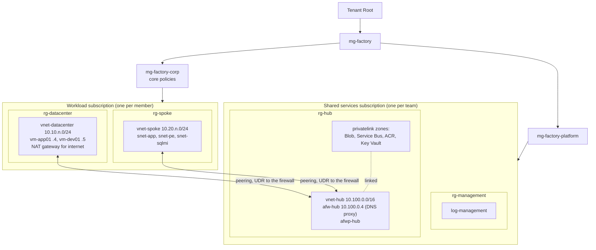

# Foundation: ALZ-lite, vending, exemptions and probes

The foundation is the team's landing zone. **ALZ-lite** is the small landing zone that attendees deploy: a management group hierarchy, a hub with Azure Firewall and central private DNS, a central Log Analytics workspace, and core policies. **Vending** puts each member's workload subscription under it and connects the member's spoke and datacenter to the hub. The team's platform lead runs both, in C2. A full portal ALZ isn't part of the kit: a coach demos it live.

## Two subscriptions per member

Each team has one **shared services subscription**, which holds the hub and the workspace. Each member has a **workload subscription**, which holds the member's datacenter, spoke and archetype. `n` is the member index, 1–20.



The datacenter and the spoke aren't peered with each other: everything between them goes through the hub firewall, which allows only the rules below. The datacenter keeps its own internet egress on its NAT gateway, as an on-premises site would.

## Management groups

ALZ-lite creates this hierarchy under Tenant Root. The prefix is the `MgPrefix` parameter (default `mg-factory`), so several kits can coexist in one tenant.

| Management group | Parent | Holds |
|---|---|---|
| `mg-factory` | Tenant Root | — |
| `mg-factory-platform` | `mg-factory` | The shared services subscription (moved by ALZ-lite) |
| `mg-factory-corp` | `mg-factory` | Members' workload subscriptions (moved by vending), and the core policies |

## ALZ-lite compared with a full ALZ

| Control | Full ALZ (coach demo) | ALZ-lite |
|---|---|---|
| Management groups | Intermediate root, Platform (Management, Connectivity, Identity), Landing zones (Corp, Online), Sandbox, Decommissioned | `mg-factory` with `-platform` and `-corp` |
| Hub networking | Hub VNet or Virtual WAN, Azure Firewall, VPN or ExpressRoute gateways, DDoS Network Protection, Bastion | `vnet-hub` with Azure Firewall Standard and DNS proxy. No gateways (the datacenter is peered: simulated ExpressRoute), DDoS off |
| DNS | Private DNS zones for every service, often a DNS Private Resolver | Four privatelink zones (Blob, Service Bus, ACR, Key Vault) linked to the hub; the firewall's DNS proxy forwards to Azure DNS |
| Logging | Central Log Analytics, Azure Monitor Agent and data collection rules, Sentinel option | `log-management` (30-day retention); diagnostics policies for the archetype's resource types |
| Policies | The ALZ policy library (hundreds of definitions in many initiatives) | 18 built-in assignments at `mg-factory-corp` (below) |
| Defender for Cloud | Paid plans per resource type | Foundational CSPM only (free); every paid plan off, unless `-SkipDefender` |
| Identity | Identity subscription, domain controllers, privileged access | None: Entra ID only |
| Subscription vending | Subscription creation, budgets, RBAC, networking | Places pre-created subscriptions; spoke, peering, UDRs, DNS, firewall rules, Owner for the member, budget |

## Policies at `mg-factory-corp`

Built-in definitions only, display names prefixed `ALZ-lite:`. The definition IDs were checked with `az policy definition list` on 2026-10-02.

| Assignment | Definition | ID | Effect |
|---|---|---|---|
| `alzl-allowed-locations` | Allowed locations | `e56962a6-4747-49cd-b67b-bf8b01975c4c` | Audit (owner decision 2026-10-06): other regions show as non-compliant but aren't blocked. `location` and `global`, plus `-AdditionalAllowedLocation` (for example the fallback region) |
| `alzl-deny-nic-pip` | Network interfaces should not have public IPs | `83a86a26-fd1f-447c-b59d-e51f44264114` | Deny (fixed in the definition) |
| `alzl-deny-pna-storage` | Storage accounts should disable public network access | `b2982f36-99f2-4db5-8eff-283140c09693` | Deny |
| `alzl-deny-pna-keyvault` | Azure Key Vault should disable public network access | `405c5871-3e91-4644-8a63-58e19d68ff5b` | Deny |
| `alzl-deny-pna-servicebus` | Service Bus Namespaces should disable public network access | `cbd11fd3-3002-4907-b6c8-579f0e700e13` | Deny |
| `alzl-deny-pna-acr` | Public network access should be disabled for Container registries | `0fdf0491-d080-4575-b627-ad0e843cba0f` | Deny |
| `alzl-deny-pna-sqlmi` | Azure SQL Managed Instances should disable public network access (the public data endpoint) | `9dfea752-dd46-4766-aed1-c355fa93fb91` | Deny |
| `alzl-dns-blob` | Configure a private DNS Zone ID for blob groupID | `75973700-529f-4de2-b794-fb9b6781b6b0` | DeployIfNotExists |
| `alzl-dns-servicebus` | Configure Service Bus namespaces to use private DNS zones | `f0fcf93c-c063-4071-9668-c47474bd3564` | DeployIfNotExists |
| `alzl-dns-acr` | Configure Container registries to use private DNS zones | `e9585a95-5b8c-4d03-b193-dc7eb5ac4c32` | DeployIfNotExists |
| `alzl-dns-keyvault` | Configure Azure Key Vaults to use private DNS zones | `ac673a9a-f77d-4846-b2d8-a57f8e1c01d4` | DeployIfNotExists |
| `alzl-diag-appservice` | Enable logging by category group for App Service (microsoft.web/sites) to Log Analytics | `c0d8e23a-47be-4032-961f-8b0ff3957061` | DeployIfNotExists |
| `alzl-diag-sqlmi` | Enable logging by category group for SQL managed instances to Log Analytics | `8fc4ca5f-6abc-4b30-9565-0bd91ac49420` | DeployIfNotExists |
| `alzl-diag-keyvault` | Enable logging by category group for Key vaults to Log Analytics | `6b359d8f-f88d-4052-aa7c-32015963ecc1` | DeployIfNotExists |
| `alzl-diag-servicebus` | Enable logging by category group for Service Bus Namespaces to Log Analytics | `0277b2d5-6e6f-4d97-9929-a5c4eab56fd7` | DeployIfNotExists |
| `alzl-diag-acr` | Enable logging by category group for Container registries to Log Analytics | `56288eb2-4350-461d-9ece-2bb242269dce` | DeployIfNotExists |
| `alzl-diag-appinsights` | Enable logging by category group for Application Insights to Log Analytics | `79494980-ea12-4ca1-8cca-317e942b6da2` | DeployIfNotExists |
| `alzl-diag-blob` | Configure diagnostic settings for Blob Services to Log Analytics workspace | `b4fe1a3b-0715-4c6c-a5ea-ffc33cf823cb` | DeployIfNotExists |

Not covered on purpose: App Service public network access (the web front end is public by design) and a private DNS zone for SQL MI (it has no private endpoint here; its VNet-local host name resolves to its private IP through Azure DNS, and a `privatelink` zone could break its management operations).

The DeployIfNotExists assignments have system-assigned identities. The private DNS ones get Network Contributor at `mg-factory-corp` and on `rg-hub`; the diagnostics ones get Log Analytics Contributor at `mg-factory-corp` and on `rg-management` (Blob also Monitoring Contributor at `mg-factory-corp`). They act on new and changed resources, typically within 30 minutes; existing resources need a remediation task.

## Vending inputs

`scripts/Deploy-Vending.ps1` finds the hub's IDs by the ALZ-lite names and passes them to `infra/foundation/vending/main.bicep`:

| Parameter | Default | Notes |
|---|---|---|
| `WorkloadSubscriptionId` | — | The member's subscription, moved into `mg-factory-corp` |
| `SharedSubscriptionId` | — | Where the hub is |
| `MemberIndex` | `1` | `n`: the spoke is `10.20.n.0/24`, the datacenter `10.10.n.0/24` |
| `Location` | `swedencentral` | |
| `MgPrefix` | `mg-factory` | As passed to ALZ-lite |
| `MemberPrincipalId` | empty | The member's object ID, who gets Owner on the workload subscription. Skipped when empty |
| `BudgetAmount` | `500` | A month, in the billing currency |
| `BudgetEmail` | — | Alert at 80% of actual cost |
| `SkipDefender` | off | Leave the subscription's Defender for Cloud plans as they are (see [Defender for Cloud](#defender-for-cloud)) |

Found in the shared services subscription: `vnet-hub`'s ID, `afw-hub`'s private IP, `afwp-hub`'s ID, `rg-hub`'s ID (the DNS zones) and `log-management`'s ID. Vending connects the datacenter only if `vnet-datacenter` exists, so run it after the datacenter, and run it again after any datacenter redeploy: `Deploy-Datacenter.ps1` resets `snet-servers` (dropping `rt-servers`) and `vnet-datacenter`'s DNS servers.

What it deploys:

| Where | What |
|---|---|
| Tenant | The workload subscription moved into `mg-factory-corp` |
| `rg-spoke` | `vnet-spoke` `10.20.n.0/24` with DNS `afw-hub`; `snet-app` `10.20.n.0/26` (delegated to `Microsoft.Web/serverFarms`, `rt-app`); `snet-pe` `10.20.n.64/26` (`rt-pe`); `snet-sqlmi` `10.20.n.128/26` (delegated to `Microsoft.Sql/managedInstances`, `nsg-sqlmi`, `rt-sqlmi`); peering `peer-spoke-to-hub` |
| `nsg-sqlmi`, `rt-sqlmi` | Created once, empty: a PUT without the rules and routes that SQL MI's network intent policy adds would remove them (B08 validation), so re-runs leave both alone. The kit's rules and route are child resources. `nsg-sqlmi`: MI link rules from the B07 report, inbound TCP 5022 and 11000–11999 from `10.10.n.4`, outbound TCP 5022 to `10.10.n.4`; diagnostics to `log-management` |
| `rg-datacenter` | Peering `peer-datacenter-to-hub`; `rt-servers` on `snet-servers`; `vnet-datacenter` DNS set to `afw-hub` (after the peering) |
| `rg-hub` | Peerings `peer-hub-to-spoke-n` and `peer-hub-to-datacenter-n`; rule collection group `rcg-member-n` in `afwp-hub` |
| Workload subscription | Owner for the member; budget `budget-factory-workload`; Defender for Cloud on Foundational CSPM only (unless `-SkipDefender`) |

The platform lead runs vending for every member, one at a time (each run updates `afwp-hub`). It needs Owner at Tenant Root, because it writes to both subscriptions and the cross-subscription peerings need rights on both VNets. Members need no role on the shared services subscription.

## Firewall rules

`rcg-member-n` (priority `1000 + n`) allows only these flows. Anything else through the firewall is denied.

| Rule | Type | From | To | Ports | Why |
|---|---|---|---|---|---|
| `dev-to-private-endpoints` | Network | `vm-dev01` `10.10.n.5` | `snet-pe` `10.20.n.64/26` | TCP 443, 5671 | Members push images to ACR, and run the app locally against Blob, Service Bus (AMQP on 5671) and Key Vault |
| `dev-to-app` | Network | `vm-dev01` | `snet-app` `10.20.n.0/26` | TCP 443 | Reach the app's integration subnet from the dev VM |
| `dev-to-sqlmi` | Network | `vm-dev01` | `snet-sqlmi` `10.20.n.128/26` | TCP 1433, 11000–11999 | SSMS, `sqlcmd` and the perf kit against the MI (redirect ports) |
| `milink-sqlserver-to-mi` | Network | `vm-app01` `10.10.n.4` | `snet-sqlmi` | TCP 5022, 11000–11999 | MI link, SQL Server to MI (B07 report) |
| `milink-mi-to-sqlserver` | Network | `snet-sqlmi` | `vm-app01` | TCP 5022 | MI link, MI to SQL Server (B07 report) |
| `app-to-entra-id` | Network | `snet-app` | Service tag `AzureActiveDirectory` | TCP 443 | The app's managed identity and Entra sign-in |
| `app-to-mcr` | Application | `snet-app` | `mcr.microsoft.com`, `*.data.mcr.microsoft.com` | HTTPS 443 | The archetype's placeholder image |
| `app-to-azure-monitor` | Application | `snet-app` | `dc.applicationinsights.azure.com`, `dc.applicationinsights.microsoft.com`, `dc.services.visualstudio.com`, `*.in.applicationinsights.azure.com`, `live.applicationinsights.azure.com`, `rt.applicationinsights.microsoft.com`, `rt.services.visualstudio.com`, `*.livediagnostics.monitor.azure.com` | HTTPS 443 | Application Insights ingestion and Live Metrics: the documented private-only exception (endpoints from [Azure Monitor network access](https://learn.microsoft.com/azure/azure-monitor/fundamentals/azure-monitor-network-access), checked 2026-10-02) |

Traffic inside the spoke (the app to its private endpoints and to the MI) stays in `vnet-spoke`: the VNet's own route is more specific than the `0.0.0.0/0` UDR.

**SNAT for private endpoints.** Traffic to private endpoints that the firewall inspects with network rules must be source-NATed to keep the flow symmetric ([Azure Firewall scenarios to inspect traffic destined to a private endpoint](https://learn.microsoft.com/azure/private-link/inspect-traffic-with-azure-firewall)). `afwp-hub` lists every kit range as private (no SNAT) **except** `snet-pe` (`10.20.n.64/26` for n = 1–20), so the firewall SNATs exactly the traffic to private endpoints and keeps the real source for everything else, which MI link and the NSG rules need.

## Routes

| Route table | Subnet | Route | Next hop | Why |
|---|---|---|---|---|
| `rt-app` | `snet-app` | `0.0.0.0/0` | `afw-hub` | App Service outbound goes through the firewall rules above |
| `rt-pe` | `snet-pe` | `0.0.0.0/0` | `afw-hub` | Anything leaving the endpoint subnet is inspected |
| `rt-sqlmi` | `snet-sqlmi` | `10.10.n.0/24` | `afw-hub` | MI link to the datacenter through the firewall. Only this range: MI keeps the routes its network intent policy adds, including its own internet route |
| `rt-servers` | `snet-servers` | `10.20.n.0/24` | `afw-hub` | The datacenter reaches the spoke through the firewall; internet egress stays on `nat-datacenter` |

## DNS

`vnet-spoke` and `vnet-datacenter` use `afw-hub`'s private IP as their DNS server. The firewall's DNS proxy forwards to Azure DNS in `vnet-hub`, where the privatelink zones are linked, so private endpoint names resolve to private IPs from the datacenter and the spoke. SQL MI's host name resolves to its private IP through the same path, without a zone. Running VMs pick up the new DNS server after a restart or `ipconfig /renew`.

## Exemptions

The datacenter existed before vending moved the workload subscription into `mg-factory-corp`, so the deny policies didn't block it, but it can show as non-compliant. `scripts/New-DatacenterExemptions.ps1` scans `rg-datacenter` and finds the policy assignments it violates. It creates one exemption for each **ALZ-lite** assignment (display name `ALZ-lite: ...`) among them, plus any assignment named with `-IncludeAssignment`, scoped to `rg-datacenter` only: category Waiver, an expiry date (default 14 days), and a description with the owner, the reason ("pre-existing on-premises simulation, migrating in C7") and the target date. Other violated assignments are listed but never exempted unless named. It prints a table for the deferred-work register. It never exempts the spoke or the workload resources. That's the lesson (PRD §4): deferred work needs an owner, a target and a timeline.

The core policies target what the archetype deploys, so a fresh datacenter violates none of them (B08 validation). The policy the simulated on-premises servers legitimately fail is the **Microsoft cloud security benchmark**, which Defender for Cloud assigns in most tenants (for example as "Azure Security Baseline" or "ASC Default"). Name it to exempt it:

```powershell
./scripts/New-DatacenterExemptions.ps1 -SubscriptionId <subscription-id> -Owner '<owner name>' -IncludeAssignment 'Azure Security Baseline' -WhatIf
```

Run it with `-WhatIf` first to see what it would create.

## Probes

`scripts/Test-Connectivity.ps1` checks the network contract and reports PASS or FAIL per check, then a verdict (exit code 0 or 1):

- In Azure: both peerings `Connected`, both VNets' DNS set to the firewall, `snet-servers` on the NAT gateway with the spoke route, and the four zones linked to `vnet-hub`.
- From `vm-dev01` (VM run command): the VM uses the firewall for DNS and the DNS proxy answers; each private endpoint in `snet-pe` resolves into `snet-pe` and connects on its port (443, plus 5671 for Service Bus); `vm-app01` answers on 80 and 1433; internet egress works.
- From `vm-app01` (an Arc run command once it's Arc-enabled, a VM run command before): the same DNS checks and, if a SQL MI exists in `snet-sqlmi`, that its host name resolves into `snet-sqlmi` and TCP 5022 and 11000 connect.

It skips the checks that don't apply yet and says so: private endpoints and the MI arrive with the archetype. An empty private zone's SOA looks the same as the public one, so the private endpoint checks are what prove private resolution end to end. The in-VM checks are in [scripts/Test-HubConnectivity.ps1](scripts/Test-HubConnectivity.ps1).

## Permissions

The platform lead needs **Owner at the Tenant Root management group**: to create the management groups, move both subscriptions, assign policies and give their identities roles, and write to both subscriptions in vending. Both deploy scripts check it first. To get it, a Global Administrator elevates access (Microsoft Entra ID > Properties > Access management for Azure resources) and assigns Owner at Tenant Root.

## Run it

```powershell
$s = Get-Content (Join-Path '.local' 'settings.json') | ConvertFrom-Json
./scripts/Deploy-AlzLite.ps1 -SharedSubscriptionId $s.sharedSubscriptionId -Location $s.location -WhatIf
./scripts/Deploy-AlzLite.ps1 -SharedSubscriptionId $s.sharedSubscriptionId -Location $s.location
./scripts/Deploy-Vending.ps1 -WorkloadSubscriptionId $s.subscriptionId -SharedSubscriptionId $s.sharedSubscriptionId -MemberIndex $s.memberIndex -BudgetEmail '<email>'
./scripts/New-DatacenterExemptions.ps1 -SubscriptionId $s.subscriptionId -Owner '<owner name>'
./scripts/Test-Connectivity.ps1 -SubscriptionId $s.subscriptionId -SharedSubscriptionId $s.sharedSubscriptionId -MemberIndex $s.memberIndex
```

## Defender for Cloud

By default both deploy scripts set Microsoft Defender for Cloud to **Foundational CSPM** (free) on their subscription, with `Microsoft.Security/pricings`: every paid plan (servers, SQL, App Service, storage, Key Vault, Resource Manager, containers, Cosmos DB, open-source databases, Defender CSPM, APIs, AI) is turned **off subscription-wide**, including for resources the kit didn't create. Event subscriptions are dedicated to the kit, so attendees keep the default.

`-SkipDefender` (on `Deploy-AlzLite.ps1` and `Deploy-Vending.ps1`) leaves the subscription's plans as they are. Use it only in a subscription that also hosts other workloads, such as the kit's build subscriptions (owner decision, 2026-10-02).

## Zones and public endpoints

No resource sets `zones`. `afw-hub` has no zone. `pip-afw-hub` is a Standard public IP, zone-redundant automatically, and the foundation's only public IP. Nothing in vending has a public IP.

## Cost

| Item | Cost while deployed |
|---|---|
| Azure Firewall Standard (`afw-hub`) | About $1.25/hour, plus $0.016/GB processed |
| `pip-afw-hub` | About $0.005/hour |
| `log-management` | Pay per GB ingested; low volume in the lab |
| Private DNS zones | About $0.50 a zone a month |
| Vending (VNets, route tables, NSGs, peering) | No hourly cost; peering traffic is billed per GB |

ALZ-lite costs about $1.30/hour per team, mostly the firewall, until `rg-hub` is deleted. Defender for Cloud stays on Foundational CSPM (free).

## API versions

Pinned, not preview, except `Microsoft.Insights/diagnosticSettings@2021-05-01-preview`: it has no GA version for diagnostic settings on a resource. Exemptions are created with `az policy exemption create`, because `Microsoft.Authorization/policyExemptions` has only preview API versions.
