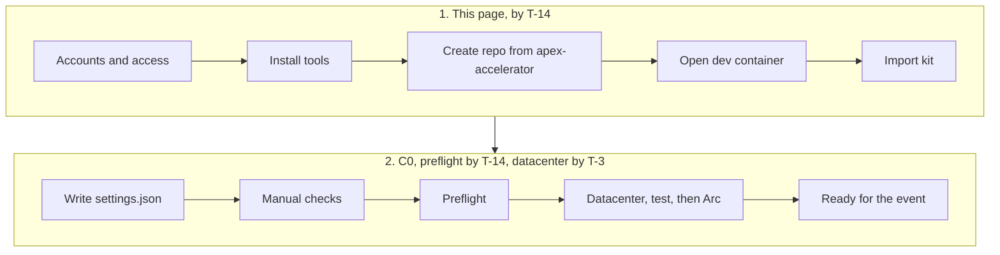

:::danger[C0 is mandatory pre-work: finish it before the event]
This page and [C0: Ready to hack](../../challenges/c00-ready-to-hack/) are **not** event-day tasks. Every attendee, including the platform lead, completes both **before the event starts**:

- **By T-14:** this page, plus C0's preflight.
- **By T-3:** C0's datacenter deployment, a passing `Test-Datacenter.ps1` run (before Arc onboarding), and Azure Arc onboarding.

If you arrive without a deployed, Arc-connected datacenter (`vm-app01` and `vm-dev01`), you can't take part in the event's challenges, because every one of them builds on it. C0 takes about 150 minutes, and the deployments run unattended for part of that. Raise any blocker with your coach now.
:::



Complete this page by **T-14**, then continue with [C0: Ready to hack](../../challenges/c00-ready-to-hack/). You're ready for the event only when C0's evidence is green: `Test-Preflight.ps1` GO, `Test-Datacenter.ps1` all PASS (run before Arc onboarding), `vm-app01` Connected in Azure Arc, and Copilot answering in VS Code on `vm-dev01`. If any blocker below applies to you, raise it with your coach now; don't leave it for event day.

## Who this is for

The event is built for partner infrastructure architects and engineers, in teams of three to five. Each team has its own Microsoft Entra tenant and a platform lead. You don't need to be a .NET or SQL Server specialist: the application and database work is GitHub Copilot-assisted. Day-to-day Azure administration with the portal, the Azure CLI and PowerShell is the assumed background.

The event is hands-on first. Infra roles hold AZ-104, GH-300 and DP-300 within six months after the event, so the exams follow it. No exam is a gate for attending the event. The [Partner learning path](../../guides/learning-path/) has the stages, the role tracks and the optional learning before the event.

## Blockers that mean you are not ready

- GitHub Copilot Chat or agent mode doesn't work in VS Code with your account.
- The models the APEX agents use are blocked by your account or organization policy.
- You have no Azure workload subscription, or you share one with another member.
- You can't register an MFA method for your Azure identity.
- The dev container doesn't open on your machine.
- You can't create private repos in the partner's GitHub org.
- You have no Owner assignment on your workload subscription.

## How you work with one repo and one dev container

You work in **one repo of your own**: a private repo created from the [`apex-accelerator`](https://github.com/jonathan-vella/apex-accelerator) template. It brings the dev container (Azure CLI, PowerShell 7, Git, `azd`, Bicep) and the APEX agents. A single import command then copies the kit into a `factory/` folder at the root of that repo. From then on you run the kit's deployment and Azure scripts from `factory/` inside the dev container, and the archetype for C5 is already in place. From C3 the app work happens on `vm-dev01` (`vm-dev01` has its own clone of the kit at `C:\src\factory`, which you connect to your repo on its own branch, `vm-dev01-work`; the [upgrade guide](../../guides/ghcp-upgrade/#switching-to-vm-dev01) has the commands); most challenge pages have a **Where to run** block that says which one to use.

Your team also has **one shared team repo**, where the team's evidence lives. It's a separate repo from yours, created once per team in [C1](../../challenges/c01-define-the-opportunity/#the-team-repo-what-it-is-and-how-to-set-it-up) from the kit's `templates/team/` folder. You don't create it now; your coach tells you who does it.

## Accounts and access

| What | Requirement |
| --- | --- |
| GitHub | A personal account in the partner's GitHub org, with GitHub Copilot enabled (agent mode and the Upgrade agent allowed by policy). |
| Azure subscription | One paid workload subscription per member, which must pass `Test-Preflight.ps1`. Trial, Azure Pass and sponsorship subscriptions are not supported. Preflight doesn't check the offer type, so confirm yours is a paid subscription before you start. |
| Azure role | An unconditional **Owner** assignment on your workload subscription (direct, inherited or through a group; activate it first if it's eligible through Privileged Identity Management). Preflight fails without it, and vending and the Arc script assume it. There is no fallback: Contributor, with or without Resource Policy Contributor, doesn't pass. If your organization blocks Owner, raise it with your coach well before T-14. |
| MFA | Registered for your Azure identity. |
| Region quota | Enough regional vCPU quota in `swedencentral` for a Standard_D8as_v6 VM (8 vCPU each, two VMs: `vm-app01` and `vm-dev01`), and quota for the archetype's SQL Managed Instance and App Service in C5. Preflight doesn't check quota. |
| Platform lead only | A **second** subscription (shared services) plus Owner at Tenant Root. The platform lead is also a member: they still need their own workload subscription, and do C0 on it like everyone else. |

Check your subscription and quota from any terminal that has the Azure CLI:

```powershell
az login
az account show --output table
az vm list-usage --location swedencentral --output table
```

## Install on your machine

You only need the host tools to open the dev container; everything else is inside it.

| Tool | Why | Verify |
| --- | --- | --- |
| [VS Code](https://code.visualstudio.com/) 1.100 or newer | The editor and agent mode | `code --version` |
| [Azure CLI](https://learn.microsoft.com/cli/azure/install-azure-cli) with its `bastion` extension (optional) | Only for the native-client shortcut `Connect-DatacenterVm.ps1` on Windows. The portal path needs neither | `az extension show --name bastion` |
| [Docker Desktop](https://www.docker.com/products/docker-desktop/) (or another Docker-compatible runtime) | Runs the dev container | `docker version` |
| [Git](https://git-scm.com/downloads) | Clone your repo | `git --version` |
| VS Code extensions: Dev Containers (`ms-vscode-remote.remote-containers`), GitHub Copilot Chat (`github.copilot-chat`) | Open the container; Copilot sign-in | `code --list-extensions` |

```powershell
code --install-extension ms-vscode-remote.remote-containers
code --install-extension github.copilot-chat
```

### Windows 11 from scratch

1. Install [WSL](https://learn.microsoft.com/windows/wsl/install) with Ubuntu (`wsl --install`), then restart.
2. Install Docker Desktop and turn on **Use the WSL 2 based engine**.
3. Install VS Code and the **WSL** extension (`ms-vscode-remote.remote-wsl`) as well as the two above.
4. In Ubuntu, create a folder for your repos: `mkdir -p ~/repos`.
5. Clone your repo (below) into `~/repos`, not into a Windows folder: the dev container is much faster, and line endings stay correct.

### Network

Allow outbound HTTPS to `github.com`, `api.github.com`, `codeload.github.com`, `*.githubusercontent.com`, `api.githubcopilot.com`, `*.azure.com`, `*.microsoft.com`, `login.microsoftonline.com`, `learn.microsoft.com`, `docker.io` and `registry-1.docker.io`. The dev container also needs `ghcr.io` (its features come from there), `mcr.microsoft.com` (its base image, covered by `*.microsoft.com`) and `packagefeedproxy.microsoft.io` (its npm and Python package proxy), and VS Code needs `marketplace.visualstudio.com` for extensions.

## Create your repo and import the kit

1. Open the [`apex-accelerator`](https://github.com/jonathan-vella/apex-accelerator) template, choose **Use this template** > **Create a new repository**, set the owner to your partner org, and make it **Private**.
2. Clone it (replace the placeholders) and open it in VS Code:

   ```bash
   cd ~/repos
   git clone https://github.com/<your-org>/<your-repo>.git
   code <your-repo>
   ```

3. When VS Code offers it, choose **Reopen in Container** (or press `F1` > `Dev Containers: Reopen in Container`). Wait for the build to finish.
4. In the dev container terminal, at the repo root, import the kit. Paste these three lines as they are:

   ```bash
   curl -fsSLO https://raw.githubusercontent.com/jonathan-vella/apex-factory-hackathon/main/scripts/Import-Kit.ps1
   pwsh ./Import-Kit.ps1
   rm Import-Kit.ps1
   ```

   This creates `factory/` (scripts, infra, app, db, templates, archetype) and imports the CoE archetype's APEX project into the repo root. It refuses to overwrite an existing `factory/` unless you add `-Force`. `-Force` replaces only the kit folders: it keeps `factory/.local/` (your settings and datacenter credentials) and your archetype work. Add `-ReplaceArchetype` only if you want the kit's archetype copy back and accept losing your changes to it.
5. Commit the result:

   ```bash
   git add -A && git commit -m "Import kit" && git push
   ```

The archetype was built against APEX commit `c209d8b` (recorded in `archetype/README.md`). If the APEX agents in your repo behave differently from the C5 instructions, tell your coach.

## Sign in and create your settings file

In the dev container terminal (it starts in bash), start PowerShell:

```bash
pwsh
```

Then, in PowerShell:

```powershell
az login --use-device-code
gh auth login
cd factory
./scripts/Initialize-Settings.ps1
```

The script asks for your tenant ID and workload subscription ID (it offers the ones from your `az login`), your member index and your location (press Enter for `swedencentral`). It checks each value and writes `factory/.local/settings.json`.

**Member index:** your coach assigns you a number from 1 to 20 from the event roster, unique within your team. Ask your coach if you don't have one; don't pick your own. It isn't the same as the six-character suffix the script generates for you.

**Shared services subscription (members):** press Enter to skip it for now. The platform lead shares its ID in the team channel at the start of C2, and you add it then by re-running `./scripts/Initialize-Settings.ps1 -SharedSubscriptionId <id>`. Re-running never changes your other values.

**Shared services subscription (platform lead):** enter it now. C0's preflight then also checks it and your Tenant Root rights (`-SharedSubscriptionId`), so a missing role shows up at T-14 and not on day one.

`factory/.local/` is git-ignored: your IDs never go to GitHub. Run every script from the `factory/` folder.

## Manual checks

`Test-Preflight.ps1` (C0, task 1) can't verify these; confirm them yourself before T-14:

| # | Check | How to verify |
| --- | --- | --- |
| 1 | Copilot Chat responds in VS Code | Open Copilot Chat, send "hello". |
| 2 | The APEX custom agents appear | In Copilot Chat's agent picker, `01-Orchestrator` and `08-As-Built` are listed. |
| 3 | The agents' models are permitted | The picker lets you select and run them (no policy block message). |
| 4 | The MCP servers in `.vscode/mcp.json` load | VS Code shows them started and authenticated. Your organization's Copilot policy must also allow MCP servers and Copilot CLI. |
| 5 | Dev container opens | You can run `az version` and `pwsh --version` in its terminal. Docker Desktop is available, or your account can use Codespaces. |
| 6 | One subscription per member | Confirm with your coach. |
| 7 | Your roles match your kit role | Platform lead: Tenant Root Owner and a separate shared services subscription. Members: Owner on your own workload subscription. |
| 8 | MFA is registered | Sign in to the Azure portal and confirm your MFA method works. |
| 9 | You can create private repos in the partner's GitHub org | Try it when you create your repo below. |
| 10 | Azure Hybrid Benefit | You hold eligible partner licenses, or you accept that the kit turns it on by default and know how to turn it off (see [Azure Hybrid Benefit](../../reference/azure-hybrid-benefit/)). |

See the [ALZ-lite guide](../../guides/alz-lite/) for why the model needs two kinds of subscription. When all of this is green, go to [C0: Ready to hack](../../challenges/c00-ready-to-hack/).
